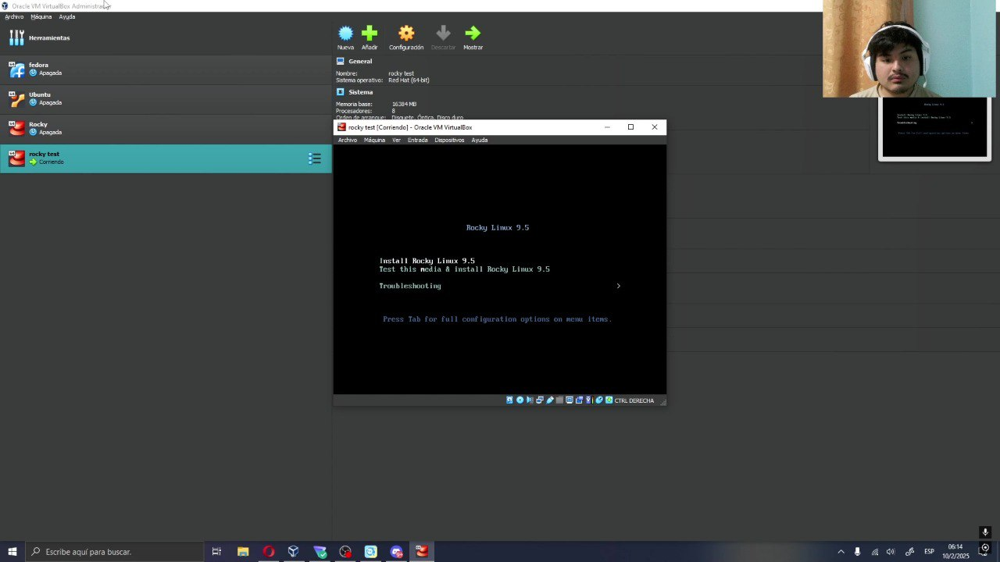
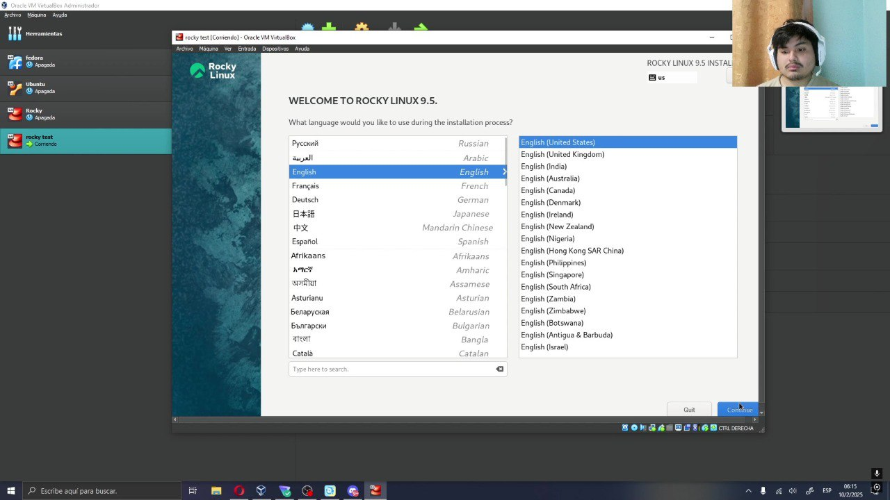
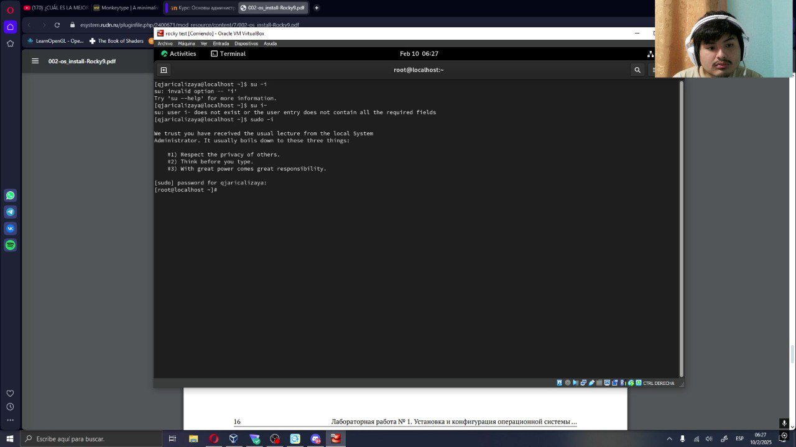

---
## Front matter
title: "отчёт по лабораторной работе №1"
subtitle: "Простейший вариант"
author: "Дмитрий Сергеевич Кулябов"

## Generic otions
lang: ru-RU
toc-title: "Содержание"

## Bibliography
bibliography: bib/cite.bib
csl: pandoc/csl/gost-r-7-0-5-2008-numeric.csl

## Pdf output format
toc: true # Table of contents
toc-depth: 2
lof: true # List of figures
lot: true # List of tables
fontsize: 12pt
linestretch: 1.5
papersize: a4
documentclass: scrreprt
## I18n polyglossia
polyglossia-lang:
  name: russian
  options:
	- spelling=modern
	- babelshorthands=true
polyglossia-otherlangs:
  name: english
## I18n babel
babel-lang: russian
babel-otherlangs: english
## Fonts
mainfont: IBM Plex Serif
romanfont: IBM Plex Serif
sansfont: IBM Plex Sans
monofont: IBM Plex Mono
mathfont: STIX Two Math
mainfontoptions: Ligatures=Common,Ligatures=TeX,Scale=0.94
romanfontoptions: Ligatures=Common,Ligatures=TeX,Scale=0.94
sansfontoptions: Ligatures=Common,Ligatures=TeX,Scale=MatchLowercase,Scale=0.94
monofontoptions: Scale=MatchLowercase,Scale=0.94,FakeStretch=0.9
mathfontoptions:
## Biblatex
biblatex: true
biblio-style: "gost-numeric"
biblatexoptions:
  - parentracker=true
  - backend=biber
  - hyperref=auto
  - language=auto
  - autolang=other*
  - citestyle=gost-numeric
## Pandoc-crossref LaTeX customization
figureTitle: "Рис."
tableTitle: "Таблица"
listingTitle: "Листинг"
lofTitle: "Список иллюстраций"
lotTitle: "Список таблиц"
lolTitle: "Листинги"
## Misc options
indent: true
header-includes:
  - \usepackage{indentfirst}
  - \usepackage{float} # keep figures where there are in the text
  - \floatplacement{figure}{H} # keep figures where there are in the text
---

# Цель работы

Целью данной работы является приобретение практических навыков установки опера-
ционной системы на виртуальную машину, настройки минимально необходимых для
дальнейшей работы сервисов.

# Задание

установить Оперативную систему в виртуальной машине

# Выполнение лабораторной работы

сначала я запускал VB и там я дал машине имя, тоже я указал где будеть сохраниться все данные, тоже файл .iso системы rocky 9.5 и потом я дал next (рис. [-@fig:001]).

{#fig:001 width=70%}

Потом я указал сколько памяти  и ядер процессора машина будет использовать  (рис. [-@fig:002	]).
 

{#fig:002 	width=70%}

дальше я указал объём жесткого диска (рис. [-@fig:003	]).

{#fig:003 	width=70%}

потом я проверил всю конфигурацию и дал terminar (рис. [-@fig:004	]).

{#fig:004 	width=70%}

Потом я загрузил ОС и выбрал первую опцию чтобы установить систему (рис. [-@fig:005	]).

{#fig:005 	width=70%}

Потом я выбрал язык (рис. [-@fig:006	]).

{#fig:006 	width=70%}

Дальше я смог смотреть настройку системы (рис. [-@fig:007	]).

{#fig:007 	width=70%}

сначала я выбрал жеский диск и там я выбрал виркуальный диск и выбрал опцю automatic (рис. [-@fig:008	]).

{#fig:008 	width=70%}

Затем я установил root password (рис. [-@fig:009	]).

{#fig:009 	width=70%}

Потом я настроил user, также я нажал на опцю make this user administrator чтобы делать его rootuser (рис. [-@fig:010	]).

{#fig:010 	width=70%}

Затем я нажал begin instalation чтобы начать установку(рис. [-@fig:011	]).
 
{#fig:011 	width=70%}

После того как вся настройка совершина я перезагрузил систему (рис. [-@fig:012	]).

{#fig:012 	width=70%}

Потом я вшел на мой user (рис. [-@fig:013	]).

{#fig:013 	width=70%}

Дальше я открыл терминал и выполнил команду sudo -i чтобы получить полномочия администратора (рис. [-@fig:014	]).

		sudo -i

{#fig:014 	width=70%}

Потом я добавить user на систему (рис. [-@fig:015	]).

		adduser -G whell username

{#fig:015 	width=70%}

Дальше я изменил имя хоста (рис. [-@fig:016	]).

		hostnamectl set-hostname username

{#fig:016 	width=70%}

Потом я показал список ползователей чтобы проверить что я провильно изменил имя (рис. [-@fig:017	]).

		hostnamectl

{#fig:017 	width=70%}

# Выводы

В этой лабораторной работы я смотрел как установить систему и как добавить хост на систему

# Список литературы{.unnumbered}

::: {#refs}
:::
