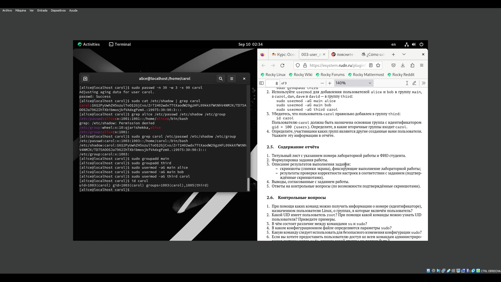

---
## Front matter
title: "Шаблон отчёта по лабораторной работе"
subtitle: "Простейший вариант"
author: "Дмитрий Сергеевич Кулябов"

## Generic otions
lang: ru-RU
toc-title: "Содержание"

## Bibliography
bibliography: bib/cite.bib
csl: pandoc/csl/gost-r-7-0-5-2008-numeric.csl

## Pdf output format
toc: true # Table of contents
toc-depth: 2
lof: true # List of figures
lot: true # List of tables
fontsize: 12pt
linestretch: 1.5
papersize: a4
documentclass: scrreprt
## I18n polyglossia
polyglossia-lang:
  name: russian
  options:
	- spelling=modern
	- babelshorthands=true
polyglossia-otherlangs:
  name: english
## I18n babel
babel-lang: russian
babel-otherlangs: english
## Fonts
mainfont: IBM Plex Serif
romanfont: IBM Plex Serif
sansfont: IBM Plex Sans
monofont: IBM Plex Mono
mathfont: STIX Two Math
mainfontoptions: Ligatures=Common,Ligatures=TeX,Scale=0.94
romanfontoptions: Ligatures=Common,Ligatures=TeX,Scale=0.94
sansfontoptions: Ligatures=Common,Ligatures=TeX,Scale=MatchLowercase,Scale=0.94
monofontoptions: Scale=MatchLowercase,Scale=0.94,FakeStretch=0.9
mathfontoptions:
## Biblatex
biblatex: true
biblio-style: "gost-numeric"
biblatexoptions:
  - parentracker=true
  - backend=biber
  - hyperref=auto
  - language=auto
  - autolang=other*
  - citestyle=gost-numeric
## Pandoc-crossref LaTeX customization
figureTitle: "Рис."
tableTitle: "Таблица"
listingTitle: "Листинг"
lofTitle: "Список иллюстраций"
lotTitle: "Список таблиц"
lolTitle: "Листинги"
## Misc options
indent: true
header-includes:
  - \usepackage{indentfirst}
  - \usepackage{float} # keep figures where there are in the text
  - \floatplacement{figure}{H} # keep figures where there are in the text
---

# Цель работы

получить навыки о создании новых пользователей

# Задание

создать и переключиться к новым пользователим

# Теоретическое введение

Более подробно про Unix см. в [@tanenbaum_book_modern-os_ru; @robbins_book_bash_en; @zarrelli_book_mastering-bash_en; @newham_book_learning-bash_en].

# Выполнение лабораторной работы

Сначала я открил терминал и написал команду для посмотра настоящего пользователя (рис. [-@fig:001]).

{#fig:001 width=70%}

Потом я вводил использовал команду id чтобы смотреть мой uid gid и к какой группе я принадлежу (рис. [-@fig:002  ]).

{#fig:002    width=70%}

Потом я переключил к учётной записи root (рис. [-@fig:003   ]).

{#fig:003    width=70%}

Потом я еще раз использовал команду id чтобы смотреть более информацию о пользователи (рис. [-@fig:004   ]).

{#fig:004    width=70%}

Потом я использовал ту же команду su чтобы вернуться к учётной записи моего пользователя, в моем случае я написал su qjarishekka (рис. [-@fig:005   ]).

{#fig:005    width=70%}

Дальше я написал sudo -i visudo и открился редактор текста файла /etc/sudoers (рис. [-@fig:006   ]).

{#fig:006    width=70%}

Затем я открил тот же файл но запуская другой редактор, в этом случае mcedit. для етого я написал вариант предыдующей команды (рис. [-@fig:007   ]).

		sudo -i EDITOR=mcedit visudo

{#fig:007    width=70%}

Потом я искал строку %wheel ALL=(ALL) ALL (рис. [-@fig:008  ]).

{#fig:008    width=70%}

Дальше я создал новего пользователя alice в группе wheel (рис. [-@fig:009   ]).

		sudo -i useradd -G wheel alicе
		
{#fig:009    width=70%}

и убедился что пользователь alice добавлен в группу wheel с помощью команды id alice (рис. [-@fig:010   ]). 

{#fig:010    width=70%}

После того как я создал пользователя alice я дал ей новый пароль с следующей командой (рис. [-@fig:011   ]).

		sudo -i passwd alice

{#fig:011    width=70%}

этому паролю надо было ввести дважды

Потом я переключился на уётную запись alice (рис. [-@fig:012   ]).

		su alice

{#fig:012    width=70%}

Потом я создал другого пользователя bob (рис. [-@fig:013   ]).

		sudo useradd bob

{#fig:013    width=70%}

Дальше я проверал что пользователь создан с помощью команды id (рис. [-@fig:014   ]).

id bob

{#fig:014  width=70%}

потом я установил пароль для bob (рис. [-@fig:015   ]).

		sudo passwd bob

{#fig:015    width=70%}

Дальше я посмотрел в какую группу входить bob (рис. [-@fig:016   ]).

{#fig:016    width=70%}

Потом я переключился к учётной запись пользователя root пиша команду su и введя пароль (рис. [-@fig:017   ]).

{#fig:017    width=70%}

Дальше я открыл файл login.defs запуская vim для посмотра файла (рис. [-@fig:018   ]).

		vim /etc/login.defs

{#fig:018    width=70%}

Потом я искал строку CREATE_HOME и изменил её параметр (рис. [-@fig:019   ]).

{#fig:019    width=70%}

Затем я тоже искал другую строку USERGROUPS_ENAB и также изменил её параметр (рис. [-@fig:020   ]).

{#fig:020    width=70%}

Потом я сохранил и выходить пиша :wq

Потом я перешел в каталог /etc/skel (рис. [-@fig:021   ]).

		cd /etc/skel

{#fig:021    width=70%}

Там я создал два каталога Pictures и Documents, эти каталоги потом добавляются по умолчанию на нового пользователя когда он создаётся (рис. [-@fig:022   ]).

		mkdir Pictures

		mkdir Documents

{#fig:022    width=70%}

Потом я перешел в предыдующий каталог, где находится файл .bashrc (рис. [-@fig:023   ]).

		vim .bashrc
		
{#fig:023    width=70%}

там я добавил строки 'export EDITOR=/usr/bin/vim' и 'export EDITOR=/usr/bin/mceditor' и еще раз я вышел оттуда пиша :wq (рис. [-@fig:024   ]).

{#fig:024    width=70%}

Потом я еще раз переключился на учётную запись пользователя alice (рис. [-@fig:025   ]).

		su alice

{#fig:025    width=70%}

Потом я создал нового пользователя carol (рис. [-@fig:026   ]).

		sudo -i useradd carol

{#fig:026    width=70%}

Затем я дал ей пароль (рис. [-@fig:027   ]).

		sudo passwd carol

{#fig:027    width=70%}

Потом я смотрел информацию о пользователе carol от рис. [-@fig:028   ] до  рис. [-@fig:030   ]

		su carol
		id
		cd
		ls -Al

{#fig:028    width=70%}

{#fig:029    width=70%}

{#fig:030    width=70%}

Дальше я еще раз переключился на уётную запись пользователя alice и запускал команду для поиска строки в файле /etc/shadow (рис. [-@fig:031   ]).

		sudo cat /etc/shadow | grep caro

{#fig:031    width=70%}

Затем я изменил свойства пароля пользователя carol (рис. [-@fig:032   ]).

		sudo passwd -n 30 -w 3 -x 90 carol

{#fig:032   width=70%}

Потом я еще раз смотрел свойтсва пароля carola (рис. [-@fig:033   ]).

		sudo cat /etc/shadow | grep carol
		
{#fig:033    width=70%}

Потом я убедился что идентификатор alice существует во всеё трёх файлах (рис. [-@fig:034   ]).

		grep alice /etc/passwd /etc/shadow /etc/group
		
{#fig:034    width=70%}

Затем я убедился что идентификатор carol существует НЕ во всех трёх файлах (рис. [-@fig:035   ]).

		sudo grep carol /etc/passwd /etc/shadow /etc/group
		
{#fig:035    width=70%}

Потом я создал две группы main и third (рис. [-@fig:036   ] и  рис. [-@fig:037   ]) .

		sudo groupadd main
		sudo groupadd third

{#fig:036    width=70%}

{#fig:037    width=70%}

Потом используя команду usermod я добавил пользователей в группы main и third ( от рис. [-@fig:038   ] до  рис. [-@fig:040   ]).

sudo usermod -aG main alice
sudo usermod -aG main bob
sudo usermod -aG third carol

{#fig:038    width=70%}

{#fig:039    width=70%}

{#fig:040    width=70%}

Потом я убедился что carol правильно добавился в группу third (рис. [-@fig:041   ]).
 
id carol

{#fig:041    width=70%}

тогда пользователи alice и bob добавились в группу main и carol в группу third.

Контрольные вопросы

1. При помощи каких команд можно получить информацию о номере (идентификаторе),
назначенном пользователю Linux, о группах, в которые включён пользователь?

С помощью команды id

2. Какой UID имеет пользователь root? При помощи какой команды можно узнать UID
пользователя? Приведите примеры.

пользователь root имеет UID 0, я определил его используя команду id root. 

		id root

3. В чём состоит различие между командами su и sudo?

Команда su используется для переключения на учётной записи другого пользователя и sudo для получения дотупа cуперпользователя или для быстро переключиться в учётной записи пользователя root

4. В каком конфигурационном файле определяются параметры sudo?

В файле /etc/sudoers

5. Какую команду следует использовать для безопасного изменения конфигурации sudo?

vim /etc/sudoers

6. Если вы хотите предоставить пользователю доступ ко всем командам администрирования системы через sudo, членом какой группы он должен быть?

он должен быть членом группы wheels

# Выводы

в этой лабораторной работе я получил навыки для переключения создания и модификация пользователей с помощью команд su, sudo, sudo groupadd, sudo passwd, vim /etc/login.defs, id, sudo -i useradd.

# Список литературы{.unnumbered}

::: {#refs}
:::
