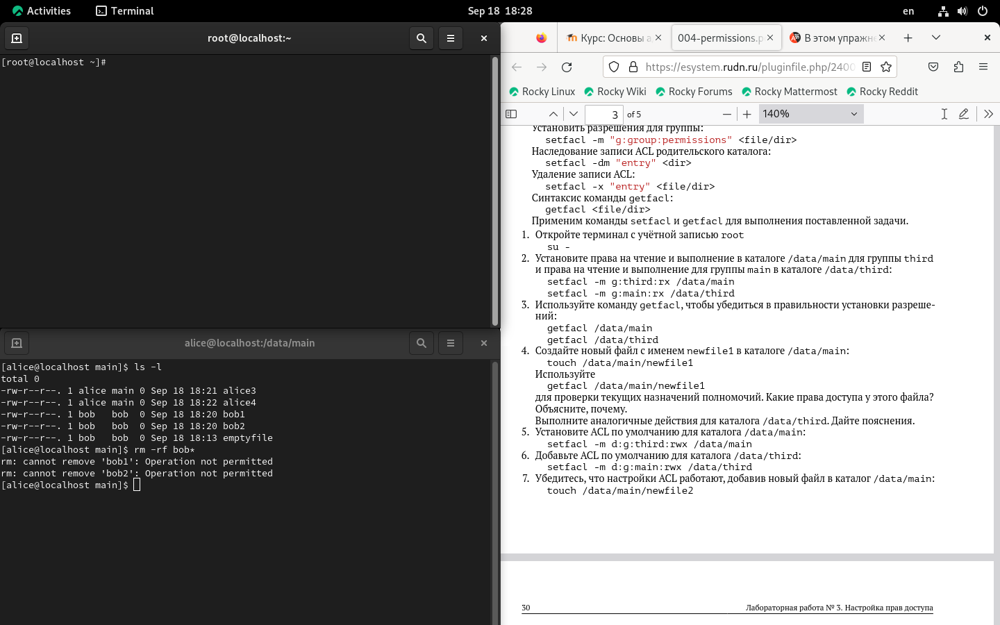

---
## Front matter
lang: ru-RU
title: Лабораторная работа №3
subtitle: настройка прав доступа
author:
  - Кхари жекка кализая арсе
institute:
  - Российский университет дружбы народов, Москва, Россия
  - Объединённый институт ядерных исследований, Дубна, Россия
date: 01 января 1970

## i18n babel
babel-lang: russian
babel-otherlangs: english

## Formatting pdf
toc: false
toc-title: Содержание
slide_level: 2
aspectratio: 169
section-titles: true
theme: metropolis
header-includes:
 - \metroset{progressbar=frametitle,sectionpage=progressbar,numbering=fraction}
---

# ЦЕЛЬ РАБОТЫ

## Цель работы

- Получить навыки о настройке прав доступа для разных пользователей в разных каталогов и файлов

# Управление базовыми разрешениями

# терминал под пользователем root

## команда su

# изменение владелцев каталогов

## комнада chgrp

# настройка разрешений 

## команда chmod

## команда chmod

# терминал под пользователем bob

## Проверка разрешений доступа

# Управление специальными разрешениями

# терминал под пользователем alice

## создание файлов

# терминал под пользователем bob

## удаление файлов пользователя alice 

## новые защищенные файлы

## новые защищенные файлы

## новые созданные файлы пользователем alice

## Показ атрибута sticky bit

# Управление расширенными разрешениями с использованием списков ACL

## Команада setfacl

## команада getfacl 

## создание примерный файл

## установление ACL

# Проверка работы ACL

# Результаты

- используя команду chgrp изменить группу владелцев можно
- chmod изпользуется чтобы дать права доступа
- sticky bit защищает файлы от изменений другими пользователями 
- setfacl даёт специяльные права доступа

