---
## Front matter
title: "Шаблон отчёта по лабораторной работе"
subtitle: "Простейший вариант"
author: "Дмитрий Сергеевич Кулябов"

## Generic otions
lang: ru-RU
toc-title: "Содержание"

## Bibliography
bibliography: bib/cite.bib
csl: pandoc/csl/gost-r-7-0-5-2008-numeric.csl

## Pdf output format
toc: true # Table of contents
toc-depth: 2
lof: true # List of figures
lot: true # List of tables
fontsize: 12pt
linestretch: 1.5
papersize: a4
documentclass: scrreprt
## I18n polyglossia
polyglossia-lang:
  name: russian
  options:
	- spelling=modern
	- babelshorthands=true
polyglossia-otherlangs:
  name: english
## I18n babel
babel-lang: russian
babel-otherlangs: english
## Fonts
mainfont: IBM Plex Serif
romanfont: IBM Plex Serif
sansfont: IBM Plex Sans
monofont: IBM Plex Mono
mathfont: STIX Two Math
mainfontoptions: Ligatures=Common,Ligatures=TeX,Scale=0.94
romanfontoptions: Ligatures=Common,Ligatures=TeX,Scale=0.94
sansfontoptions: Ligatures=Common,Ligatures=TeX,Scale=MatchLowercase,Scale=0.94
monofontoptions: Scale=MatchLowercase,Scale=0.94,FakeStretch=0.9
mathfontoptions:
## Biblatex
biblatex: true
biblio-style: "gost-numeric"
biblatexoptions:
  - parentracker=true
  - backend=biber
  - hyperref=auto
  - language=auto
  - autolang=other*
  - citestyle=gost-numeric
## Pandoc-crossref LaTeX customization
figureTitle: "Рис."
tableTitle: "Таблица"
listingTitle: "Листинг"
lofTitle: "Список иллюстраций"
lotTitle: "Список таблиц"
lolTitle: "Листинги"
## Misc options
indent: true
header-includes:
  - \usepackage{indentfirst}
  - \usepackage{float} # keep figures where there are in the text
  - \floatplacement{figure}{H} # keep figures where there are in the text
---

# Цель работы

Здесь приводится формулировка цели лабораторной работы. Формулировки
цели для каждой лабораторной работы приведены в методических
указаниях.

Цель данного шаблона --- максимально упростить подготовку отчётов по
лабораторным работам.  Модифицируя данный шаблон, студенты смогут без
труда подготовить отчёт по лабораторным работам, а также познакомиться
с основными возможностями разметки Markdown.

# Задание

Здесь приводится описание задания в соответствии с рекомендациями
методического пособия и выданным вариантом.

# Теоретическое введение
                                                                              

Более подробно про Unix см. в [@tanenbaum_book_modern-os_ru; @robbins_book_bash_en; @zarrelli_book_mastering-bash_en; @newham_book_learning-bash_en].

# Выполнение лабораторной работы

я начал эту лабораторную работу откривая терминал и подключаяся к учётной записи root (рис. [-@fig:001     ]).

		su -

{#fig:001    width=70%}

Потом я создал каталог main и third в каталоге data (рис. [-@fig:002     ]).

		mkdir -p /data/main /data/third
  
{#fig:002    width=70%}

и затем я убедился что каталоги создались правильно и кто является владелцем (рис. [-@fig:003     ]).

		ls -l /data

{#fig:003    width=70%}

Потом я изменил владелцев этих каталогов с root на main и third (рис. [-@fig:004     ]).

		chgrp main /data/main
		chgrp third /data/third

{#fig:004    width=70%}

Дальше я еще раз посмотрел кто теперь является владелцем каталогов (рис. [-@fig:005     ]).

		ls -Al /data

{#fig:005    width=70%}

Потом я установил разрешения этих каталогов (рис. [-@fig:006     ]).

		chmod 770 /data/main
		chmod 770 /data/third

{#fig:006    width=70%}

Дальше я проверал еще раз разрешения (рис. [-@fig:007     ]).

		ls -l /data
 
{#fig:007    width=70%}

		

Потом я открыл другой терминал и подключился к учётной записи пользователя bob который я создал на прошлую лабораторную работу, его пароль - beta1234 (рис. [-@fig:008     ]).

		su - bob

{#fig:008    width=70%}

Дальше я попробовал переити в каталог data/main и создать файл emptyfile (рис. [-@fig:009     ]).

		cd /data/main
		touch emptyfile
		ls -Al

{#fig:009    width=70%}

я смог создать этот файл потому что все в группе main являются владелцами каталога main

Потои я еще раз открыл новый термирнал и подключился к учетной записи alice, её пароль - alfa1234 (рис. [-@fig:011     ]).

		su - alice

{#fig:011    width=70%}

Потом я перешел в каталог /data/main (рис. [-@fig:012   ]).

		cd /data/main
		
{#fig:012    width=70%}

Дальше я создал файлы alice1 и alice2 (рис. [-@fig:013     ]).

		touch alice1
		touch alice2
		ls -Al /data/main

{#fig:013    width=70%}

Потом я открыл новый терминал и подключился к учётной записи пользователя bob (рис. [-@fig:014     ]).

		su - bob

{#fig:014    width=70%}

Дальше я перешел в каталог /data/main (рис. [-@fig:015    ]).

		cd /data/main
		
{#fig:015    width=70%}

Потом я смотрел какие файлы там находятся (рис. [-@fig:016    ]).

		ls -l

{#fig:016    width=70%}

потом я удалил все файлы пользователя alice (рис. [-@fig:017    ]).

		rm -f alice*

{#fig:017    width=70%}

Потом я создал два файла с пользователем bob (bob1 и bob2) (рис. [-@fig:018    ]).

		touch bob1
		touch bob2

{#fig:018    width=70%}

потом в терминале под ползователем root я установил бит идентификатора группы для каталога /data/main, а также stiky-bit для разделяемого каталога группы (рис. [-@fig:018    ]).

		chmod g+s,o+t /data/main

{#fig:019    width=70%}

Потом в терминале под пользователем alice я создал в каталоге /data/main файлы alice3 и alice 4 (рис. [-@fig:020    ]).

		touch alice3
		touch alice4
		ls -l

{#fig:020    width=70%}

Дальше в терминале под пользователем alice я попробовал удалить файлы bob1 и bob2 (рис. [-@fig:021    ]).

		rm -rf bob*

{#fig:021    width=70%}

конечно это действие запрещено потому что у alicа нет доступа на эти файлы

Потом еще раз в терминале под пользователем root я установил права на чтение и выполнение в каталоге /data/main для группы third и права на чтение и выполнение для группы main в каталоге /data/third (рис. [-@fig:022    ]).

		setfacl -m g:third:rx /data/main
		setfacl -m g:main:rx /data/third

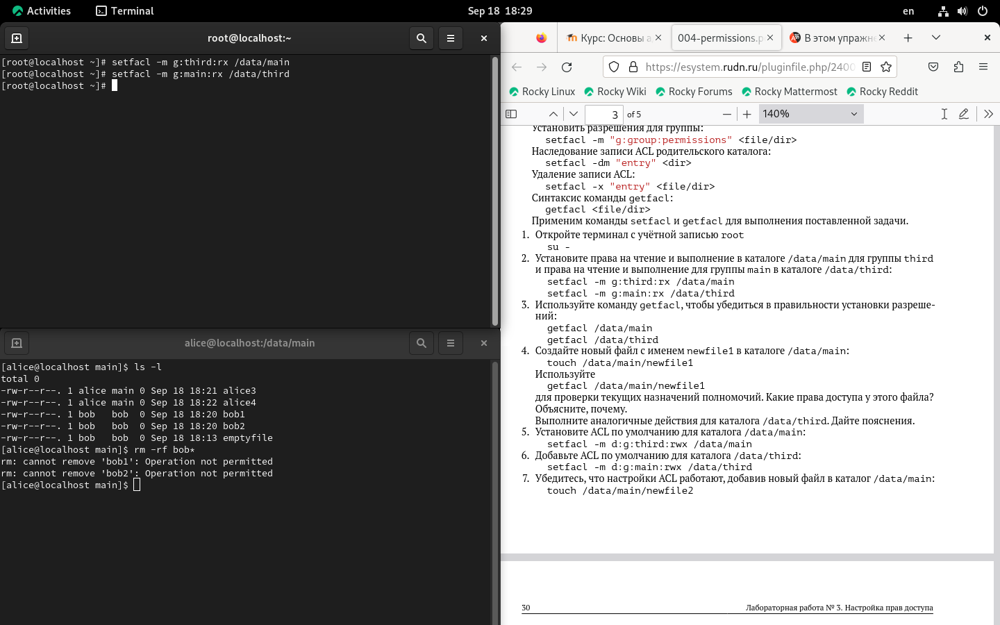{#fig:022    width=70%}

Потом я создал файл newfile1 в каталоге /data/main (рис. [-@fig:023    ]).

		touch /data/main/newfile1

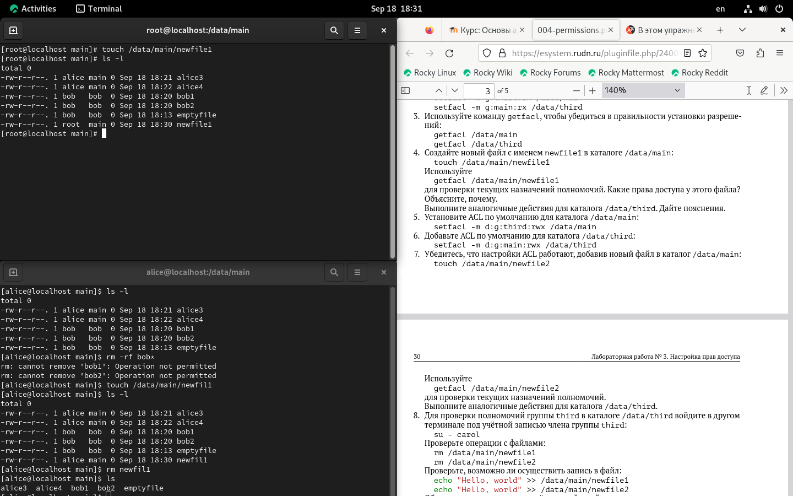{#fig:023    width=70%}

Потом я проверял текущие назначения полномочий (рис. [-@fig:025    ]).

		getfacl /data/main/newfile1
		
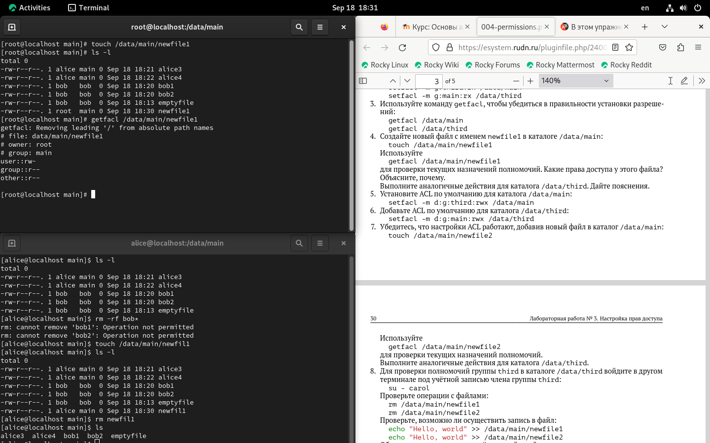{#fig:025    width=70%}

		
Потом я повторил дествия в каталоге third (рис. [-@fig:026    ]).

		touch /data/main/newfile1
		getfacl /data/main/newfile1
		
		
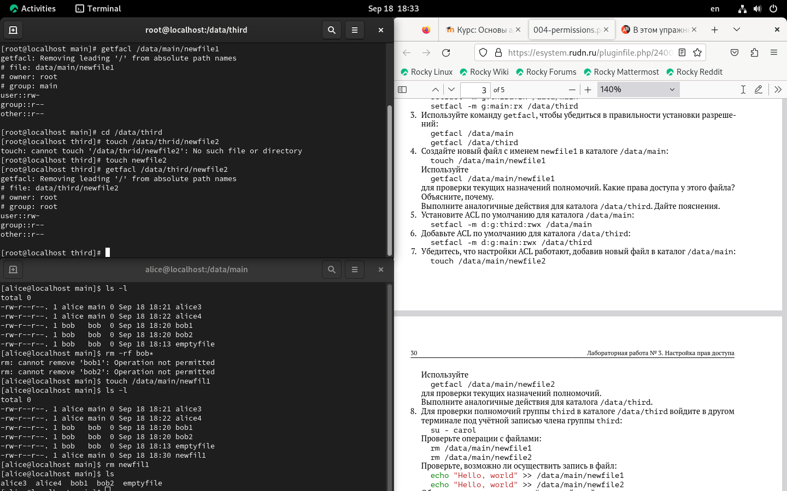{#fig:026    width=70%}

Потом я установил ACL по умолчанию для каталога /data/main (рис. [-@fig:027    ]).

		setfacl -m d:g:third:rwx /data/main

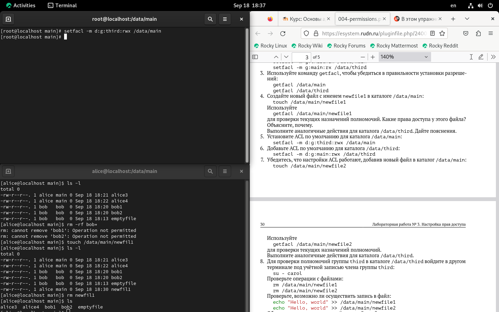{#fig:027    width=70%}

Дальше установил ACL для каталога /data/third (рис. [-@fig:028    ]).
		
		setfacl -m d:g:main:rwx /data/third

{#fig:028    width=70%}
		
Потом я создал файл newfile2 в каталоге /data/main

		touch /data/main/newfile2

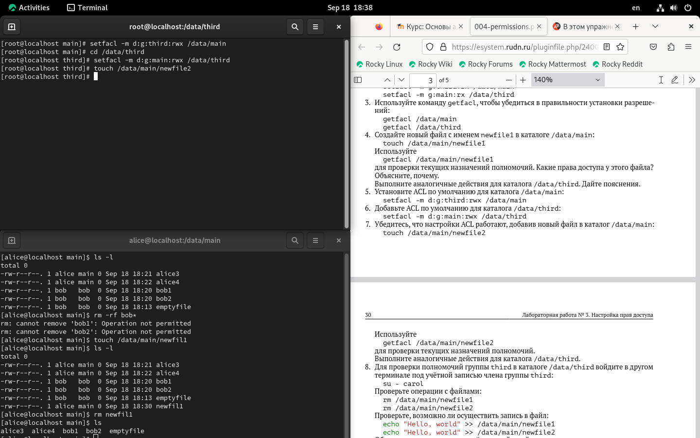{#fig:029    width=70%}

И использовал getfacl для проверки (рис. [-@fig:030    ]).
		
		getfacl /data/main/newfile2

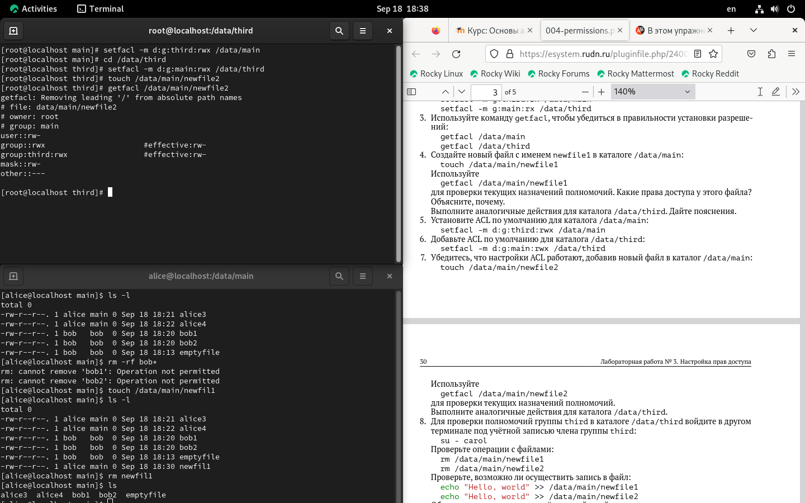{#fig:030    width=70%}

Потом я сделал еще раз те дейтсвия для каталога data/third (рис. [-@fig:031    ]) (рис. [-@fig:032    ]).

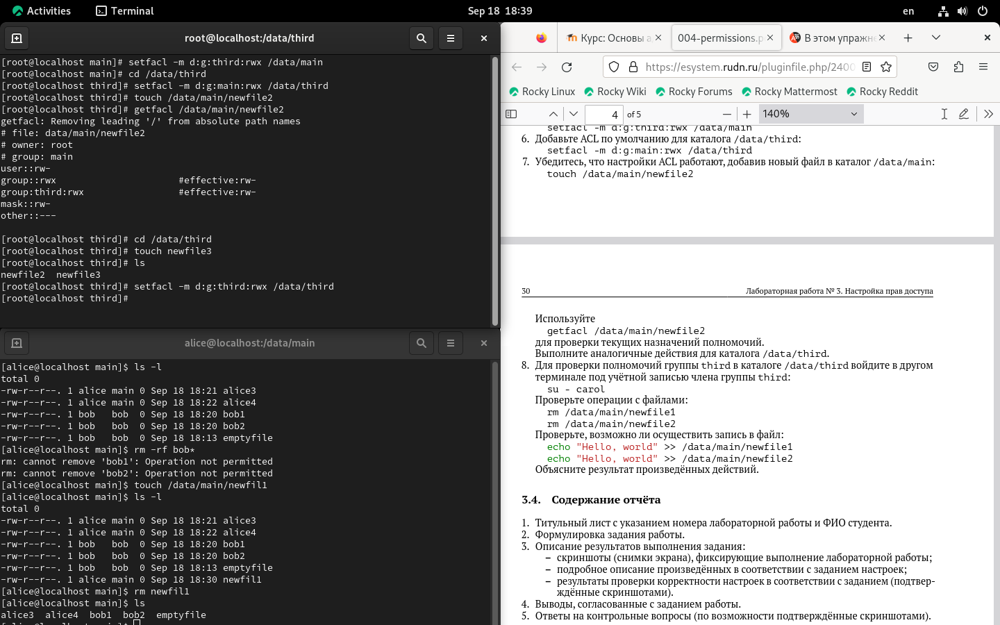{#fig:031    width=70%}

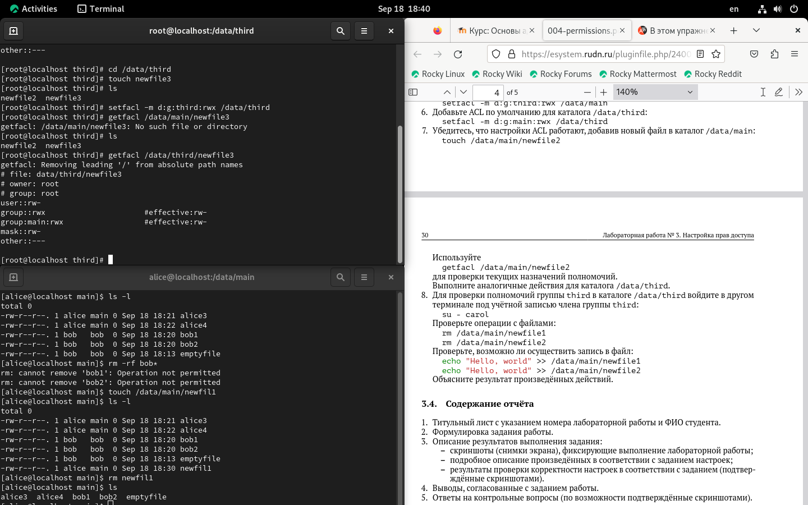{#fig:032    width=70%}

Потом я подключился к учётной записи пользователя carol (пароль - gama1234) (рис. [-@fig:034    ]).

		su - carol

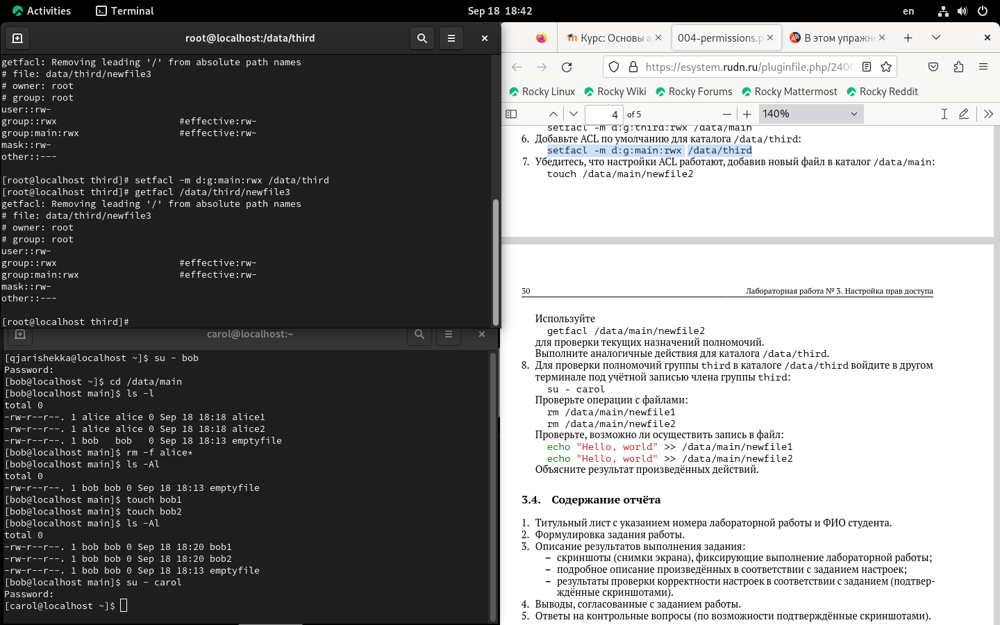{#fig:034    width=70%}

Потом я попробовал удалить файлы newfile 1 и newfile2  (рис. [-@fig:035    ]).

		rm /data/main/newfile1
		rm /data/main/newfile2

	
{#fig:035    width=70%}

Потом я попробовал другую команду в терминале (рис. [-@fig:036    ]).

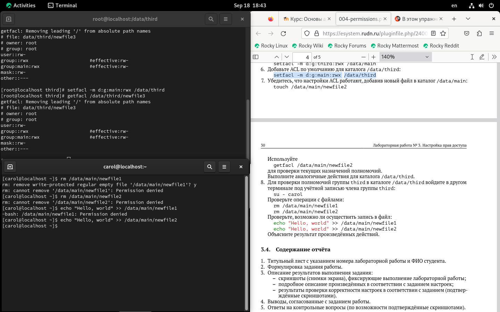{#fig:036    width=70%}

пользователь carol не может изменять ничего в каталогах потому что у неё нет доступа

Контрольные вопросы
1. Как следует использовать команду chown, чтобы установить владельца группы для
файла? Приведите пример.

2. С помощью какой команды можно найти все файлы, принадлежащие конкретному
пользователю? Приведите пример.

3. Как применить разрешения на чтение, запись и выполнение для всех файлов в каталоге
/data для пользователей и владельцев групп, не устанавливая никаких прав для
других? Приведите пример.

4. Какая команда позволяет добавить разрешение на выполнение для файла, который
необходимо сделать исполняемым?

5. Какая команда позволяет убедиться, что групповые разрешения для всех новых фай-
лов, создаваемых в каталоге, будут присвоены владельцу группы этого каталога?
Приведите пример.

6. Необходимо, чтобы пользователи могли удалять только те файлы, владельцами ко-
торых они являются, или которые находятся в каталоге, владельцами которого они
являются. С помощью какой команды можно это сделать? Приведите пример.

7. Какая команда добавляет ACL, который предоставляет членам группы права доступа
на чтение для всех существующих файлов в текущем каталоге?

8. Что нужно сделать для гарантии того, что члены группы получат разрешения на чтение
для всех файлов в текущем каталоге и во всех его подкаталогах, а также для всех файлов,
которые будут созданы в этом каталоге в будущем? Приведите пример.

9. Какое значение umask нужно установить, чтобы «другие» пользователи не получали
какие-либо разрешения на новые файлы? Приведите пример

# Выводы

В этой лабораторной работе мы смотрели как работать с другими пользователями, как давать им права доступа используя их группы. также мы смотрели как изпользовать другие команды как setfacl, getfacl 

# Список литературы{.unnumbered}

::: {#refs}
:::
