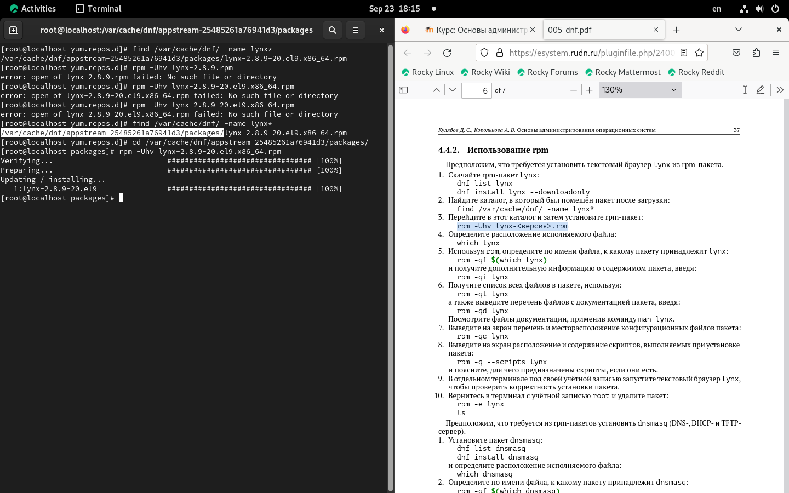

---
## Front matter
lang: ru-RU
title: Прецентация лабораторной работы № 4.
subtitle: Работа с программными пакетами
author:
  - Кхари Жекка Кализая Арсе.
institute:
  - Российский университет дружбы народов, Москва, Россия

date: 28 сентябра 2024

## i18n babel
babel-lang: russian
babel-otherlangs: english

## Formatting pdf
toc: false
toc-title: Содержание
slide_level: 2
aspectratio: 169
section-titles: true
theme: metropolis
header-includes:
 - \metroset{progressbar=frametitle,sectionpage=progressbar,numbering=fraction}
---

# Последовательность выполнения работы

# Работа с репозиториями

## консоль под пользователя root

:::::::::::::: {.columns align=center}
::: {.column width="70%"}

 

:::
::::::::::::::

## содержание файлов .repos

- cd /etc/yum.repos.d
- ls
- cat название_репозитория.repo

:::::::::::::: {.columns align=center}
::: {.column width="60%"}

:::
::::::::::::::

## список репозиториев

- dnf repolist

:::::::::::::: {.columns align=center}
::: {.column width="60%"}

:::
::::::::::::::

## список пакетов "user"

- dnf search user

:::::::::::::: {.columns align=center}
::: {.column width="60%"}

:::
::::::::::::::

## установка nmap

- dnf search nmap
- dnf info nmap
- dnf install nmap
- dnf install nmap\*

:::::::::::::: {.columns align=center}
::: {.column width="60%"}

:::
::::::::::::::

## удаление nmap

- dnf remove nmap
- dnf remove nmap\*

:::::::::::::: {.columns align=center}
::: {.column width="60%"}

:::
::::::::::::::

## RPM Development Tools

- dnf groups list
- LANG=C dnf groups list
- dnf groups info "RPM Development Tools"
- dnf groupinstall "RPM Development Tools"

:::::::::::::: {.columns align=center}
::: {.column width="60%"}

:::
::::::::::::::

## удаление RPM Development Tools

- dnf groupremove "RPM Development Tools"

:::::::::::::: {.columns align=center}
::: {.column width="60%"}

:::
::::::::::::::

## история команды dnf

- dnf history

:::::::::::::: {.columns align=center}
::: {.column width="60%"}

:::
::::::::::::::

# Использование rpm

## загрузка пакета lynx

- dnf list lynx
- dnf install lynx --downloadonly

:::::::::::::: {.columns align=center}
::: {.column width="60%"}

:::
::::::::::::::

## пойск пакета lynx

- find /var/cache/dnf/ -name lynx*

:::::::::::::: {.columns align=center}
::: {.column width="60%"}

:::
::::::::::::::

## установка пакета lynx

- rpm -Uhv lynx-2.8.9-20.el9.x86_64.rpm

:::::::::::::: {.columns align=center}
::: {.column width="60%"}

:::
::::::::::::::

## расположение исполняемого файла

- which lynx

:::::::::::::: {.columns align=center}
::: {.column width="60%"}

:::
::::::::::::::

## к какому пакету принадлежит lynx? 

- rpm -qf $(which lynx)
- rpm -qi lynx		(для дополнительной иформации)

:::::::::::::: {.columns align=center}
::: {.column width="60%"}

:::
::::::::::::::

## Список всех файлов в пакете
- rpm -ql lynx

:::::::::::::: {.columns align=center}
::: {.column width="60%"}

:::
::::::::::::::

## документация

- rpm -qd lynx

:::::::::::::: {.columns align=center}
::: {.column width="60%"}

:::
::::::::::::::

## конфигурация

- rpm -qc lynx

:::::::::::::: {.columns align=center}
::: {.column width="60%"}

:::
::::::::::::::

## скрипты 

- rpm -q --scripts lynx

:::::::::::::: {.columns align=center}
::: {.column width="60%"}

:::
::::::::::::::

## запуск lynx

- lynx 

:::::::::::::: {.columns align=center}
::: {.column width="60%"}

:::
::::::::::::::

## удаление пакета

- rpm -e lynx
- ls

:::::::::::::: {.columns align=center}
::: {.column width="60%"}

:::
::::::::::::::

# Примерная ситуация для показа работы rpm

## загрузка пакета dnsmasq

- dnf list dnsmasq
- dnf install dnsmasq

:::::::::::::: {.columns align=center}
::: {.column width="60%"}

:::
::::::::::::::

## расположение исполняемого файла

- which dnsmasq

:::::::::::::: {.columns align=center}
::: {.column width="60%"}

:::
::::::::::::::

## файл содержащий пакет dnsmasq
- rpm -qf $(which dnsmasq)

:::::::::::::: {.columns align=center}
::: {.column width="60%"}

:::
::::::::::::::

## дополнительная информация 

- rpm -qi dnsmasq

:::::::::::::: {.columns align=center}
::: {.column width="60%"}

:::
::::::::::::::

## писок всех файлов в пакете 

- rpm -ql dnsmasq

:::::::::::::: {.columns align=center}
::: {.column width="60%"}

:::
::::::::::::::

## документация 

- rpm -qd dnsmasq

:::::::::::::: {.columns align=center}
::: {.column width="60%"}

:::
::::::::::::::

## конфигурационные файлы

- rpm -qc dnsmasq

:::::::::::::: {.columns align=center}
::: {.column width="60%"}

:::
::::::::::::::

## скрипты 

- rpm -q --scripts dnsmasq

:::::::::::::: {.columns align=center}
::: {.column width="60%"}

:::
::::::::::::::

## удаление пакета 

- rpm -e dnsmask

:::::::::::::: {.columns align=center}
::: {.column width="60%"}

:::
::::::::::::::

