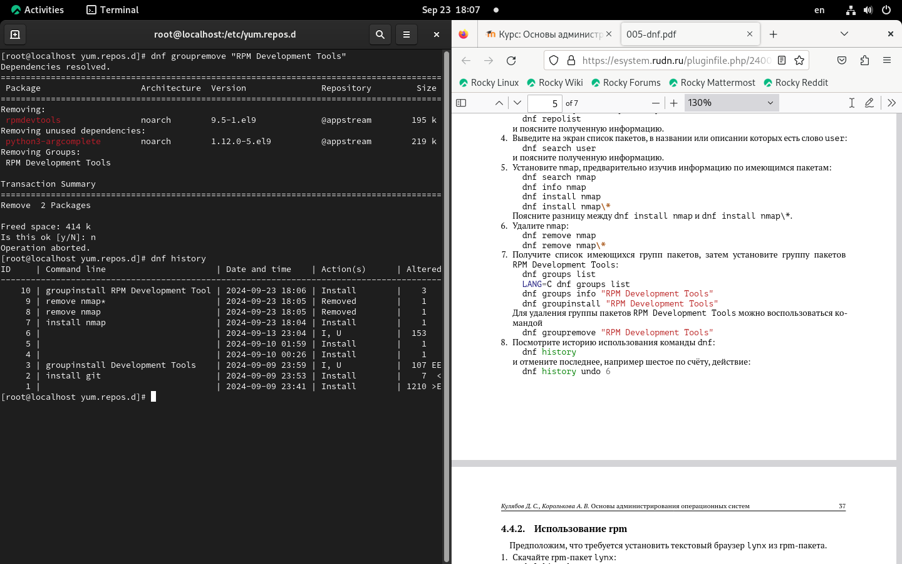
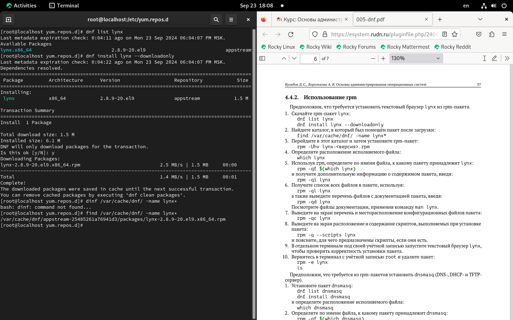

---
## Front matter
title: "Шаблон отчёта по лабораторной работе №4"
subtitle: "Работа с программными пакетами"
author: "Кхари Жекка Кализая Арсе"

## Generic otions
lang: ru-RU
toc-title: "Содержание"

## Bibliography
bibliography: bib/cite.bib
csl: pandoc/csl/gost-r-7-0-5-2008-numeric.csl

## Pdf output format
toc: true # Table of contents
toc-depth: 2
lof: true # List of figures
lot: true # List of tables
fontsize: 12pt
linestretch: 1.5
papersize: a4
documentclass: scrreprt
## I18n polyglossia
polyglossia-lang:
  name: russian
  options:
	- spelling=modern
	- babelshorthands=true
polyglossia-otherlangs:
  name: english
## I18n babel
babel-lang: russian
babel-otherlangs: english
## Fonts
mainfont: IBM Plex Serif
romanfont: IBM Plex Serif
sansfont: IBM Plex Sans
monofont: IBM Plex Mono
mathfont: STIX Two Math
mainfontoptions: Ligatures=Common,Ligatures=TeX,Scale=0.94
romanfontoptions: Ligatures=Common,Ligatures=TeX,Scale=0.94
sansfontoptions: Ligatures=Common,Ligatures=TeX,Scale=MatchLowercase,Scale=0.94
monofontoptions: Scale=MatchLowercase,Scale=0.94,FakeStretch=0.9
mathfontoptions:
## Biblatex
biblatex: true
biblio-style: "gost-numeric"
biblatexoptions:
  - parentracker=true
  - backend=biber
  - hyperref=auto
  - language=auto
  - autolang=other*
  - citestyle=gost-numeric
## Pandoc-crossref LaTeX customization
figureTitle: "Рис."
tableTitle: "Таблица"
listingTitle: "Листинг"
lofTitle: "Список иллюстраций"
lotTitle: "Список таблиц"
lolTitle: "Листинги"
## Misc options
indent: true
header-includes:
  - \usepackage{indentfirst}
  - \usepackage{float} # keep figures where there are in the text
  - \floatplacement{figure}{H} # keep figures where there are in the text
---

# Цель работы

Здесь приводится формулировка цели лабораторной работы. Формулировки
цели для каждой лабораторной работы приведены в методических
указаниях.

Цель данного шаблона --- максимально упростить подготовку отчётов по
лабораторным работам.  Модифицируя данный шаблон, студенты смогут без
труда подготовить отчёт по лабораторным работам, а также познакомиться
с основными возможностями разметки Markdown.

# Задание

Здесь приводится описание задания в соответствии с рекомендациями
методического пособия и выданным вариантом.

# Теоретическое введение

Более подробно про Unix см. в [@tanenbaum_book_modern-os_ru; @robbins_book_bash_en; @zarrelli_book_mastering-bash_en; @newham_book_learning-bash_en].

# Выполнение лабораторной работы

Сначала, я открыл терминал и перешел в режим работы суперпользователя (рис. [-@fig:001     ]).
		
		-su

{#fig:001    width=70%}

Потом я перешел в каталог /etc/yum.repos.d и читал все файлы с именами repos ( от рис. [-@fig:002-1     ] до рис. [-@fig:002-4 ]).

		cd /etc/yum.repos.d
		ls
		cat название_репозитория.repo

{#fig:002-1    width=70%}

{#fig:002-2    width=70%}

{#fig:002-3    width=70%}

{#fig:002-4    width=70%}

Дальше я смотрел список репозиториев  (рис. [-@fig:003     ]).

		dnf search user

{#fig:003    width=70%}

Потом я установил nmap ( от рис. [-@fig:005-1     ]  до рис. [-@fig:005-4     ]).

		dnf search nmap
		dnf info nmap
		dnf install nmap
		dnf install nmap\*

{#fig:005-1    width=70%}

{#fig:005-2    width=70%}

{#fig:005-3    width=70%}

{#fig:005-4    width=70%}

команды dnf install nmap\* и dnf install nmap отличаются в чем, что первый устанавливает все пакеты у которых есть nmap в имени, а второй только тот пакет, которым называется nmap

Потом я удалил nmap  ( от рис. [-@fig:006-1     ] до [-@fig:006-4     ] ).

		dnf remove nmap
		dnf remove nmap\*
		
{#fig:006-1    width=70%}

{#fig:006-2    width=70%}

{#fig:006-3    width=70%}

{#fig:006-4  width=70%}

Потом я получил список имеющихся групп пакетов и установил группу пакетов RPM Development tools  (от рис. [-@fig:007-1     ] до рис. [-@fig:007-5     ]).

		dnf groups list
		LANG=C dnf groups list
		dnf groups info "RPM Development Tools"
		dnf groupinstall "RPM Development Tools"
		
{#fig:007-1    width=70%}

{#fig:007-2    width=70%}

{#fig:007-3    width=70%}

{#fig:007-4    width=70%}

{#fig:007-5    width=70%}

Потом я удалил RPM Developments Tools (рис. [-@fig:007-6     ]).

		dnf groupremove "RPM Development Tools"

{#fig:007-6    width=70%}
		
		
		
Потом я смотрел историю команд  (рис. [-@fig:008-1     ]).

		dnf history

{#fig:008-1    width=70%}

Затем выполнил следующую команду  (рис. [-@fig:008-2     ]).

		dnf history undo 6

{#fig:008-2    width=70%}

Потом я установил текстовый браузер lynx (рис. [-@fig:009-1     ] - рис. [-@fig:009-3     ]).

		dnf list lynx
		dnf install lynx --downloadonly

{#fig:009-1    width=70%}

{#fig:009-2    width=70%}

{#fig:009-3    width=70%}

Потом я искал загруженный пакет  (рис. [-@fig:010     ]).

		find /var/cache/dnf/ -name lynx*

{#fig:010    width=70%}

Затем я установил пакет lynx (рис. [-@fig:011     ]).

		rpm -Uhv lynx-2.8.9-20.el9.x86_64.rpm

{#fig:011    width=70%}

Потом я определил расположение исполняемого файла lynx (рис. [-@fig:012     ]).

		which lynx

{#fig:012   width=70%}

Потом я определил по имени файла, к какому пакету принадлежит lynx  (рис. [-@fig:013     ]).

		rpm -qf $(which lynx)

{#fig:013    width=70%}

и чтобы смотрет дополнительную информацию (рис. [-@fig:014     ]) я введил команду  : 

{#fig:014    width=70%}

Потом чтобы получил список всех файлов в пакете я использовал опцию -ql  (рис. [-@fig:015     ]).

		rpm -ql lynx

{#fig:015    width=70%}

Также я получил перечень файлов с документацей пакета с помощью опции -qd (рис. [-@fig:016     ]).

		rpm -qd lynx

{#fig:016    width=70%}

Чтобы смотреть конфигурацию пакета я исползовал опцию -qc  (рис. [-@fig:017     ]).

		rpm -qc lynx

{#fig:017    width=70%}

Потом я получил расположение и содержание скриптов с помощью опции -q --scripts (рис. [-@fig:018     ]).

		rpm -q --scripts lynx

{#fig:018    width=70%}

в моем случае не былы скрипты

Потом я открыл другой терминал и запускал lynx (рис. [-@fig:019     ]).

		lynx

{#fig:019    width=70%}

Потом я вернулся в предыдующий терминал и удалил lynx (рис. [-@fig:020     ]).

		rpm -e lynx
		ls

{#fig:020    width=70%}

Потом я начал установить пакет dnsmasq. для этого я выполнил 2 команду (рис. [-@fig:021     ]).

		dnf list dnsmasq
		dnf install dnsmasq

{#fig:021    width=70%}

Потом я определил расположение пакета (рис. [-@fig:021-3     ]).

		which dnsmasq

{#fig:021-3    width=70%}

Потом я опеределил к какому пакету принадлежит dnsmasq (рис. [-@fig:022-1     ]).

		rpm -qf $(which dnsmasq)

{#fig:022-1    width=70%}

Дальше я получил дополнительную информацию (рис. [-@fig:022-2     ]).

		rpm -qi dnsmasq

{#fig:022-2    width=70%}

Потом я получил список всех файлов в пакете (рис. [-@fig:023-1     ]).

		rpm -ql dnsmasq

{#fig:023-1    width=70%}

и также я получил перечень файлов с документацией пакета (рис. [-@fig:023-2     ]).

		rpm -qd dnsmasq

{#fig:023-2    width=70%}

Потом я смотрел перечень и месторасположение конфигурационных файлов пакета (рис. [-@fig:024     ]).

		rpm -qc dnsmasq

{#fig:024    width=70%}

Дальше я определил расположение и содержание скриптов пакета (рис. [-@fig:025     ]).

		rpm -q --scripts dnsmasq

{#fig:025    width=70%}

Они используются чтобы установить дополнительные пакеты при определенных случаях

Дальше я удалил пакет  (рис. [-@fig:026     ]).

		rpm -e dnsmask

{#fig:026    width=70%}

Контрольные вопросы

1. Какая команда позволяет вам искать пакет rpm, содержащий файл useradd?
2. Какие команды вам нужно использовать, чтобы показать имя группы dnf, которая
содержит инструменты безопасности и показывает, что находится в этой группе?
3. Какая команда позволяет вам установить rpm, который вы загрузили из Интернета
и который не находится в репозиториях?
4. Вы хотите убедиться, что пакет rpm, который вы загрузили, не содержит никакого
опасного кода сценария. Какая команда позволяет это сделать?
5. Какая команда показывает всю документацию в rpm?
6. Какая команда показывает, какому пакету rpm принадлежит файл?
При ответах на контрольные вопросы рекомендуется ознакомиться с информацией
из [1—4].

# Выводы

В этой лабораторной работе я изучал работу с программными пакетами и менеджерами пакетов, я смотрел функцию утилита dnf и их опции для загрузки установке и удаления пакетов и их соответственых скриптов.

# Список литературы{.unnumbered}

::: {#refs}
:::
