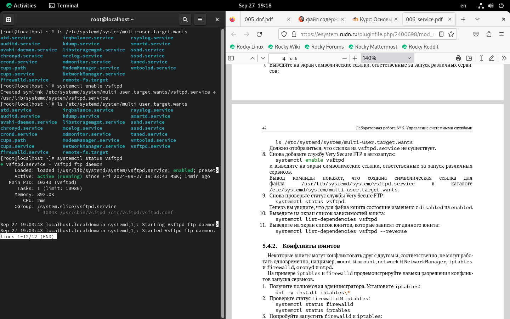
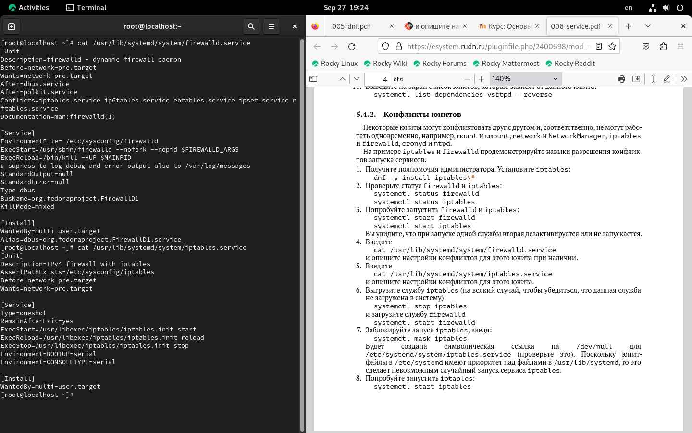

---
## Front matter
title: "Шаблон отчёта по лабораторной работе №5"
subtitle: "Управление системными службами"
author: "Кхари жекка кализая арсе"

## Generic otions
lang: ru-RU
toc-title: "Содержание"

## Bibliography
bibliography: bib/cite.bib
csl: pandoc/csl/gost-r-7-0-5-2008-numeric.csl

## Pdf output format
toc: true # Table of contents
toc-depth: 2
lof: true # List of figures
lot: true # List of tables
fontsize: 12pt
linestretch: 1.5
papersize: a4
documentclass: scrreprt
## I18n polyglossia
polyglossia-lang:
  name: russian
  options:
	- spelling=modern
	- babelshorthands=true
polyglossia-otherlangs:
  name: english
## I18n babel
babel-lang: russian
babel-otherlangs: english
## Fonts
mainfont: IBM Plex Serif
romanfont: IBM Plex Serif
sansfont: IBM Plex Sans
monofont: IBM Plex Mono
mathfont: STIX Two Math
mainfontoptions: Ligatures=Common,Ligatures=TeX,Scale=0.94
romanfontoptions: Ligatures=Common,Ligatures=TeX,Scale=0.94
sansfontoptions: Ligatures=Common,Ligatures=TeX,Scale=MatchLowercase,Scale=0.94
monofontoptions: Scale=MatchLowercase,Scale=0.94,FakeStretch=0.9
mathfontoptions:
## Biblatex
biblatex: true
biblio-style: "gost-numeric"
biblatexoptions:
  - parentracker=true
  - backend=biber
  - hyperref=auto
  - language=auto
  - autolang=other*
  - citestyle=gost-numeric
## Pandoc-crossref LaTeX customization
figureTitle: "Рис."
tableTitle: "Таблица"
listingTitle: "Листинг"
lofTitle: "Список иллюстраций"
lotTitle: "Список таблиц"
lolTitle: "Листинги"
## Misc options
indent: true
header-includes:
  - \usepackage{indentfirst}
  - \usepackage{float} # keep figures where there are in the text
  - \floatplacement{figure}{H} # keep figures where there are in the text
---

# Цель работы

Получить навыки управления системными службами операционной системы посредством systemd.

# Задание

1. Выполните основные операции по запуску (останову), определению статуса, добавлению (удалению) в автозапуск и пр. службы Very Secure FTP (раздел 5.4.1).
2. Продемонстрируйте навыки по разрешению конфликтов юнитов для служб
firewalld и iptables (раздел 5.4.2).
3. Продемонстрируйте навыки работы с изолированными целями (разделы 5.4.3, 5.4.4).

# Теоретическое введение

Более подробно про Unix см. в [@tanenbaum_book_modern-os_ru; @robbins_book_bash_en; @zarrelli_book_mastering-bash_en; @newham_book_learning-bash_en].

# Выполнение лабораторной работы

Сначала я открыл терминал под пользователем root (рис. [-@fig:001    ]).

		su -

{#fig:001		 width=70%}

Потом я смотрел статус службы Very Secure FTP (рис. [-@fig:002    ]).

		systemctl status vsftpd

{#fig:002		width=70%}

но команда вернула сообщение о том, что служба не установлена.

Затем я установил службу  (рис. [-@fig:003    ]).

		dnf -y install vsftpd

{#fig:003 		width=70%}

Потом я запустил службу (рис. [-@fig:004    ]).

		systemctl start vsftpd

{#fig:004 		width=70%}

Дальше я еще раз проверил статус службы (рис. [-@fig:005    ]).

		systemctl status vsftpd

{#fig:005 		width=70%}

потом я включил автузапуск службы Very Secure FTP с помощью команды и смотрел её статус, потом я выключил автозапуск службы и еще раз смотрел её статус (рис. [-@fig:006-1    ]) и (рис. [-@fig:006-2    ]).

		systemctl enable vsftpd

{#fig:006-1 		width=70%}

{#fig:006-2 		width=70%}

потом я смотрел список служб, которые при запуске запускаются самостоятельно (рис. [-@fig:007    ]).

		ls /etc/systemd/system/multi-user.target.wants

{#fig:007 		width=70%}

Затем я еще раз добавил службу Very Secure FTP в автозапуск (рис. [-@fig:008    ]). и еще раз смотрел список служб и тогда там появилась служба Very Secure FTP

		systemctl enable vsftpd
		ls /etc/systemd/system/multi-user.target.wants

{#fig:008 		width=70%}

Потом я еще раз смотрел статус службы Very Secure FTP (рис. [-@fig:009    ]).

{#fig:009 		width=70%}

Дальше я смотрел список зависимостей юнита (рис. [-@fig:010    ]).

		systemctl list-dependencies vsftpd
 
{#fig:010 		width=70%}

И потом я смотрел список юнитов, которые зависят от данного юнита (рис. [-@fig:011    ]).

		systemctl list-dependencies vsftpd --reverse

{#fig:011 		width=70%}

Потом я рассмотрел конфликты юнитов. Для этого, я получил полномочия администратора и установил iptables (рис. [-@fig:012    ]).

		dnf -y install iptables\*

{#fig:012		width=70%}

Дальше я проверил статус firewalld и iptables (рис. [-@fig:013    ]).

		systemctl status firewalld
		systemctl status iptables

{#fig:013 		width=70%}

Потом я попробовал запустить firewalld и iptables (рис. [-@fig:014-1    ]).

		systemctl start firewalld
		systemctl start iptables

{#fig:014-1 		width=70%}

Затем я проверил статус юнитов и осознал что эти два юнита не могут запускаться одновременно. (рис. [-@fig:014-2    ]).

		systemctl status firewalld
		systemctl status iptables

{#fig:014-2 		width=70%}

Потом я ввел следующую команду (рис. [-@fig:015    ]).

		cat /usr/lib/systemd/system/firewalld.service

{#fig:015 		width=70%}

И также я смотрел настройку для iptables (рис. [-@fig:016    ]).

		cat /usr/lib/systemd/system/iptables.service
		
{#fig:016 		width=70%}

Затем я остановил службу iptables и запустил firewalld (рис. [-@fig:017    ]).

		systemctl stop iptables
		systemctl start firewalld
		
{#fig:017 		width=70%}

Потом я заблокировал запуск iptables  (рис. [-@fig:018    ]).

		systemctl mask iptables

{#fig:018 		width=70%}

Затем я попробовал запустить службу iptables (рис. [-@fig:019    ]).

		systemctl start iptables

{#fig:019 		width=70%}

Также я попытался добавить iptables в автозапуск (рис. [-@fig:020    ]).

		systemctl enable iptables

{#fig:020 		width=70%}

Потом я получил список всех активных загруженных целей (рис. [-@fig:021    ]).

		systemctl --type=target

{#fig:021 		width=70%}

Потом я получил список всех целей (рис. [-@fig:022    ]).

		systemctl --type=target --all

{#fig:022 		width=70%}

потом я получил полномочия администратора и перешел в каталог systemd и получил список всех целей которые можно изолировать (рис. [-@fig:023    ]).

		cd /usr/lib/systemd/system
		grep Isolate *.target
		
{#fig:023 		width=70%}

Потом я пепеключил операционную систему в режим восстановления (рис. [-@fig:024    ]).

		systemctl isolate rescue.target
		
{#fig:024 		width=70%}
		
Потом я написал пароль root и потом перезапустил операционную систему 

		systemctl isolate reboot.target

Дальше я получил цель установленную по умолчанию (рис. [-@fig:026    ]).

		systemctl get-default

{#fig:026 		width=70%}

Потом я изменил ту цель с помощью команды (рис. [-@fig:027    ]).

		systemctl set-default multi-user.target

{#fig:027 		width=70%}

Это делает что система загружается в текстом режиме 

Затем я еще раз изменил ту цель  (рис. [-@fig:028    ]).

		systemctl set-default graphical.target

{#fig:028 		width=70%}

5.6. Контрольные вопросы

1. Что такое юнит (unit)? Приведите примеры.

2. Какая команда позволяет вам убедиться, что цель больше не входит в список автома-
тического запуска при загрузке системы?

3. Какую команду вы должны использовать для отображения всех сервисных юнитов,
которые в настоящее время загружены?
4. Как создать потребность (wants) в сервисе?
5. Как переключить текущее состояние на цель восстановления (rescue target)?
6. Поясните причину получения сообщения о том, что цель не может быть изолирована.
7. Вы хотите отключить службу systemd, но, прежде чем сделать это, вы хотите узнать,
какие другие юниты зависят от этой службы. Какую команду вы бы использовали?
При ответах на контрольные вопросы рекомендуется ознакомиться с информацией
из [1–3].

# Выводы

Здесь кратко описываются итоги проделанной работы.

# Список литературы{.unnumbered}

::: {#refs}
:::
