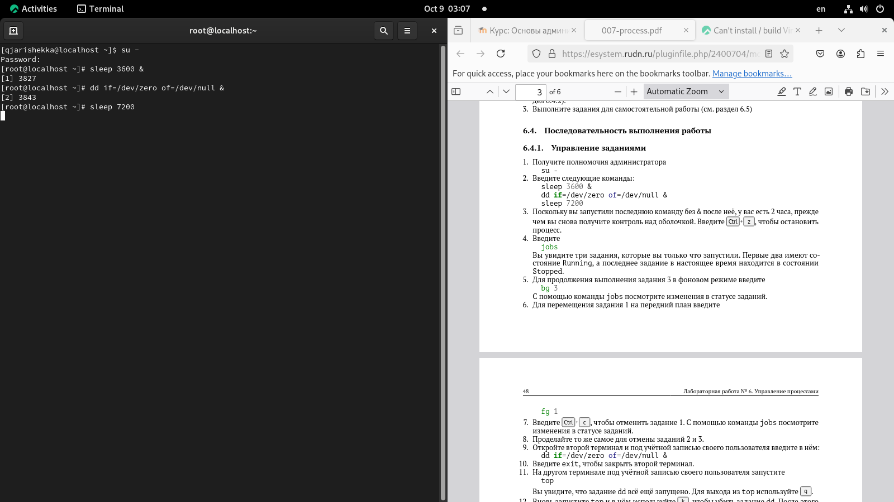
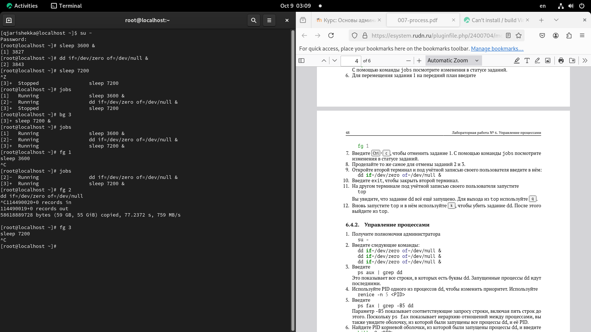
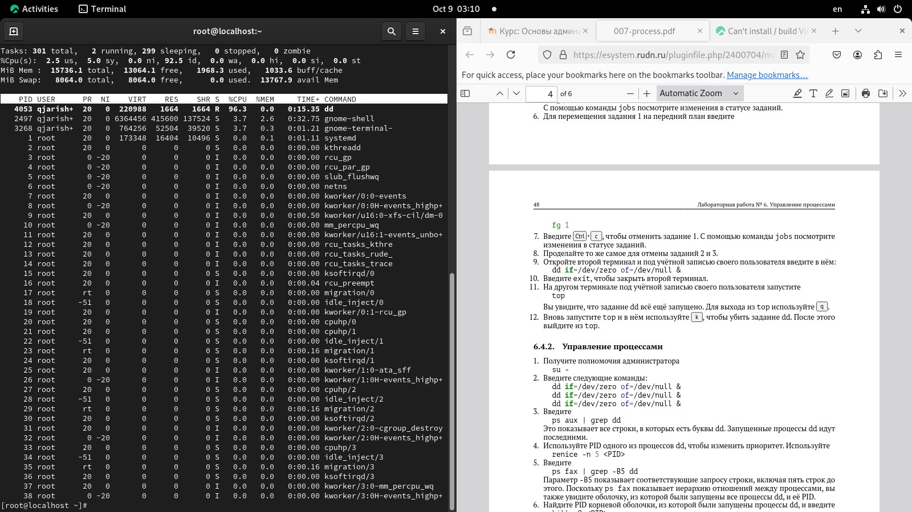
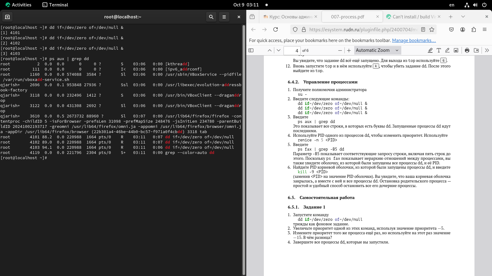
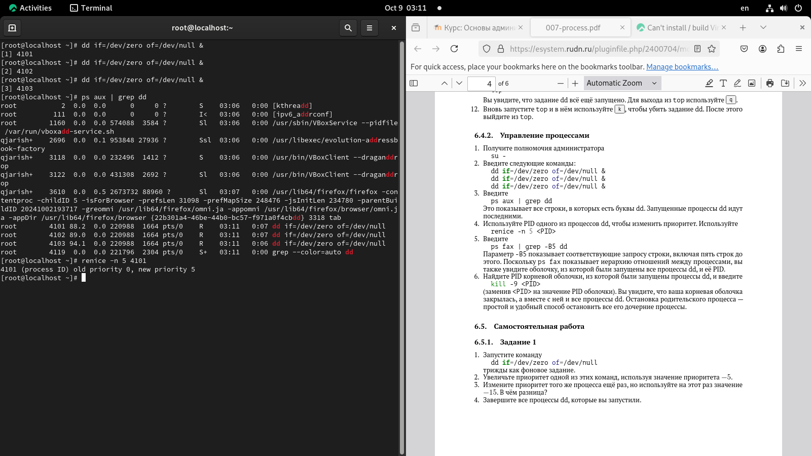
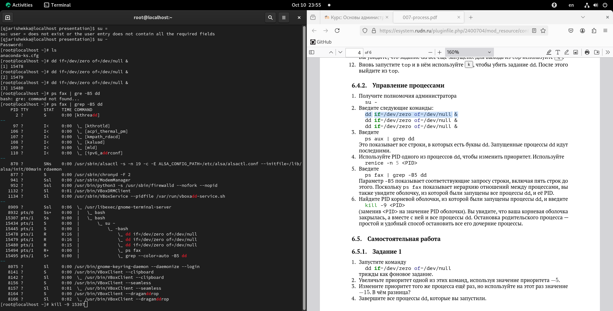
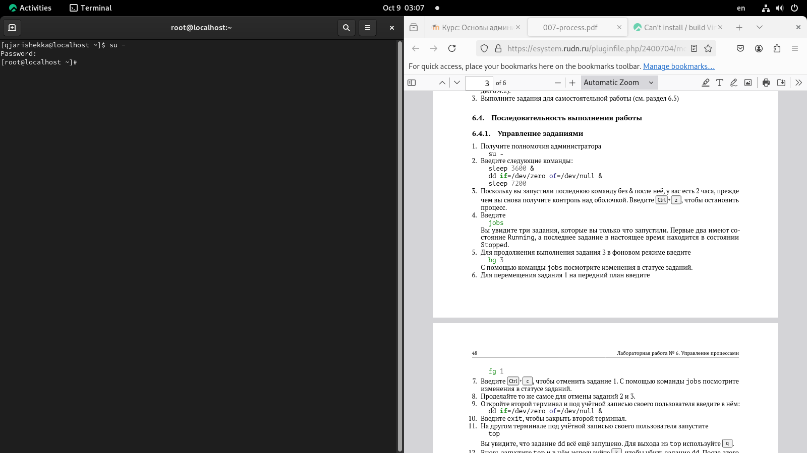

---
## Front matter
lang: ru_RU
title: прецентация лабораторной работы №6
subtitle: Управление процессами
author:
  - Кхари Жекка Кализая Арсе
institute:
  - Российский университет дружбы народов, Москва, Россия
  
## I18n babel
babel-lang: russian
babel-otherlangs: english

## I18n polyglossia
polyglossia-lang:
  name: russian
  options:
	- spelling=modern
	- babelshorthands=true
polyglossia-otherlangs:
  name: english

## Fonts
mainfont: IBM Plex Serif
romanfont: IBM Plex Serif
sansfont: IBM Plex Sans
monofont: IBM Plex Mono
mathfont: STIX Two Math
mainfontoptions: Ligatures=Common,Ligatures=TeX,Scale=0.94
romanfontoptions: Ligatures=Common,Ligatures=TeX,Scale=0.94
sansfontoptions: Ligatures=Common,Ligatures=TeX,Scale=MatchLowercase,Scale=0.94
monofontoptions: Scale=MatchLowercase,Scale=0.94,FakeStretch=0.9

## Formatting pdf
toc: false
toc-title: Содержание
slide_level: 2
aspectratio: 169
section-titles: true
theme: metropolis
header-includes:
 - \metroset{progressbar=frametitle,sectionpage=progressbar,numbering=fraction}
---

# Последовательность выполнения работы

# Управление процессами

# Последовательность выполнения работы

# Управление заданиями

## задания

- su -
- sleep 3600 &
- dd if=/dev/zero of=/dev/null &
- sleep 7200

:::::::::::::: {.columns align=center}
::: {.column width="70%"}

 

:::
::::::::::::::

## виды режима

- Ctrl + Z 
- jobs
- bg 3
- fg 1
- Ctrl + C

:::::::::::::: {.columns align=center}
::: {.column width="70%"}

 

:::
::::::::::::::

## top

- dd if=/dev/zero of=/dev/null &
- top
- k
- q

:::::::::::::: {.columns align=center}
::: {.column width="70%"}

 

:::
::::::::::::::

# Управление процессами

## команда ps

- dd if=/dev/zero of=/dev/null &
- dd if=/dev/zero of=/dev/null &
- dd if=/dev/zero of=/dev/null &
- ps aux | grep dd

:::::::::::::: {.columns align=center}
::: {.column width="70%"}

 

:::
::::::::::::::

## команда renice

- renice -n 5 <PID>
- ps fax | grep -B5 dd

:::::::::::::: {.columns align=center}
::: {.column width="70%"}

 

:::
::::::::::::::

## Команда kill 

- kill -9 <PID>

:::::::::::::: {.columns align=center}
::: {.column width="70%"}

 

:::
::::::::::::::

# Самостоятельная работа

## Задание 1

- dd if=/dev/zero of=/dev/null
- fg <номер задания>
- Ctrl + C

:::::::::::::: {.columns align=center}
::: {.column width="70%"}

 

:::
::::::::::::::

# Задание 2

:::::::::::::: {.columns align=center}
::: {.column width="70%"}

 

:::
::::::::::::::

