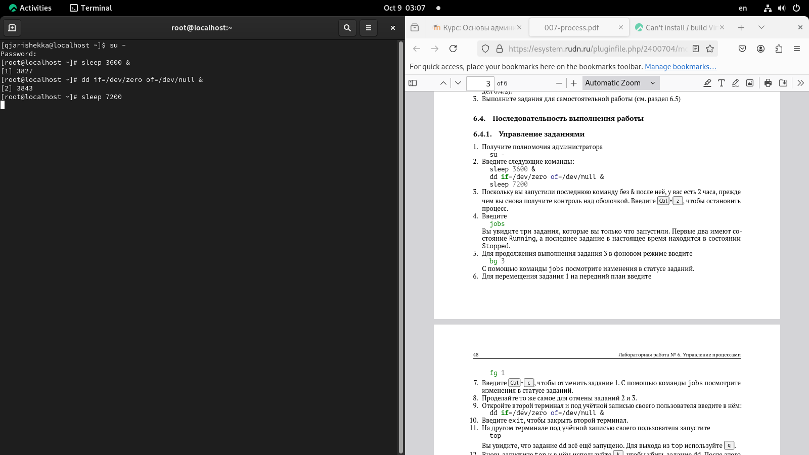
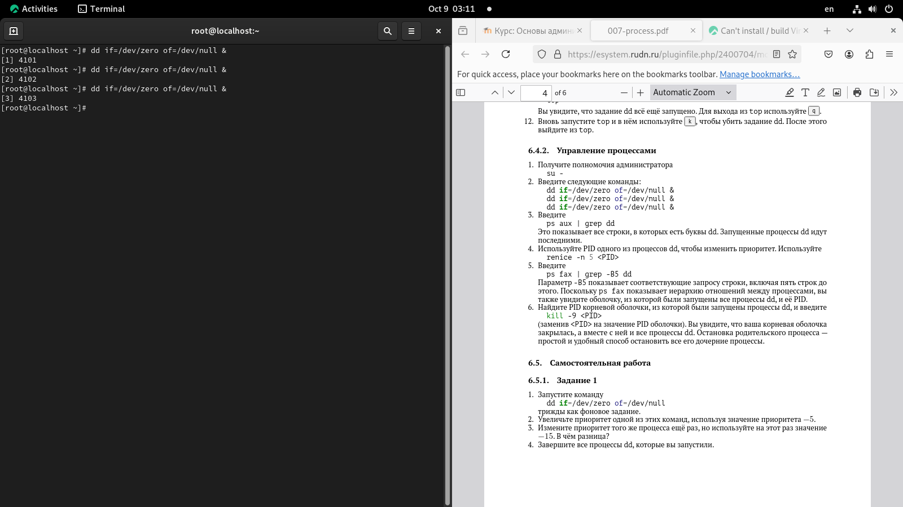
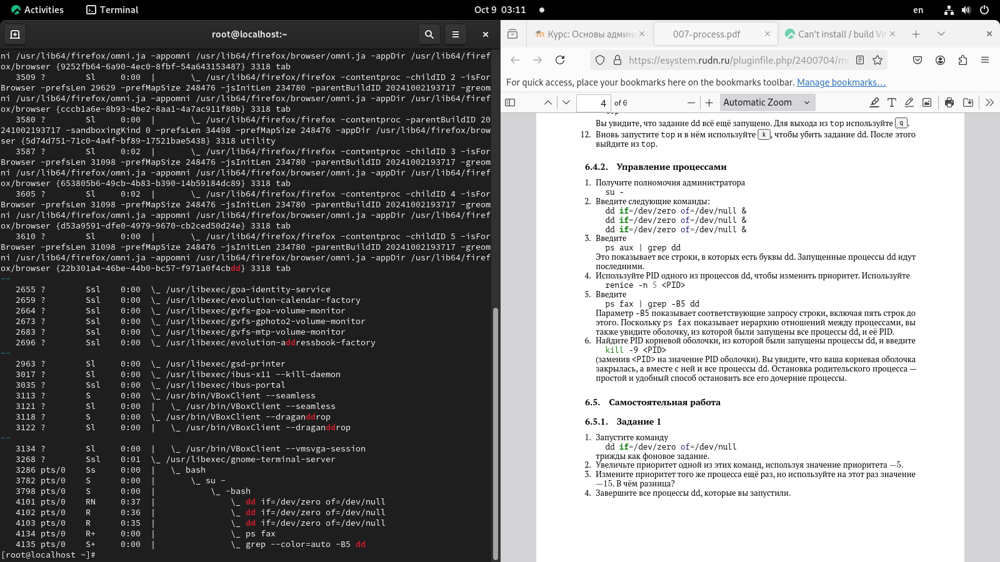
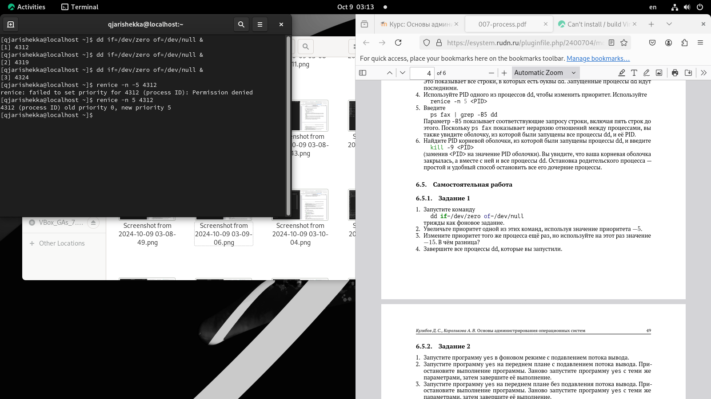
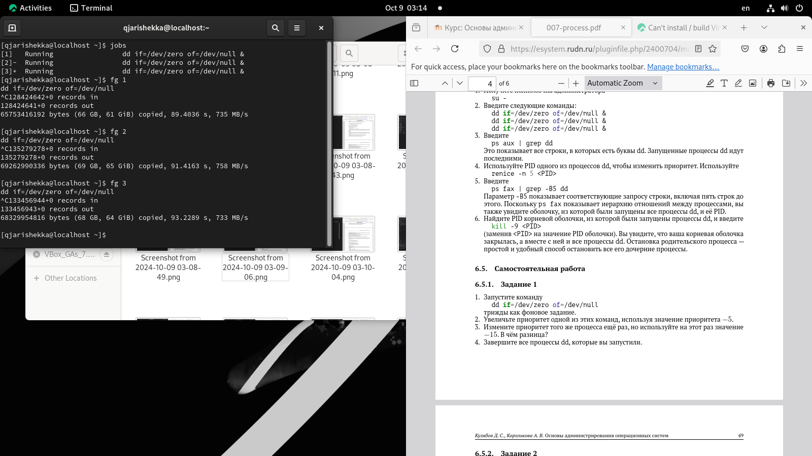
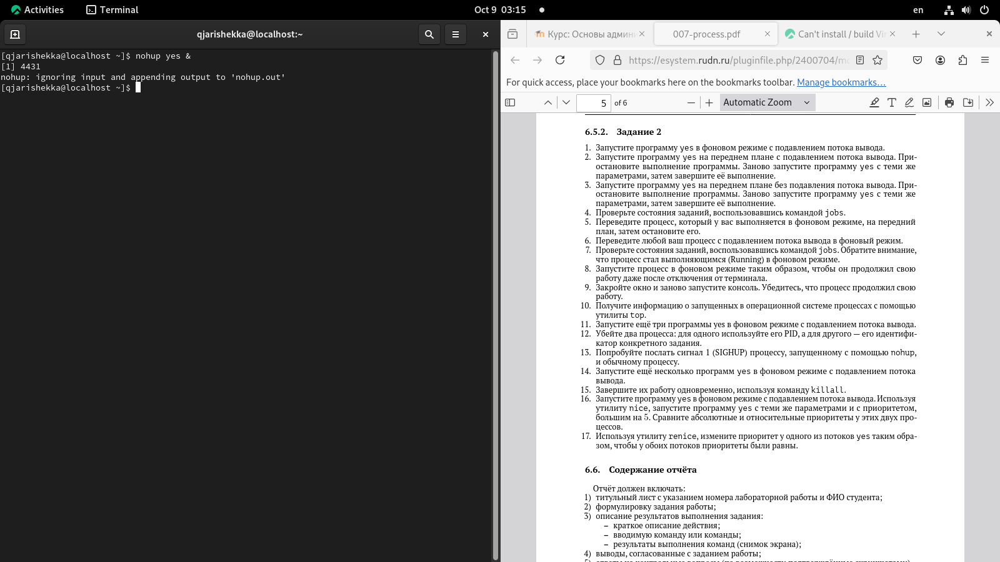
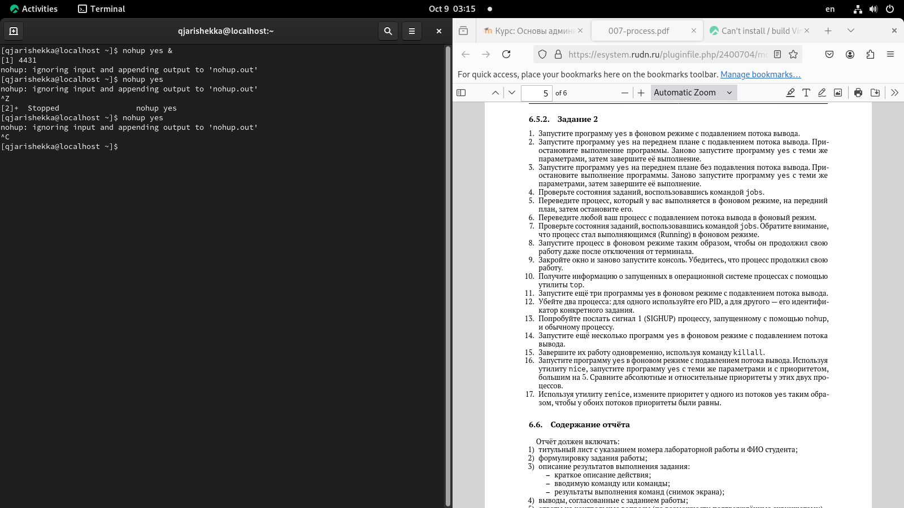
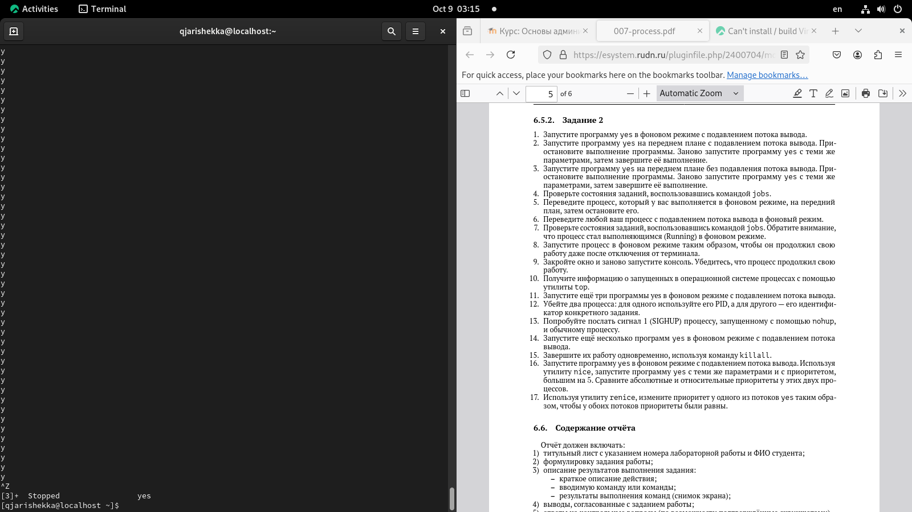
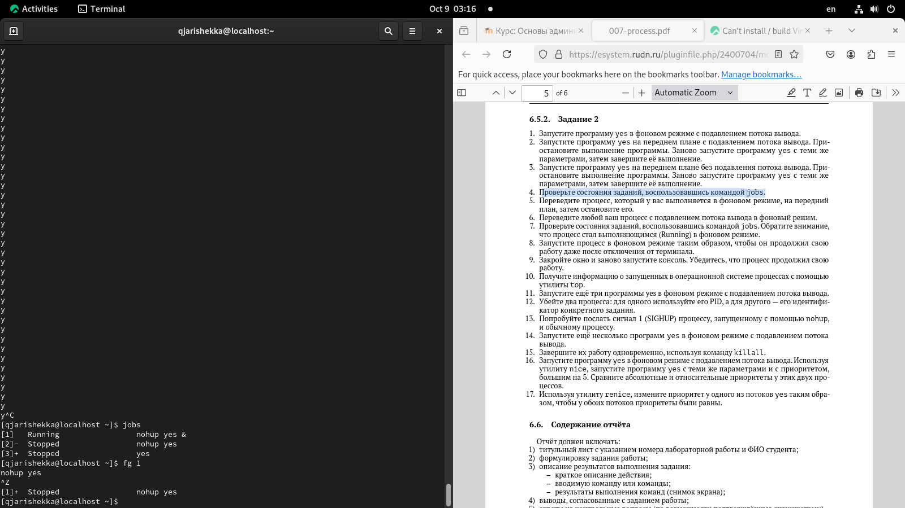
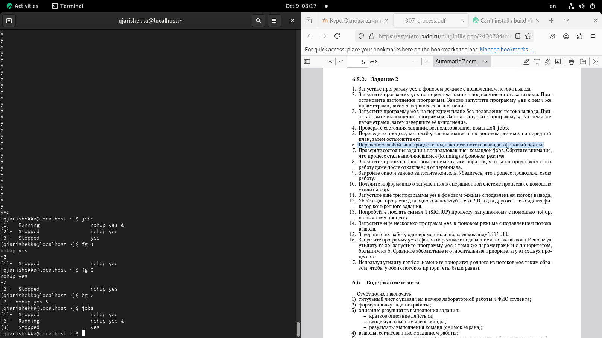

---
## Front matter
title: "Шаблон отчёта по лабораторной работе №6"
subtitle: "Управление процессами"
author: "Кхари Жекка Кализая Арсе"

## Generic otions
lang: ru-RU
toc-title: "Содержание"

## Bibliography
bibliography: bib/cite.bib
csl: pandoc/csl/gost-r-7-0-5-2008-numeric.csl

## Pdf output format
toc: true # Table of contents
toc-depth: 2
lof: true # List of figures
lot: true # List of tables
fontsize: 12pt
linestretch: 1.5
papersize: a4
documentclass: scrreprt
## I18n polyglossia
polyglossia-lang:
  name: russian
  options:
	- spelling=modern
	- babelshorthands=true
polyglossia-otherlangs:
  name: english
## I18n babel
babel-lang: russian
babel-otherlangs: english
## Fonts
mainfont: IBM Plex Serif
romanfont: IBM Plex Serif
sansfont: IBM Plex Sans
monofont: IBM Plex Mono
mathfont: STIX Two Math
mainfontoptions: Ligatures=Common,Ligatures=TeX,Scale=0.94
romanfontoptions: Ligatures=Common,Ligatures=TeX,Scale=0.94
sansfontoptions: Ligatures=Common,Ligatures=TeX,Scale=MatchLowercase,Scale=0.94
monofontoptions: Scale=MatchLowercase,Scale=0.94,FakeStretch=0.9
mathfontoptions:
## Biblatex
biblatex: true
biblio-style: "gost-numeric"
biblatexoptions:
  - parentracker=true
  - backend=biber
  - hyperref=auto
  - language=auto
  - autolang=other*
  - citestyle=gost-numeric
## Pandoc-crossref LaTeX customization
figureTitle: "Рис."
tableTitle: "Таблица"
listingTitle: "Листинг"
lofTitle: "Список иллюстраций"
lotTitle: "Список таблиц"
lolTitle: "Листинги"
## Misc options
indent: true
header-includes:
  - \usepackage{indentfirst}
  - \usepackage{float} # keep figures where there are in the text
  - \floatplacement{figure}{H} # keep figures where there are in the text
---

# Цель работы

Получить навыки управления процессами операционной системы

# Задание

1. Продемонстрируйте навыки управления заданиями операционной системы (см. раз-
дел 6.4.1).
2. Продемонстрируйте навыки управления процессами операционной системы (см. раз-
дел 6.4.2).
3. Выполните задания для самостоятельной работы (см. раздел 6.5)

# Теоретическое введение

Более подробно про Unix см. в [@tanenbaum_book_modern-os_ru; @robbins_book_bash_en; @zarrelli_book_mastering-bash_en; @newham_book_learning-bash_en].

# Выполнение лабораторной работы

Сначала этой лабораторной работы я открыл терминал под пользователя root (рис. [-@fig:001   ]).

		su -

{#fig:001	 width=70%}

Потом я выполнил несколькие команды в фоновом режиме и один в переднем плане  (рис. [-@fig:002   ]).

		sleep 3600 &
		dd if=/dev/zero of=/dev/null &
		sleep 7200

{#fig:002	 width=70%}

Затем я нажал две клавиши `Ctrl` + `z` чтобы остановил задание, которые выполняется на переднем плане (рис. [-@fig:003   ]).

{#fig:003	 width=70%}

Дальше чтобы смотреть все задания, которые выполняются в терминале в фоновом режиме я написал другую команду jobs (рис. [-@fig:004   ]).

		jobs

{#fig:004	 width=70%}

там я смог смотреть состояния задач (либо running либо stopped)

Потом я принес последнее задание в фоновый режиме с помощью команды bg (рис. [-@fig:005   ]).

		bg 3

{#fig:005	 width=70%}

Потом я еще раз смотрел все выполняющие задачи (рис. [-@fig:006  ]).

		jobs

{#fig:006	 width=70%}

Потом я переместил задание 1 на переднй план с помощью командой fg (рис. [-@fig:007   ]).

		fg 1

{#fig:007	 width=70%}

Дальше я завершил это задание нажимая сочетание клавиш `Ctrl` + `C` (рис. [-@fig:008   ]).
		
{#fig:008	 width=70%}

Потом я повторил то же действие с остальными заданиями  (рис. [-@fig:009   ]).

{#fig:009	 width=70%}

Затем я открыл другой терминал и выполнил другую команду (рис. [-@fig:010   ]).

		dd if=/dev/zero of=/dev/null &

{#fig:010	 width=70%}

Там я выполнил команду top чтобы смотреть все задания, которые выполняются в оперативной системе (рис. [-@fig:011   ]).

		top
		
{#fig:011	 width=70%}
		
Вверху таблицы можно смотреть задание dd. Затем я вышел оттуда нажав клавишу q (рис. [-@fig:012   ]).
		
		q
		
{#fig:012	 width=70%}

Потом я еще раз выполнил команду top и завершил задание оттуда  (рис. [-@fig:013   ]).

		top
		k
		`enter`

{#fig:013	 width=70%}

Потом я начал вторую часть лабораторной работы.

Сначала в терминале под пользователя root я запускал 3 задания в фоновом режиме (рис. [-@fig:014   ]).

		dd if=/dev/zero of=/dev/null &
		dd if=/dev/zero of=/dev/null &
		dd if=/dev/zero of=/dev/null &

{#fig:014	 width=70%}

Они выполняют задания в фоновом режиме.

Потом я ввел команду ps (рис. [-@fig:015   ]).

		ps aux | grep dd

{#fig:015	 width=70%}

Эта команда показывает все строки, в которых есть буквы dd

Дальше я выполил команду renice чтобы изменять приоритет процесса указывая его PID (рис. [-@fig:016   ]).

		renice -n 5 <PID>

{#fig:016	 width=70%}

Потом я выполнил другую команду (ps) чтобы смотреть иерархию процессов (рис. [-@fig:017   ]).

		ps fax | grep -B5 dd

{#fig:017	 width=70%}

Дальше я использовал команду kill чтобы завершить задание (рис. [-@fig:018   ]).

		kill -9 <PID>

{#fig:018	 width=70%}

Потом я начал выполнить задание 1 

Сначала я выполнил 3 раза ту же команду  (рис. [-@fig:019   ]).

		dd if=/dev/zer of=/dev/null

{#fig:019	 width=70%}

Потом я изменил приоритет одного задания на 5 (рис. [-@fig:020   ]).

		renice -n 5 <PID>

{#fig:020	 width=70%}

Потом я еще раз изменил приоритет того же задания (рис. [-@fig:021   ]).

		renice -n 15 <PID>

{#fig:021	 width=70%}

Потом я завершил все процессы (рис. [-@fig:022   ]).

		fg 1
		ctrl + c
		fg 2
		ctrl + c
		fg3
		ctrl + c
{#fig:021	 width=70%}

  

Затем я начал вторей задание.

Сначала я запустил программу yes в фоновом режиме с подавлением потока вывода (рис. [-@fig:023   ]).

		nohup yes &

{#fig:023	 width=70%}

Потом я выполнил ту же программу но на переднем плане, потом еще раз выполнил ту же программу с одиноковыми параметрами и завершил его (рис. [-@fig:024   ]).

		nohup yes

{#fig:024	 width=70%}

Потом я еще раз выполнил то же команду но без подавления потока вывода (рис. [-@fig:025   ]).

		yes

{#fig:025	 width=70%}

Потом я остановил процесс и заново выполнил команду yes и завершил его (рис. [-@fig:026   ]).

		Ctrl + z
		yes
		Ctrl + c
		

{#fig:026	 width=70%}

Дальше изпользовал команду jobs чтобы смотреть все выполняющийся процессы (рис. [-@fig:027   ]).

		jobs
		
{#fig:027	 width=70%}

Потом я перевел один процесс с подавлением потока вывода в фоновом режиме на передний план (рис. [-@fig:028   ]).

		fg 1
		Ctrl + c
		
{#fig:028	 width=70%}	

Потом я перевел другой процесс с подавлением потока вывода в фоновый режим (рис. [-@fig:029   ]).

		bg 2

{#fig:029	 width=70%}

Потом я проверил состояния заданий с помощью команды jobs (рис. [-@fig:030   ]).

		jobs

{#fig:030	 width=70%}

Потом я выполнил еще раз команду yes в фоновом режиме (рис. [-@fig:031  ]).

		nohup yes &

{#fig:031	 width=70%}

Потом я закрыл терминал и открыл другой, в котором я выполнил команду top чтобы смотреть состояние процесса yes  (рис. [-@fig:032   ]).

		tops

{#fig:032	 width=70%}

Дальше я запустил еще раз три прграммы yes  в фоновом режиме с подвалением потока вывода (рис. [-@fig:033   ]).

		nohup yes &
		nohup yes &
		nohup yes &

{#fig:033	 width=70%}

Потом я использовал команду kill чтобы убить процессы  (рис. [-@fig:034   ]).

		kill 
		kill

{#fig:034	 width=70%}

Потом я еще раз запустил те же программы yes (рис. [-@fig:035   ]).

		nohup yes &
		nohup yes &
		nohup yes &

{#fig:035	 width=70%}

Затем я убил все процессы используя команду killall  (рис. [-@fig:036   ]).

		killall

{#fig:036	 width=70%}

Потом я еще раз запустил программу yes в фоновом режиме с подавлением потока вывода и использовал утилиту nice, потом еще раз запустил программу yes с теми же параметрами и с приоритетом большим на 5 и потом сравнил приоритеты. (рис. [-@fig:037   ]).

{#fig:038	 width=70%}

в конце концов я использовал утилиту renice чтобы изменить приоритет у одного из потоков yes таким образом они будут равным (рис. [-@fig:039   ]).

{#fig:039	 width=70%}

(рис. [-@fig:03   ]).
{#fig:03	 width=70%}

# Выводы

Здесь кратко описываются итоги проделанной работы.

# Список литературы{.unnumbered}

::: {#refs}
:::
