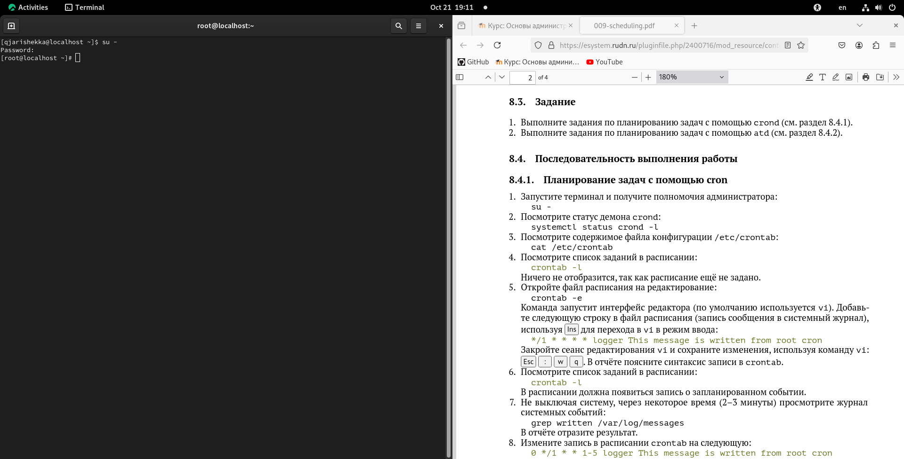
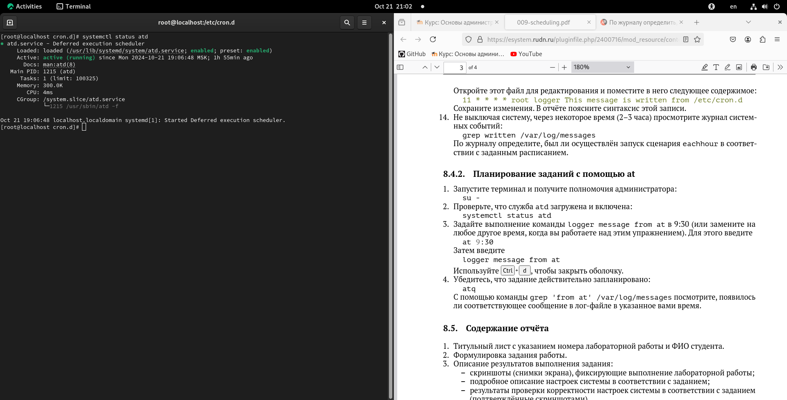

---
## Front matter
title: "Шаблон отчёта по лабораторной работе №8"
subtitle: "Планировщики событий"
author: "Кхари Жекка Кализая Арсе"

## Generic otions
lang: ru-RU
toc-title: "Содержание"

## Bibliography
bibliography: bib/cite.bib
csl: pandoc/csl/gost-r-7-0-5-2008-numeric.csl

## Pdf output format
toc: true # Table of contents
toc-depth: 2
lof: true # List of figures
lot: true # List of tables
fontsize: 12pt
linestretch: 1.5
papersize: a4
documentclass: scrreprt
## I18n polyglossia
polyglossia-lang:
  name: russian
  options:
	- spelling=modern
	- babelshorthands=true
polyglossia-otherlangs:
  name: english
## I18n babel
babel-lang: russian
babel-otherlangs: english
## Fonts
mainfont: IBM Plex Serif
romanfont: IBM Plex Serif
sansfont: IBM Plex Sans
monofont: IBM Plex Mono
mathfont: STIX Two Math
mainfontoptions: Ligatures=Common,Ligatures=TeX,Scale=0.94
romanfontoptions: Ligatures=Common,Ligatures=TeX,Scale=0.94
sansfontoptions: Ligatures=Common,Ligatures=TeX,Scale=MatchLowercase,Scale=0.94
monofontoptions: Scale=MatchLowercase,Scale=0.94,FakeStretch=0.9
mathfontoptions:
## Biblatex
biblatex: true
biblio-style: "gost-numeric"
biblatexoptions:
  - parentracker=true
  - backend=biber
  - hyperref=auto
  - language=auto
  - autolang=other*
  - citestyle=gost-numeric
## Pandoc-crossref LaTeX customization
figureTitle: "Рис."
tableTitle: "Таблица"
listingTitle: "Листинг"
lofTitle: "Список иллюстраций"
lotTitle: "Список таблиц"
lolTitle: "Листинги"
## Misc options
indent: true
header-includes:
  - \usepackage{indentfirst}
  - \usepackage{float} # keep figures where there are in the text
  - \floatplacement{figure}{H} # keep figures where there are in the text
---

# Цель работы

Получение навыков работы с планировщиками событий cron и at.

# Задание

1. Выполните задания по планированию задач с помощью crond (см. раздел 8.4.1).
2. Выполните задания по планированию задач с помощью atd (см. раздел 8.4.2).

# Выполнение лабораторной работы

## Планирование задач с помощью cron

Сначала я открыл терминал под пользователя root (рис. [-@fig:001	]).

		su -
		
{#fig:001 		width=70%}

Дальше я выполнил команду systectl чтобы смотреть статус демона crond (рис. [-@fig:002		]).

		systemctl status crond -l

{#fig:002 		width=70%}

Потом я смотрель содершимое файла конфигурации /etc/crontab (рис. [-@fig:003		]).

		cat /etc/crontab

{#fig:003 		width=70%}

Затем я посмотрел список заданий в расписании (рис. [-@fig:004		]).

{#fig:004 		width=70%}

но команда не отобразил ничего потому что расписание еще не задано. Поэтому я открыл файл расписания с помощью команды crontab  (рис. [-@fig:005		]).

		crontab -e

{#fig:005 		width=70%}

как только я запускал команду откылся текстовый редактор vim и там я добавил следующую строку  (рис. [-@fig:006		]).

		*/1 * * * * logger This message is written from root cron

{#fig:006 		width=70%}

я настроил запись в расписании чтобы записать в журнале задания каждую минуту
Потом с помощью клавиш :wq я закрыл и сохранил файл.

Затем я выполнил команду crontab чтобы смотреть список заданий в расписаний (рис. [-@fig:007		]).

		crontab -l
		
{#fig:007 		width=70%}	
		
		
Потом я ждал за 2 минуты и посмотрел журнал системных событий (рис. [-@fig:008		]).
		
		grep written /var/log/messages

{#fig:008 		width=70%}

Потом я еще раз изменил запись в расписании corntab  (рис. [-@fig:009		]).

		crontab -e
		0 */1 * * 1-5 logger This message is written from root cron
		
{#fig:009 		width=70%}
		
тогда я настроил запись в расписании чтобы записать в журнале за кажды час. 

Сохранив и закрыв файл я посмотрел список заданий в расписании (рис. [-@fig:010		]).

		crontab -l

{#fig:010 		width=70%}

Потом я перешел в каталог /etc/cron.hourly  и создал файл eachhour (рис. [-@fig:011		]).

		cd /etc/cron.hourly
		touch eachhour

{#fig:011		width=70% }

Потом с помощью текстового редактора vim я открыл созданный файл  (рис. [-@fig:012		]).

		vim eachhour

{#fig:012 		width=70%}

Там я написал следующую строки (рис. [-@fig:013		]):

		#!/bin/sh
		logger This message is written at #(date)

{#fig:013 		width=70%}

Потом я дал файлу права для запуска  (рис. [-@fig:014		]).

		cdmod +x eachhour

{#fig:014 		width=70%}

Потом я перешел в другой каталог cron.d и там я создал файл eachhour (рис. [-@fig:015		]).

		cd /etc/cron.d
		touch eachhour

{#fig:015 		width=70%}

и там я написал следующую строку (рис. [-@fig:016		]):

		11 * * * * root logger This message is written from /etc/cron.d

{#fig:016 		width=70%}

Эта строка создала еще 11 строк которая содержат ту же строку

Потом я ждал за 2 часа и выполнил следующий шаг чтобы смотреть журнал системных событий  (рис. [-@fig:017		]).

		grep written /var/log/messages

{#fig:017 		width=70%}

## Планирование заданий с помощью at

здесь я использовал то же терминал  (рис. [-@fig:018		]).

{#fig:018 		width=70%}

Затем я выполнил команду systemctl чтобы смотерть статус службы atd (рис. [-@fig:019		]).

		systemctl status atd

{#fig:019 		width=70%}

Потом я выполнил команду logger message from at  и в конце я написал час в который я выполнил лабораторную работу (рис. [-@fig:020		]).

		logger message from at 7:00

{#fig:020 		width=70%}

Затем я нажал клавиши Ctrl + d чтобы закрывать оболочку и потом я выполнил команду atq (рис. [-@fig:022	]).

		atq

{#fig:022 		width=70%}

и в конце концов я выполнил команду grep  чтобы смотреть журнал системных событий (рис. [-@fig:023		]).

		grep written /var/log/messages

{#fig:023 		width=70%}

здесь я смог просмотреть что расписание работает как я хотел там расписание по часам указано и отличается в чем что у него есть другой конец.

# Выводы

Чтобы настройть расписание записи в журнале мы можем следовать эти шаги и сам изменить минуту час день как мы потребуем 

# Список литературы{.unnumbered}

::: {#refs}
:::
