---
## Front matter
lang: ru-RU
title: Презентация лабораторной работы №9
subtitle: Управление SELinux
author:
  - Кхари Жекка Кализая Арсе

## i18n babel
babel-lang: russian
babel-otherlangs: english

## Fonts
mainfont: IBM Plex Serif
romanfont: IBM Plex Serif
sansfont: IBM Plex Sans
monofont: IBM Plex Mono
mathfont: STIX Two Math
mainfontoptions: Ligatures=Common,Ligatures=TeX,Scale=0.94
romanfontoptions: Ligatures=Common,Ligatures=TeX,Scale=0.94
sansfontoptions: Ligatures=Common,Ligatures=TeX,Scale=MatchLowercase,Scale=0.94
monofontoptions: Scale=MatchLowercase,Scale=0.94,FakeStretch=0.9

## Formatting pdf
toc: false
toc-title: Содержание
slide_level: 2
aspectratio: 169
section-titles: true
theme: metropolis
header-includes:
 - \metroset{progressbar=frametitle,sectionpage=progressbar,numbering=fraction}
---

#Выполнение Лабораторной работы 

# Управление режимами SELinux

## проверка состояния службы SELinux

- команды:
	- su -
	- sestatus -v
	- getenforce
	
:::::::::::::: {.columns align=center}
::: {.column width="60%"}

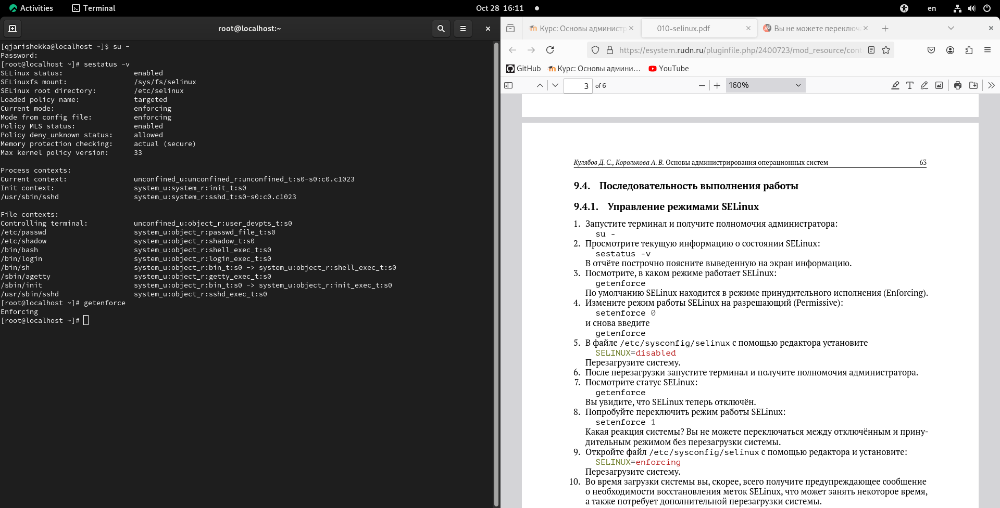 

:::
::::::::::::::

## настройка режима работы SELinux

- команды:

	- setenforce 0
	- getenforce

:::::::::::::: {.columns align=center}
::: {.column width="60%"}

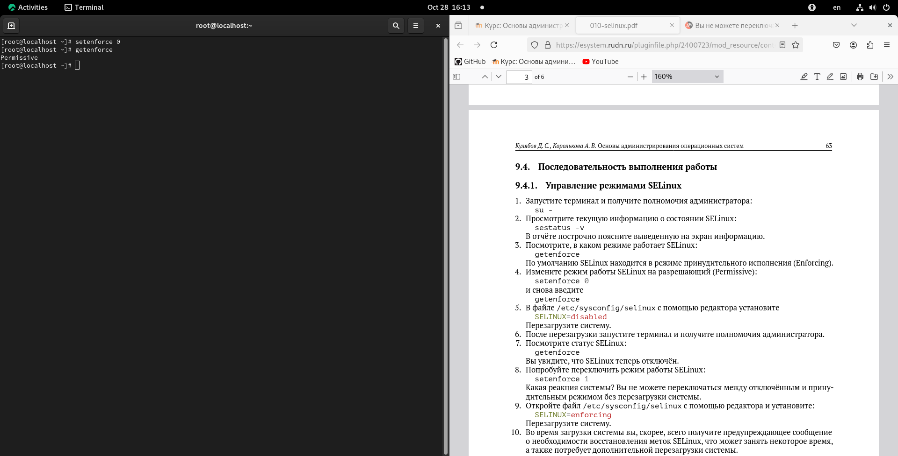 

:::
::::::::::::::

## настройка режима работы SELinux

- команды:
	- vim /etc/sysconfig/selinux
	- SELINUX=disabled
	
- перезагрузить систему

:::::::::::::: {.columns align=center}
::: {.column width="60%"}

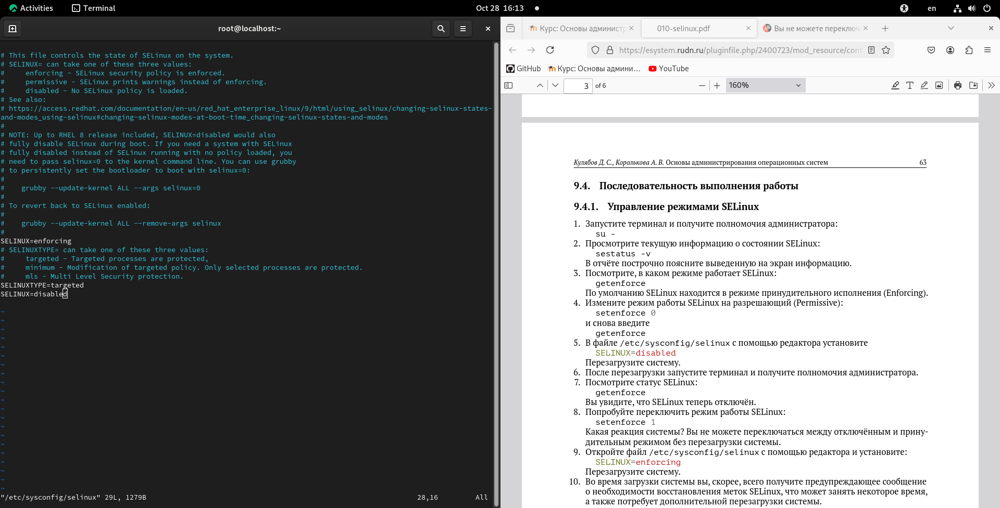 

:::
::::::::::::::

## Проверка режима работы SELinux

- команды:
	- getenforce
	-setenforce 1

:::::::::::::: {.columns align=center}
::: {.column width="60%"}

 

:::
::::::::::::::

## Настройка службы SELinux

- команды:
	- vim /etc/sysconfig/selinux
	- SELINUX=enforcing

:::::::::::::: {.columns align=center}
::: {.column width="60%"}

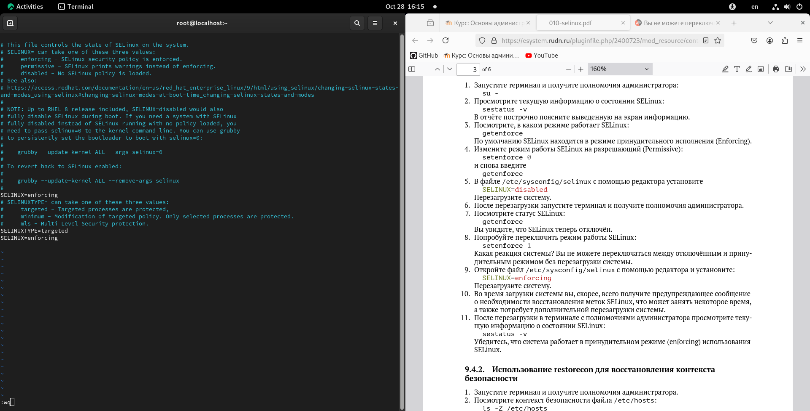 

:::
::::::::::::::

## Проверка режима работы SELinux

- команды:
	- sestatus -v

:::::::::::::: {.columns align=center}
::: {.column width="60%"}

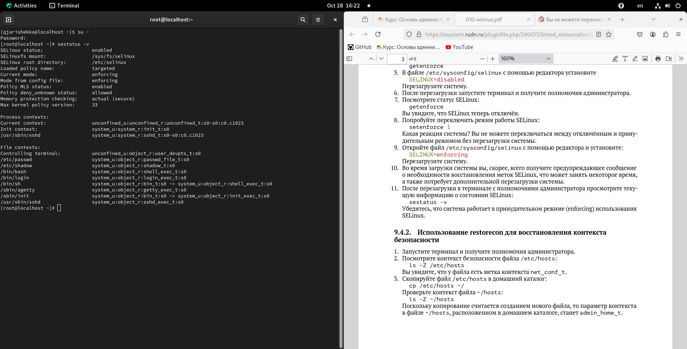 

:::
::::::::::::::

# Использование restorecon для восстановления контекста безопасности

## Проверка работы службы restorecon

- команды:
	- ls -Z /etc/hosts
	- cp /etc/hosts ~/
	- ls -Z ~/hosts
	- mv ~/hosts/etc
	- ls -Z /etc/hosts

:::::::::::::: {.columns align=center}
::: {.column width="60%"}

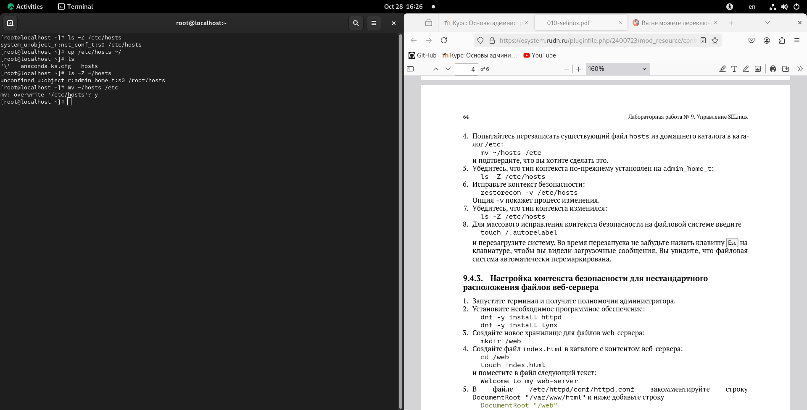 

:::
::::::::::::::

## Проверка работы службы restorecon

- команды:
	- restorecon -v /etc/hosts
	- ls -Z /etc/hosts
	
:::::::::::::: {.columns align=center}
::: {.column width="60%"}

 

:::
::::::::::::::

## массовое исправление контекста безопасности на файловой системе

- команды:
	- touch /.autorelabel
- перезагрузить систему

:::::::::::::: {.columns align=center}
::: {.column width="60%"}

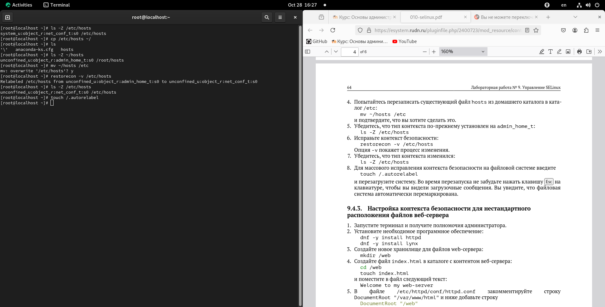 

:::
::::::::::::::

# Настройка контекста безопасности для нестандартного расположения файлов веб-сервера

## установка необходимых программных обеспечений

- команды:
	- dnf -y install httpd
	- dnf -y install lynx

:::::::::::::: {.columns align=center}
::: {.column width="60%"}

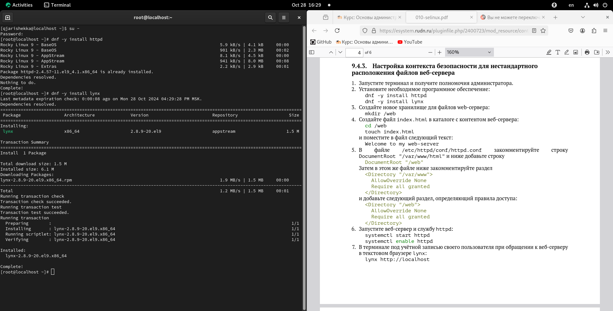 

:::
::::::::::::::

## настройка веба-сервера

- команды:
	- mkdir /web
	- cd /web
	- touch index.html
	- vim index.html
	- Welcome to my web-server

:::::::::::::: {.columns align=center}
::: {.column width="60%"}

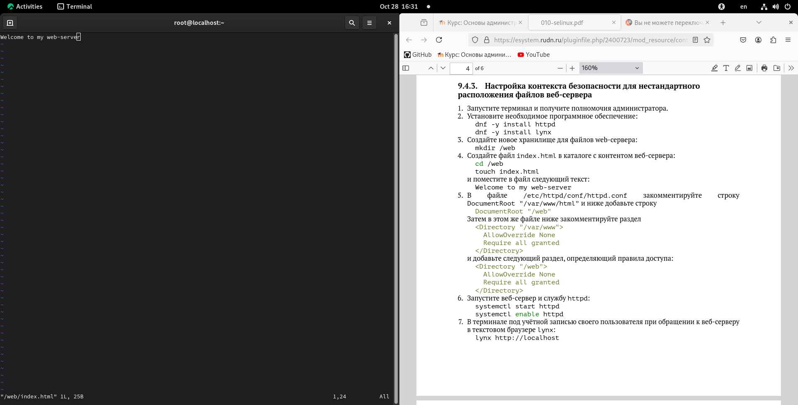 

:::
::::::::::::::

## настройка веба-сервера

- команды:
	- vim /etc/httpd/conf/httpd.conf
	- DocumentRoot "/var/www/html" 	-> DocumentRoot "/web"
	- <Directory "/var/www">	-> <Directory "/web">
	- AllowOverride None		->	AllowOverride None
	- Require all granted		->	Require all granted
	- </ Directory>			-> </ Directory>

## настройка веба-сервера

:::::::::::::: {.columns align=center}
::: {.column width="60%"}

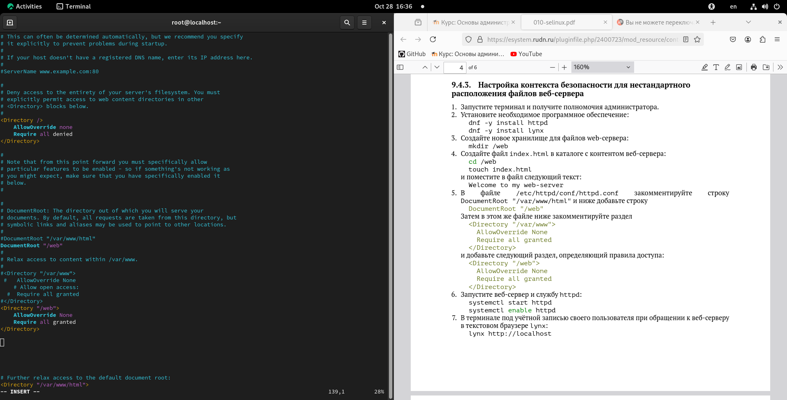 

:::
::::::::::::::

## запуска веб-сервера

- команды: 
	- systemctl start httpd
	- systemctl enable httpd
	- lynx http://localhost
	
:::::::::::::: {.columns align=center}
::: {.column width="60%"}

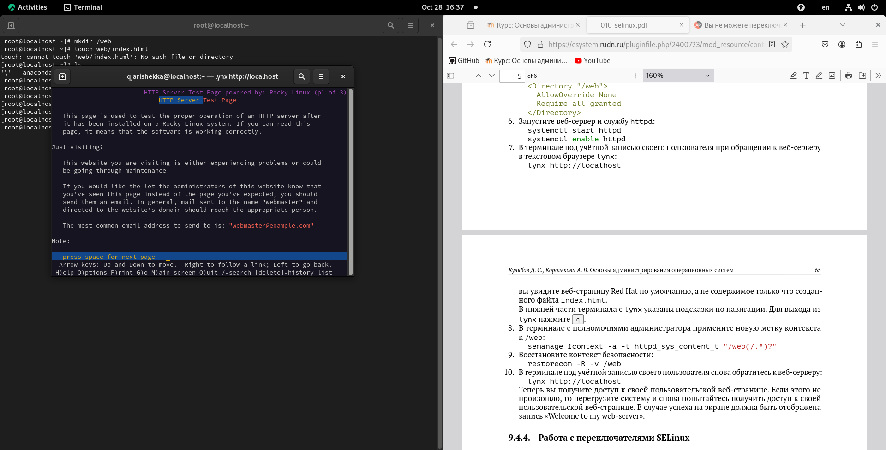 

:::
::::::::::::::

## запуска веб-сервера

- команды:
	- semanage fcontext -a -t httpd_sys_content_t "/web/(/.*)
	- restorecon -R -v /web
	- перезагрузка
	- lynx httpd://localhost

:::::::::::::: {.columns align=center}
::: {.column width="60%"}

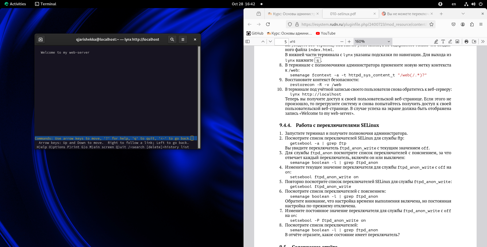 

:::
::::::::::::::

# Работа с переключателями SELinux

## список переключателей SELinux для службы ftp

- команды: 
	- getsebool -a | grep ftp

:::::::::::::: {.columns align=center}
::: {.column width="60%"}

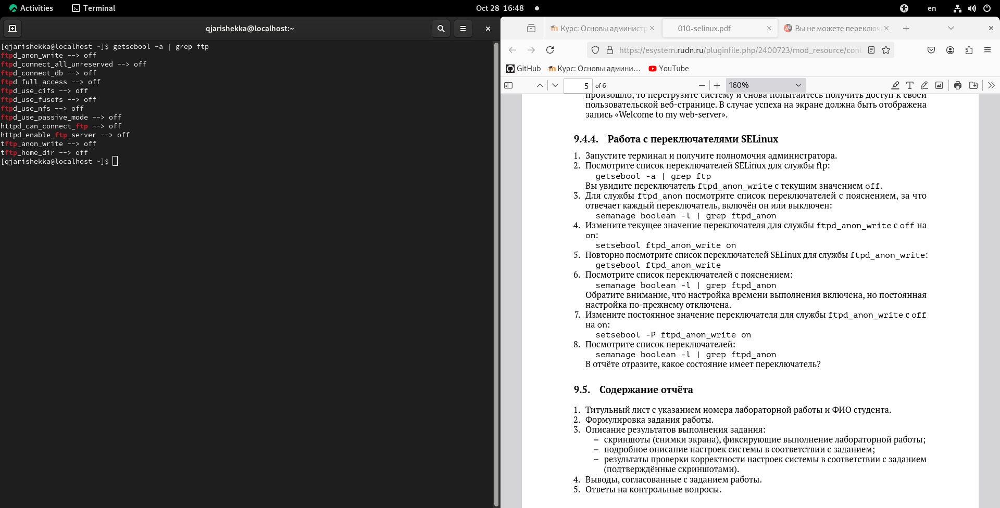 

:::
::::::::::::::

## Список переключателей с пояснением

- команды:
	- semanage boolean -l | grep ftpd_anon

:::::::::::::: {.columns align=center}
::: {.column width="60%"}

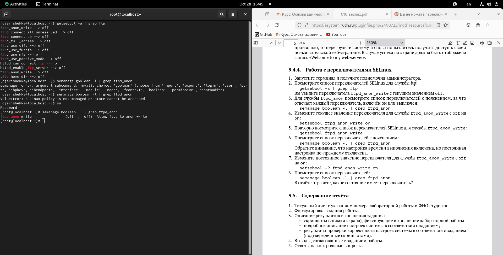 

:::
::::::::::::::

## изменение текущего значения переключателя (off -> on)

- команды:
	- setsebool ftpd_anon_write on
	- getsebool ftpd_anon_write

:::::::::::::: {.columns align=center}
::: {.column width="60%"}

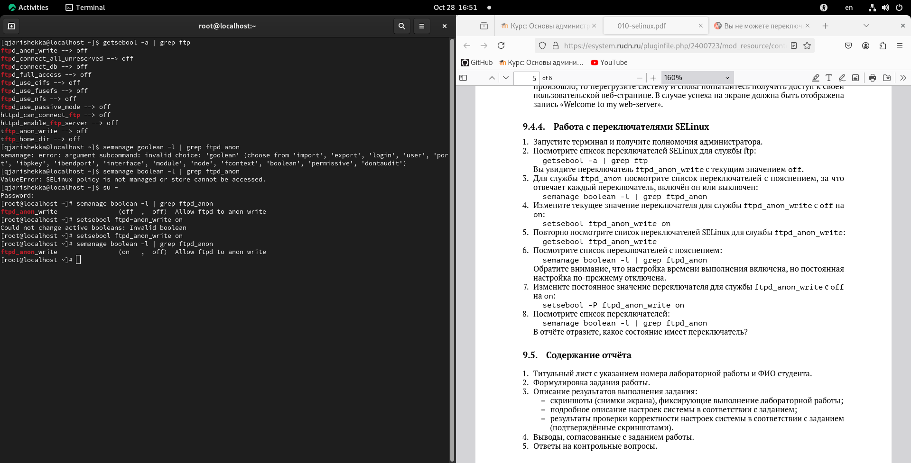 

:::
::::::::::::::

## Список переключателей с пояснением

- команды:
	- semanage boolean -l | grep ftpd_anon

:::::::::::::: {.columns align=center}
::: {.column width="60%"}

 

:::
::::::::::::::

## изменение постоянного значения переключателя

- команды:
	- setsebool -P ftpd_anon_write on
	- semanage boolean -l | grep ftpd_anon

:::::::::::::: {.columns align=center}
::: {.column width="60%"}

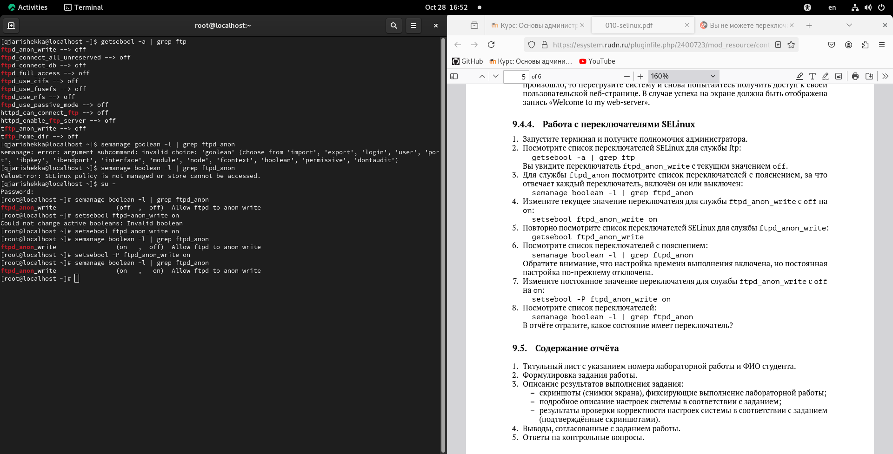 

:::
::::::::::::::

