---
## Front matter
title: "Шаблон отчёта по лабораторной работе №9"
subtitle: "Управление SELinux"
author: "Кхари Жекка Кализая Арсе"

## Generic otions
lang: ru-RU
toc-title: "Содержание"

## Bibliography
bibliography: bib/cite.bib
csl: pandoc/csl/gost-r-7-0-5-2008-numeric.csl

## Pdf output format
toc: true # Table of contents
toc-depth: 2
lof: true # List of figures
lot: true # List of tables
fontsize: 12pt
linestretch: 1.5
papersize: a4
documentclass: scrreprt
## I18n polyglossia
polyglossia-lang:
  name: russian
  options:
	- spelling=modern
	- babelshorthands=true
polyglossia-otherlangs:
  name: english
## I18n babel
babel-lang: russian
babel-otherlangs: english
## Fonts
mainfont: IBM Plex Serif
romanfont: IBM Plex Serif
sansfont: IBM Plex Sans
monofont: IBM Plex Mono
mathfont: STIX Two Math
mainfontoptions: Ligatures=Common,Ligatures=TeX,Scale=0.94
romanfontoptions: Ligatures=Common,Ligatures=TeX,Scale=0.94
sansfontoptions: Ligatures=Common,Ligatures=TeX,Scale=MatchLowercase,Scale=0.94
monofontoptions: Scale=MatchLowercase,Scale=0.94,FakeStretch=0.9
mathfontoptions:
## Biblatex
biblatex: true
biblio-style: "gost-numeric"
biblatexoptions:
  - parentracker=true
  - backend=biber
  - hyperref=auto
  - language=auto
  - autolang=other*
  - citestyle=gost-numeric
## Pandoc-crossref LaTeX customization
figureTitle: "Рис."
tableTitle: "Таблица"
listingTitle: "Листинг"
lofTitle: "Список иллюстраций"
lotTitle: "Список таблиц"
lolTitle: "Листинги"
## Misc options
indent: true
header-includes:
  - \usepackage{indentfirst}
  - \usepackage{float} # keep figures where there are in the text
  - \floatplacement{figure}{H} # keep figures where there are in the text
---

# Цель работы

 Получить навыки работы с контекстом безопасности и политиками SELinux
 
# Задание

1. Продемонстрируйте навыки по управлению режимами SELinux (см. раздел 9.4.1).

2. Продемонстрируйте навыки по восстановлению контекста безопасности SELinux (см.
раздел 9.4.2).

3. Настройте контекст безопасности для нестандартного расположения файлов веб-
службы (см. раздел 9.4.3).

4. Продемонстрируйте навыки работы с переключателями SELinux (см. раздел 9.4.4)

# Выполнение лабораторной работы

## управление режимами SELinux

Сначала этой лабораторной работы я открыл терминал под пользователя root как обычно  (рис. [-@fig:001	]).

		su -

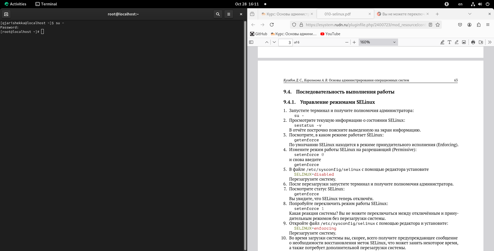{#fig:001 	width=70%}

Потом я смотрел статус службы SELinux (рис. [-@fig:002	]).

		sestatus -v

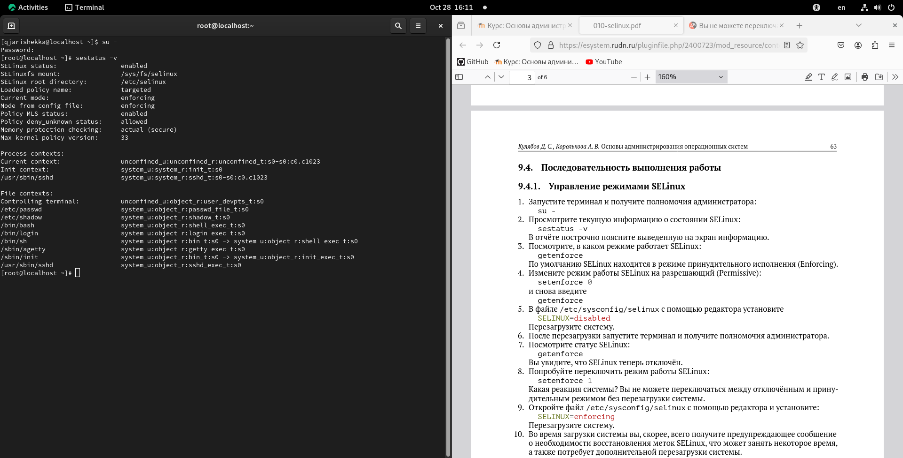{#fig:002 	width=70%}

там я смог смотреть статус, место монтирования, место расположения загрузена полиса, текующий режим и версию

Потом я выполнил команду чтобы только смотреть на каком режиме работает SELinux (рис. [-@fig:003	]).

		getenforce

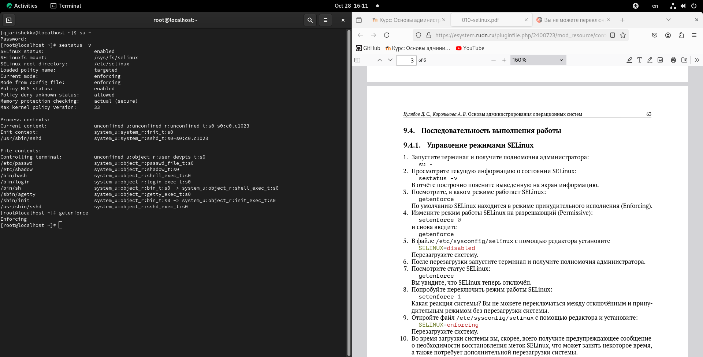{#fig:003 	width=70%}

Потом я изменил режим работы SELinux на разрешающий и снова я смотрел режим работы (рис. [-@fig:005	]).

		setenforce 0

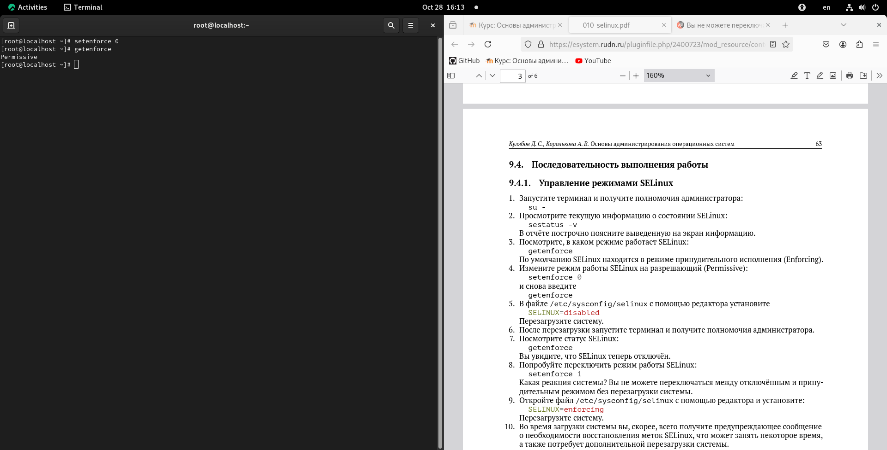{#fig:005 	width=70%}

Затем я добавил строку в файле /etc/sysconfig/selinux с помощью редактора vim (рис. [-@fig:006	]).

		SELINUX=disabled

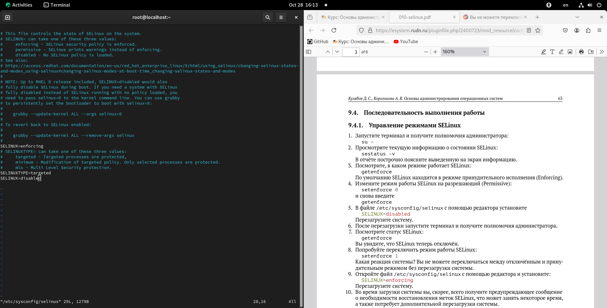{#fig:006 	width=70%}

Дальше я перезагрузил ОС (рис. [-@fig:007	]).

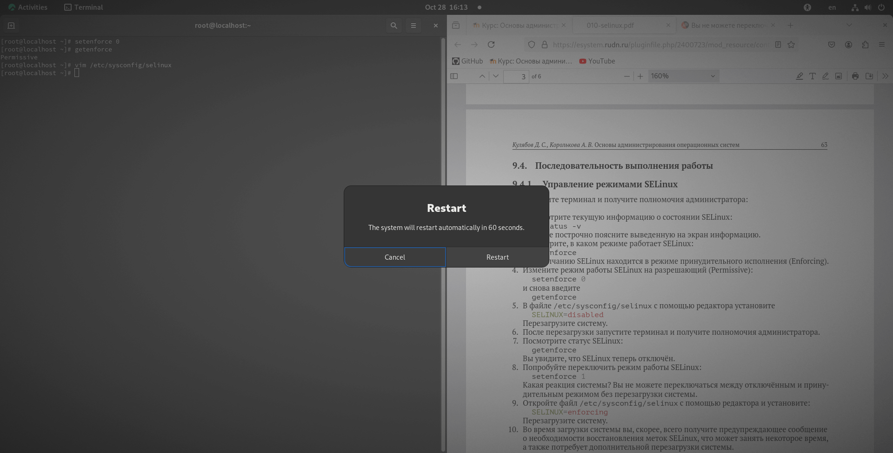{#fig:007 	width=70%}

Потом я еще раз открыл терминал под пользователя root (рис. [-@fig:008	]).

		su -

{#fig:008 	width=70%}

Затем я посмотрел статус SELinux (рис. [-@fig:009	]).

		getenforce 

{#fig:009 	width=70%}

Потом я переключил режим работы SELinux  (рис. [-@fig:010	]).

		setenforce 1

{#fig:010 	width=70%}

Потом я открыл файл /etc/sysconfig/selinux с помощью редактора vim и изменил строку (рис. [-@fig:011	]).

		vim /etc/sysconfig/selinux
		SELINUX=enforcing
		
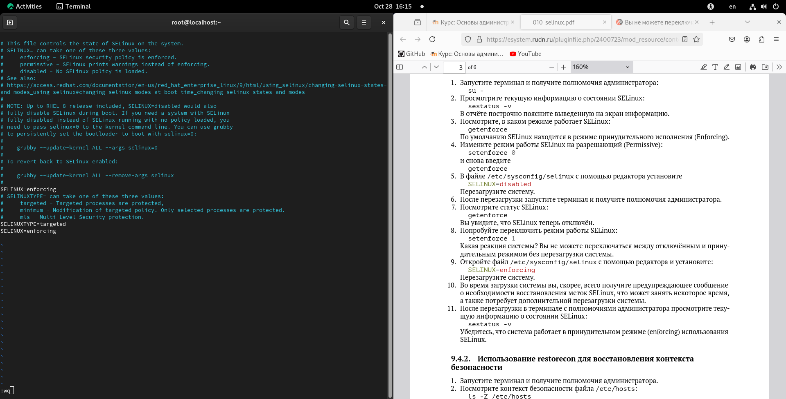{#fig:011 	width=70%}

Потом я еще раз перезагрузил систему (рис. [-@fig:012	]).

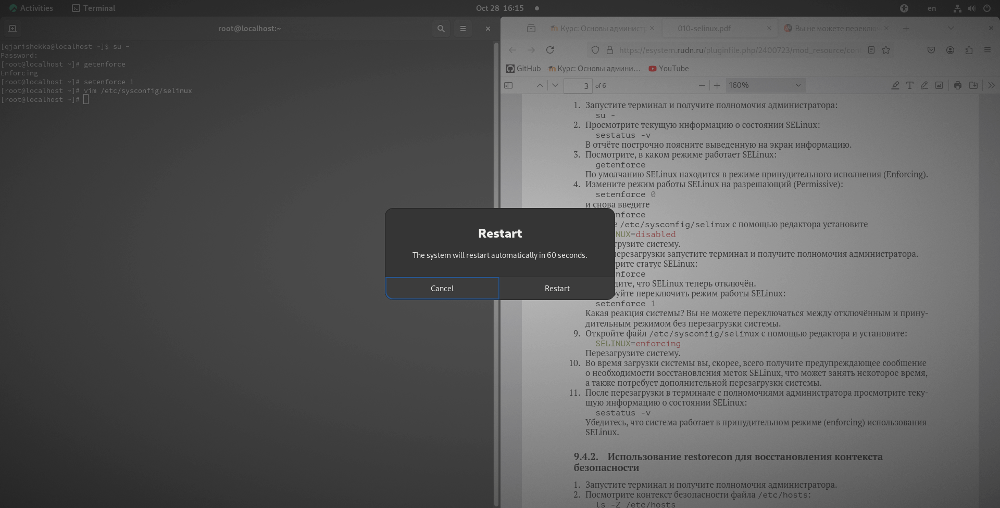{#fig:012	width=70%}

После перезагрузки я еще раз открыл терминал с полномочиями администратора и выполнил команду sestatus чтобы получил информацию о состоянии SELinux (рис. [-@fig:014	]).

		su - 
		password
		sestatus -v

{#fig:014 	width=70%}

## Использование restorecon для восстановления конткеста безопасности

Еще раз в терминале под пользователя root я выполнил команду ls чтобы смотерть контекст безопасности файла /etc/hosts (рис. [-@fig:015	]).

		ls -Z /etc/hosts

{#fig:015 	width=70%}

и там я увидел что у файла есть метка контекста net_conf_t

Потом я скопировал то же файл в домашний каталог (рис. [-@fig:016	]).

		cp /etc/hosts ~/

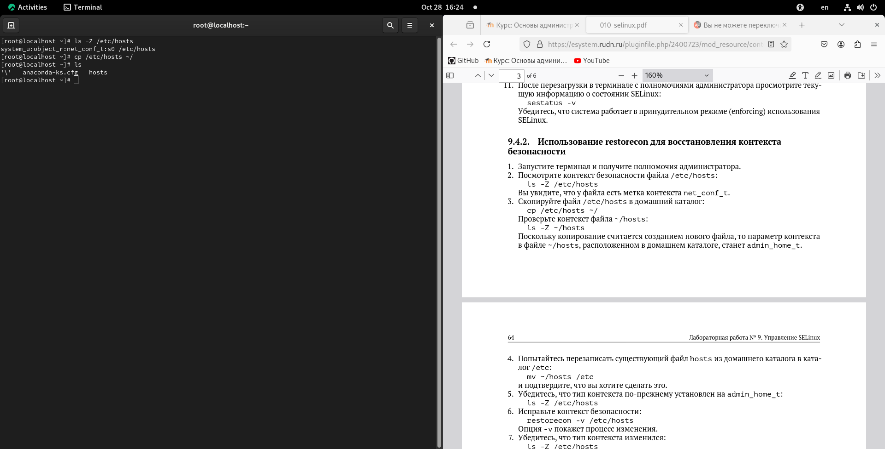{#fig:016 	width=70%}

дальше я проверил контекст файла  (рис. [-@fig:017	]).

		ls -Z ~/hosts

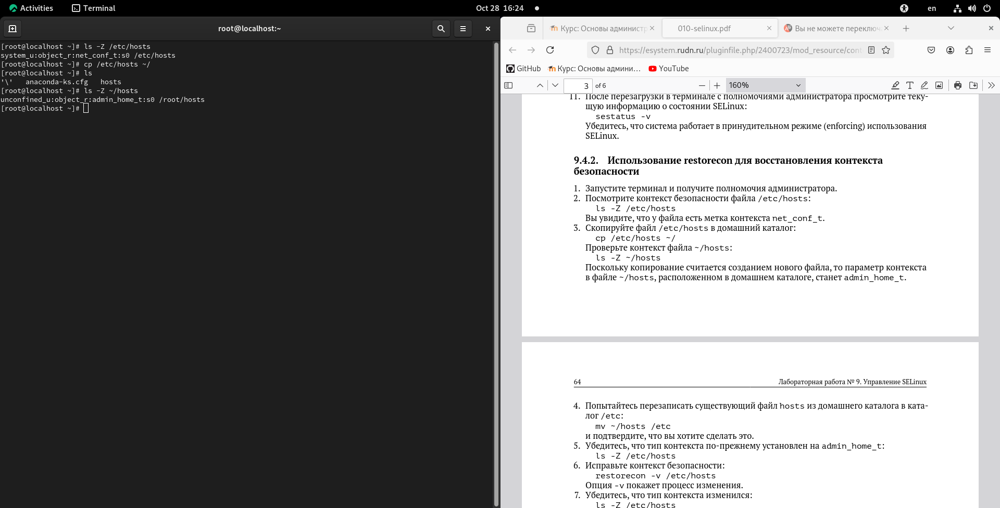{#fig:017 	width=70%}

там я смог увидет что контекст файла изменился. это произошло потому что файл скопирован в другой каталог(домашний каталог) и станет admin_home_t

Потом я перезаписал существующий файл hosts из домашнего каталога в каталог /etc (рис. [-@fig:018	]).

		mv ~/hosts /etc
		yes
		
		
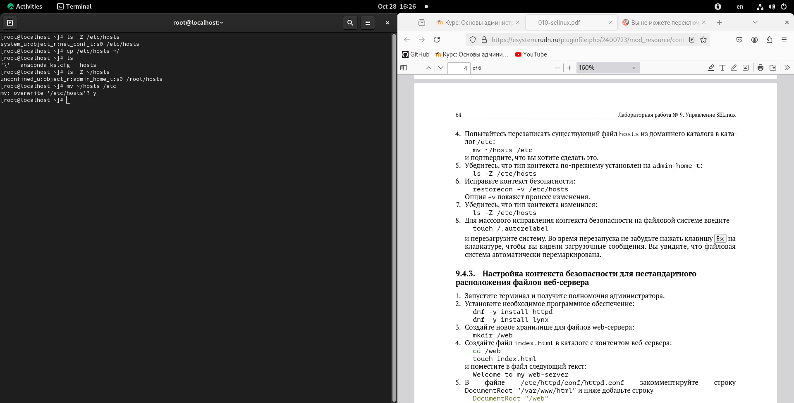{#fig:018 	width=70%}	

Дальше я проверил тип контекста файла и он изменился на admin_home_t. Чтобы исправить его я выполнил команду restorecon (рис. [-@fig:019	]).

		restorecon -v /etc/hosts

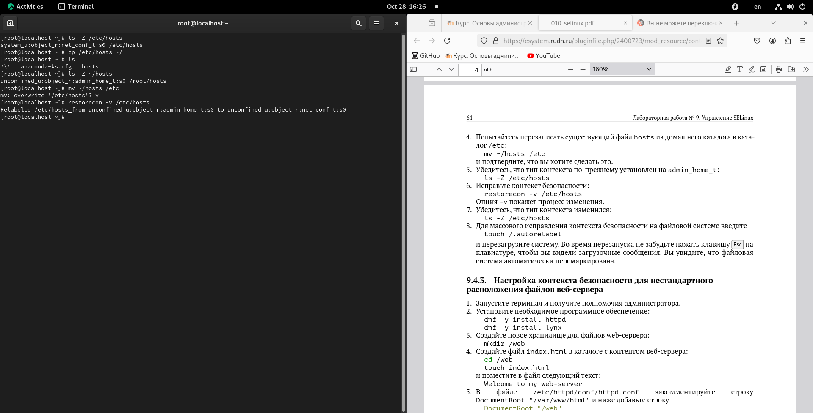{#fig:019 	width=70%}

И еще раз проверил его  (рис. [-@fig:020	]).

		ls -Z /etc/hosts

{#fig:020	width=70%}

(рис. [-@fig:02	]).

{#fig:02 	width=70%}

# Выводы

# Список литературы{.unnumbered}

::: {#refs}
:::
