---
## Front matter
title: "Шаблон отчёта по лабораторной работе №9"
subtitle: "Управление SELinux"
author: "Кхари Жекка Кализая Арсе"

## Generic otions
lang: ru-RU
toc-title: "Содержание"

## Bibliography
bibliography: bib/cite.bib
csl: pandoc/csl/gost-r-7-0-5-2008-numeric.csl

## Pdf output format
toc: true # Table of contents
toc-depth: 2
lof: true # List of figures
lot: true # List of tables
fontsize: 12pt
linestretch: 1.5
papersize: a4
documentclass: scrreprt
## I18n polyglossia
polyglossia-lang:
  name: russian
  options:
	- spelling=modern
	- babelshorthands=true
polyglossia-otherlangs:
  name: english
## I18n babel
babel-lang: russian
babel-otherlangs: english
## Fonts
mainfont: IBM Plex Serif
romanfont: IBM Plex Serif
sansfont: IBM Plex Sans
monofont: IBM Plex Mono
mathfont: STIX Two Math
mainfontoptions: Ligatures=Common,Ligatures=TeX,Scale=0.94
romanfontoptions: Ligatures=Common,Ligatures=TeX,Scale=0.94
sansfontoptions: Ligatures=Common,Ligatures=TeX,Scale=MatchLowercase,Scale=0.94
monofontoptions: Scale=MatchLowercase,Scale=0.94,FakeStretch=0.9
mathfontoptions:
## Biblatex
biblatex: true
biblio-style: "gost-numeric"
biblatexoptions:
  - parentracker=true
  - backend=biber
  - hyperref=auto
  - language=auto
  - autolang=other*
  - citestyle=gost-numeric
## Pandoc-crossref LaTeX customization
figureTitle: "Рис."
tableTitle: "Таблица"
listingTitle: "Листинг"
lofTitle: "Список иллюстраций"
lotTitle: "Список таблиц"
lolTitle: "Листинги"
## Misc options
indent: true
header-includes:
  - \usepackage{indentfirst}
  - \usepackage{float} # keep figures where there are in the text
  - \floatplacement{figure}{H} # keep figures where there are in the text
---

# Цель работы

 Получить навыки работы с контекстом безопасности и политиками SELinux
 
# Задание

1. Продемонстрируйте навыки по управлению режимами SELinux (см. раздел 9.4.1).

2. Продемонстрируйте навыки по восстановлению контекста безопасности SELinux (см.
раздел 9.4.2).

3. Настройте контекст безопасности для нестандартного расположения файлов веб-
службы (см. раздел 9.4.3).

4. Продемонстрируйте навыки работы с переключателями SELinux (см. раздел 9.4.4)

# Выполнение лабораторной работы

## управление режимами SELinux

Сначала этой лабораторной работы я открыл терминал под пользователя root как обычно  (рис. [-@fig:001	]).

		su -

{#fig:001 	width=70%}

Потом я смотрел статус службы SELinux (рис. [-@fig:002	]).

		sestatus -v

{#fig:002 	width=70%}

там я смог смотреть статус, место монтирования, место расположения загрузена полиса, текующий режим и версию

Потом я выполнил команду чтобы только смотреть на каком режиме работает SELinux (рис. [-@fig:003	]).

		getenforce

{#fig:003 	width=70%}

Потом я изменил режим работы SELinux на разрешающий и снова я смотрел режим работы (рис. [-@fig:005	]).

		setenforce 0

{#fig:005 	width=70%}

Затем я добавил строку в файле /etc/sysconfig/selinux с помощью редактора vim (рис. [-@fig:006	]).

		SELINUX=disabled

{#fig:006 	width=70%}

Дальше я перезагрузил ОС (рис. [-@fig:007	]).

{#fig:007 	width=70%}

Потом я еще раз открыл терминал под пользователя root (рис. [-@fig:008	]).

		su -

{#fig:008 	width=70%}

Затем я посмотрел статус SELinux (рис. [-@fig:009	]).

		getenforce 

{#fig:009 	width=70%}

Потом я переключил режим работы SELinux  (рис. [-@fig:010	]).

		setenforce 1

{#fig:010 	width=70%}

Потом я открыл файл /etc/sysconfig/selinux с помощью редактора vim и изменил строку (рис. [-@fig:011	]).

		vim /etc/sysconfig/selinux
		SELINUX=enforcing
		
{#fig:011 	width=70%}

Потом я еще раз перезагрузил систему (рис. [-@fig:012	]).

{#fig:012	width=70%}

После перезагрузки я еще раз открыл терминал с полномочиями администратора и выполнил команду sestatus чтобы получил информацию о состоянии SELinux (рис. [-@fig:014	]).

		su - 
		password
		sestatus -v

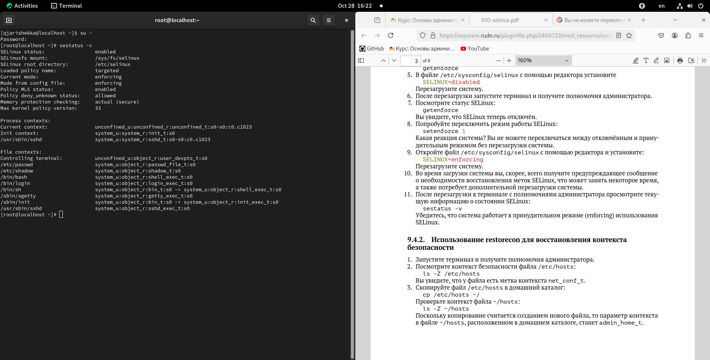{#fig:014 	width=70%}

## Использование restorecon для восстановления конткеста безопасности

Еще раз в терминале под пользователя root я выполнил команду ls чтобы смотерть контекст безопасности файла /etc/hosts (рис. [-@fig:015	]).

		ls -Z /etc/hosts

{#fig:015 	width=70%}

и там я увидел что у файла есть метка контекста net_conf_t

Потом я скопировал то же файл в домашний каталог (рис. [-@fig:016	]).

		cp /etc/hosts ~/

{#fig:016 	width=70%}

дальше я проверил контекст файла  (рис. [-@fig:017	]).

		ls -Z ~/hosts

{#fig:017 	width=70%}

там я смог увидет что контекст файла изменился. это произошло потому что файл скопирован в другой каталог(домашний каталог) и станет admin_home_t

Потом я перезаписал существующий файл hosts из домашнего каталога в каталог /etc (рис. [-@fig:018	]).

		mv ~/hosts /etc
		yes
		
		
{#fig:018 	width=70%}	

Дальше я проверил тип контекста файла и он изменился на admin_home_t. Чтобы исправить его я выполнил команду restorecon (рис. [-@fig:019	]).

		restorecon -v /etc/hosts

{#fig:019 	width=70%}

И еще раз проверил его  (рис. [-@fig:020	]).

		ls -Z /etc/hosts

{#fig:020	width=70%}

Потом для массового исправления контекста безопасности на файловой системе я выполнил создал файл /.autorelabel и перезагрузил систему (рис. [-@fig:021	]).

		touch /.autorelabel

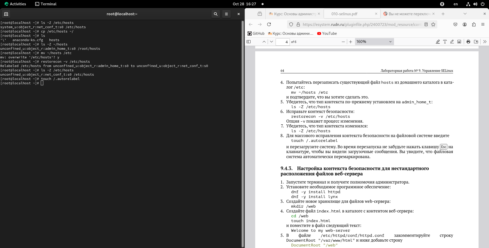{#fig:021 	width=70%}

## настройка контекста безопасности для нестандартного расположения файлов веб-сервера

я еще раз открыл терминал и получил полномочия администратора  (рис. [-@fig:022	]).

		su -

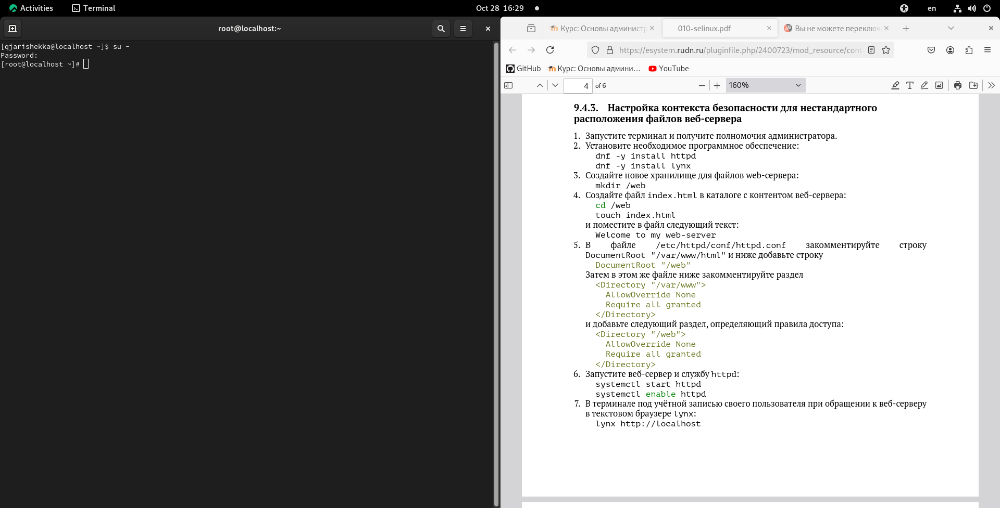{#fig:022 	width=70%}

Потом я установил два программного обеспечения (рис. [-@fig:023	]) и (рис. [-@fig:024	]).

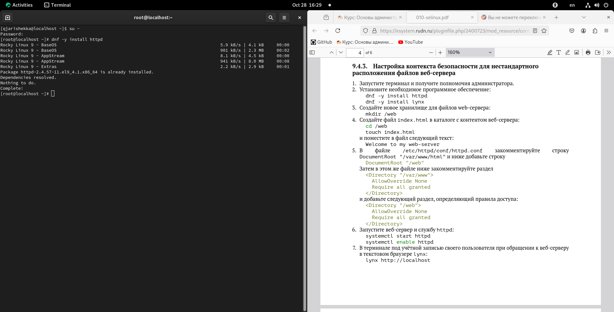{#fig:023 	width=70%}

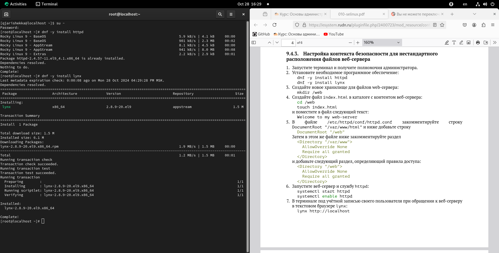{#fig:024 	width=70%}

Дальше я создал новое хранилище для файлов web-сервера (рис. [-@fig:025	]).

		mkdir /web

 {#fig:025 	width=70%}

Потом я создал файл index.html и расположил его в каталоге web (рис. [-@fig:026	]).

		touch /web/index.html

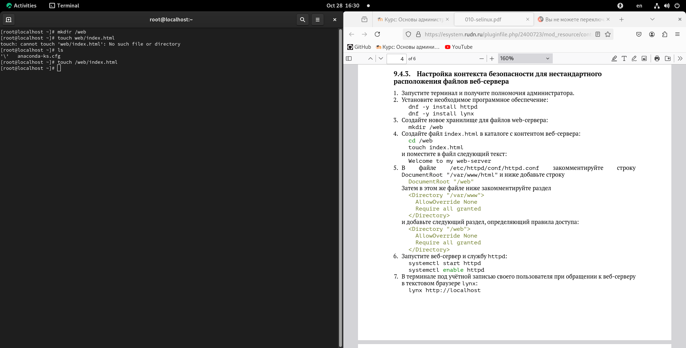{#fig:026 	width=70%}

Затем я добавил строку  (рис. [-@fig:027	]).

		vim /web/index.html
		Welcome to my web-server

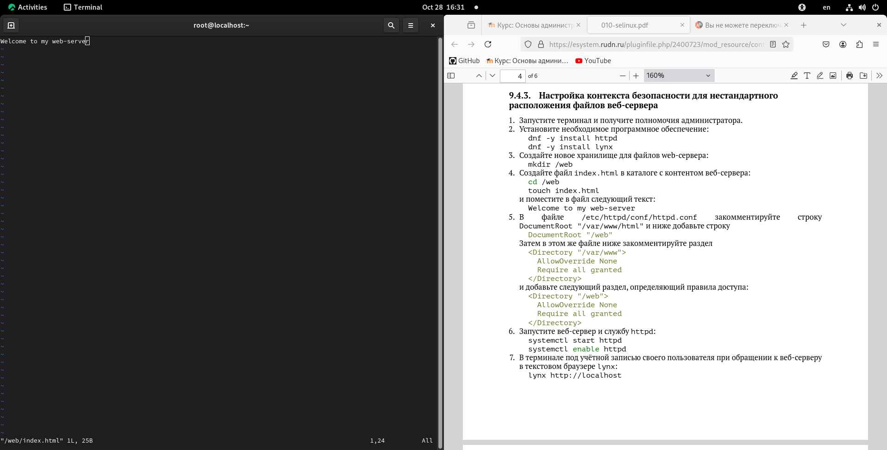{#fig:027 	width=70%}

Потом в файле /etc/httpd/conf/httpd.conf я изменил строки  (рис. [-@fig:032	]).

		vim /etc/httpd/conf/httpd.conf

		#DocumentRoot "/var/www/html"
		
		#<Directory "/var/www">
		#AllowOverride None
		#Require all granted
		#</Directory>

на

		DocumentRoot "/web"
		
		<Directory "/web">
		AllowOverride None
		Require all granted
		</Directory>
		
		:wq

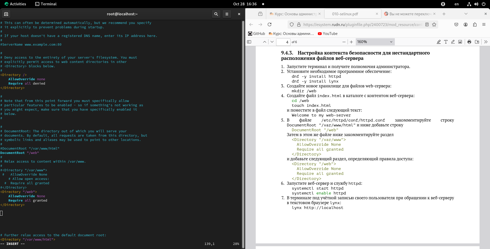{#fig:032 	width=70%}

Потом я запутил веб-сервер и службу httpd (рис. [-@fig:033	]).

		systemctl start httpd
		systemctl enable httpd

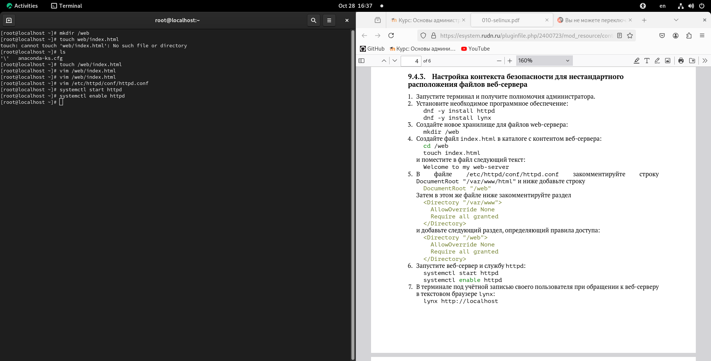{#fig:033 	width=70%}

Затем в терминале я выполнил команду дляо запуск текстовой браузер lynx (рис. [-@fig:034	]).

		lynx http://localhost

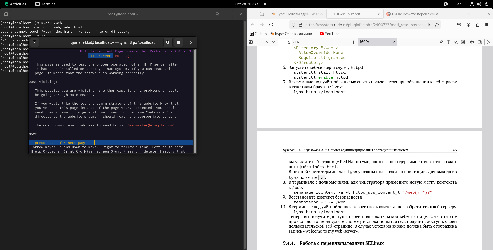{#fig:034 	width=70%}

Но у меня не права доступа на сайт, поэтому я только закрыл браузер нажимая клавишу q и y (рис. [-@fig:035	]).
	
		q
		y

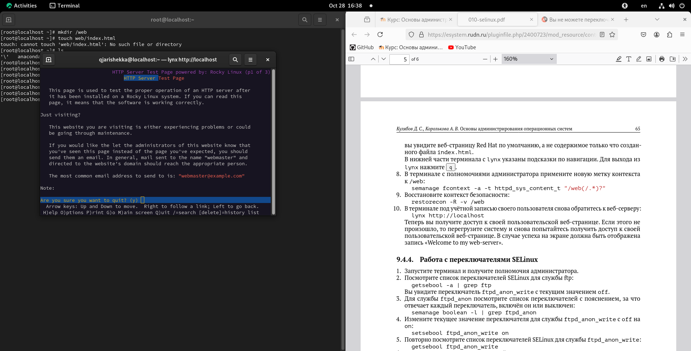{#fig:035 	width=70%}

Тогда я в терминале выполнил команду semanage чтобы изменить метку контекста каталога web (рис. [-@fig:036	]).

		semanage fcontext -a -t httpd_sys_content_t "/web(/.*)?"

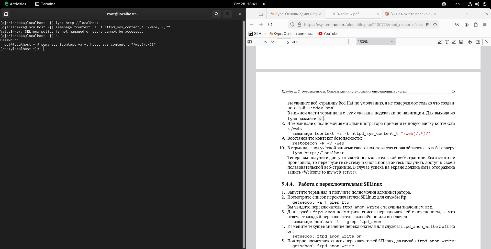{#fig:036	width=70%}

и восстановил контекста безопасности  (рис. [-@fig:037	]).

		restorecon -R -v /web

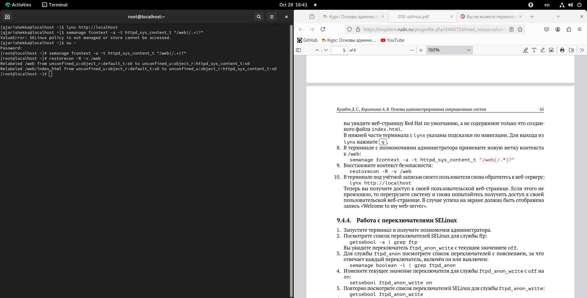{#fig:037 	width=70%}

И еще раз выполнил команду для запуска текстового браузера  (рис. [-@fig:038	]).

		lynx http://localhost

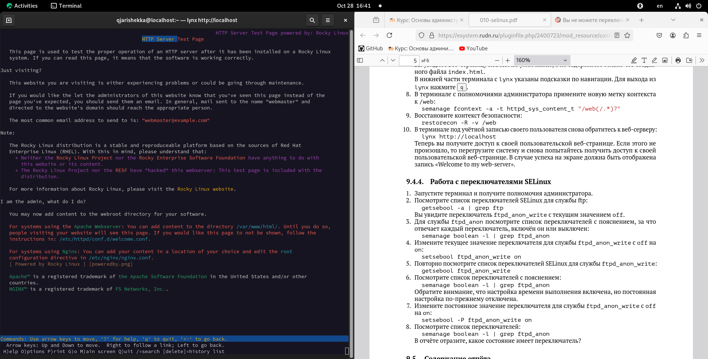{#fig:038 	width=70%}

у меня еще нет права доступа но после перезагрузки системы я снова выполнил ту же команду (рис. [-@fig:040	]).

		перезагрузка
		lynx http://localhost

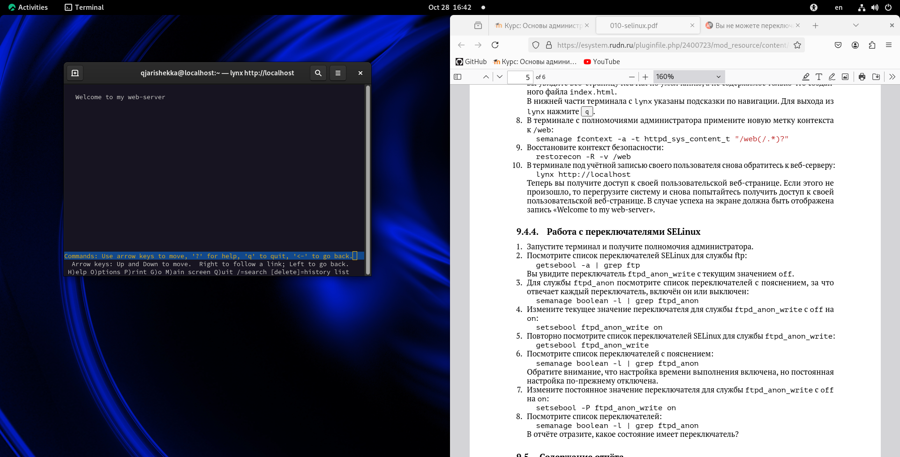{#fig:040 	width=70%}

и там я смог смотреть то что я написал в файле index.html

## Работа с переключателями SELinux

Еще раз в терминале под пользователя root я выполнил команду getsebool чтобы получить список переключателей SELinux для службы ftp (рис. [-@fig:041	]).

		getsebool -a | grepftp
		
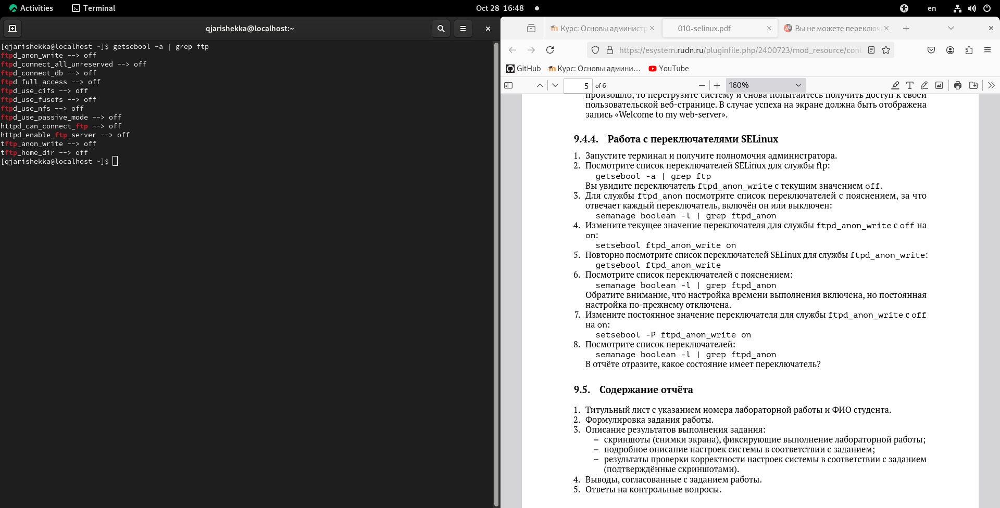{#fig:041 	width=70%} 

там  у всех переключателей есть значение off

Потом я смотрел другой список переключателей чтобы смотреть за что отвечают и включён или выключен (рис. [-@fig:042	]).

		semanage boolean -l | grep ftpd_anon

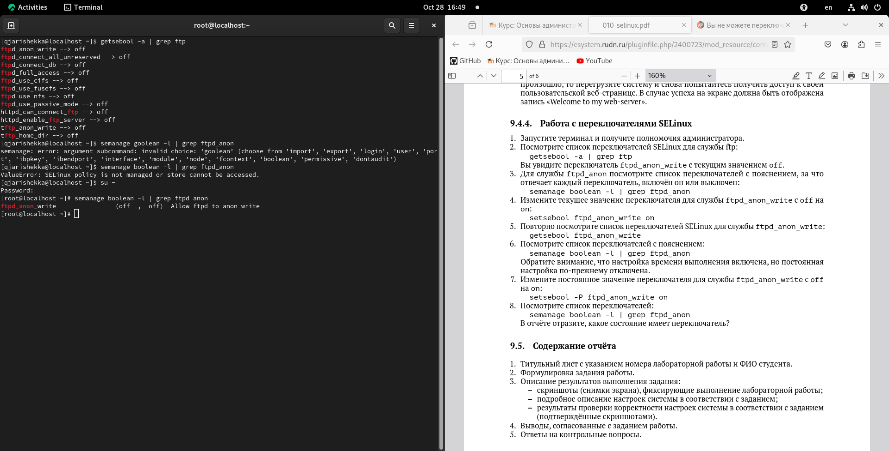{#fig:042 	width=70%}

дальше я изменил текущее значение для службы ftpd_anon_write с оff на on (рис. [-@fig:043	]).

		setsebool ftpd_anon_write
		
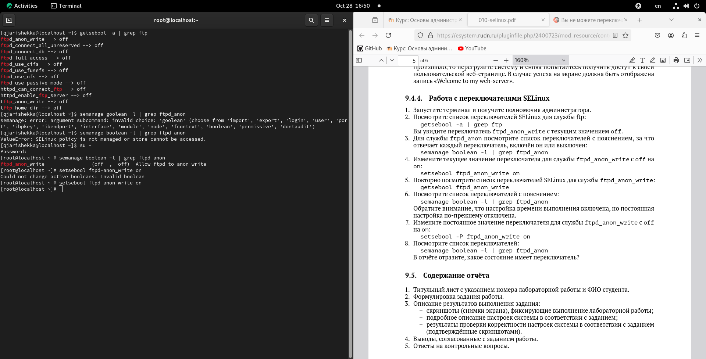{#fig:043 	width=70%}

и еще раз смотерл список переключателей с пояснением (рис. [-@fig:044	]).

		semanage boolean -l | grep ftpd_anon

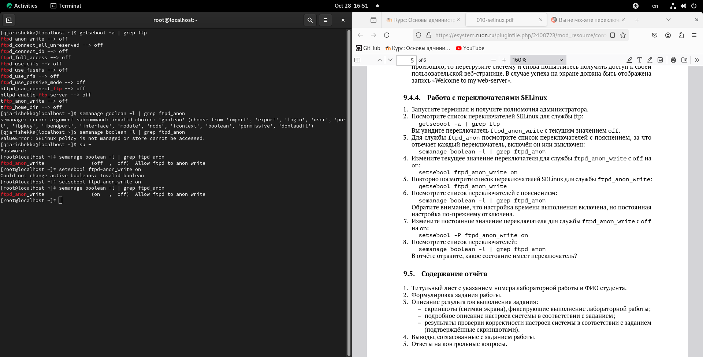{#fig:044 	width=70%}

и там появилась та же служба, которую я изменил её значение. но настройка времени выполнения включена и постоянная настройка по-прежнемиу отключена.

чтобы исправить постоянное значение переключателя для слжубы ftpd_anon_write я использовал другую опцию (рис. [-@fig:045	]).

		setsebool -P ftpd_anon_write on
		
{#fig:045	width=70%}

и еще раз посмотрел список переключателей (рис. [-@fig:046	]).

		semanage boolean -l | grep ftpd_anon

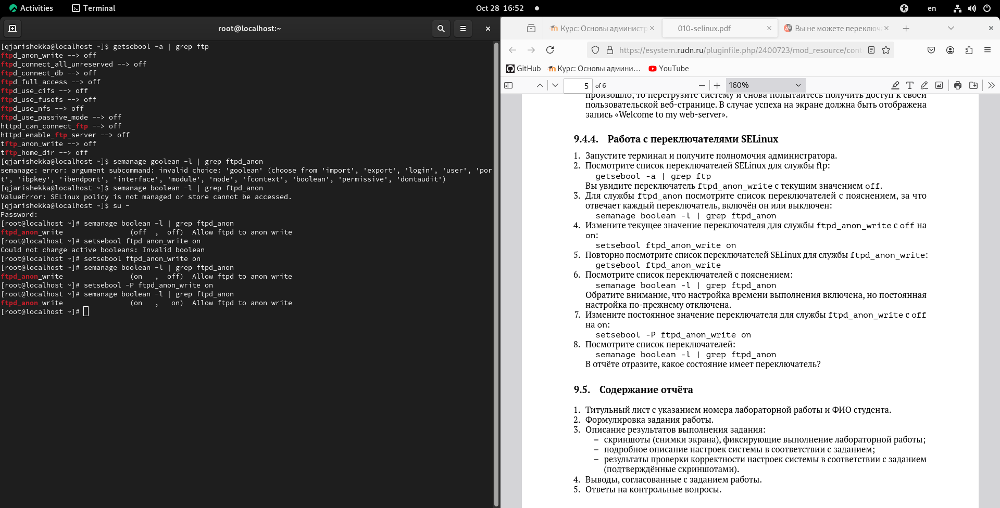{#fig:046 	width=70%}

Контрольные вопросы

1. Вы хотите временно поставить SELinux в разрешающем режиме. Какую команду вы
используете?

2. Вам нужен список всех доступных переключателей SELinux. Какую команду вы ис-
пользуете?

3. Каково имя пакета, который требуется установить для получения легко читаемых
сообщений журнала SELinux в журнале аудита?

4. Какие команды вам нужно выполнить, чтобы применить тип контекста
httpd_sys_content_t к каталогу /web?

5. Какой файл вам нужно изменить, если вы хотите полностью отключить SELinux?

6. Где SELinux регистрирует все свои сообщения?

7. Вы не знаете, какие типы контекстов доступны для службы ftp. Какая команда позво-
ляет получить более конкретную информацию?

8. Ваш сервис работает не так, как ожидалось, и вы хотите узнать, связано ли это с SELinux
или чем-то ещё. Какой самый простой способ узнать?

# Выводы

на эту лабораторную работу я смотрел работу контекстом безопасности и политиками SELinux, как они разрешают нас на ядер Linux и также как настройть его, также я смотрел переключатели SElinux и как изменить их значения 

# Список литературы{.unnumbered}

::: {#refs}
:::
