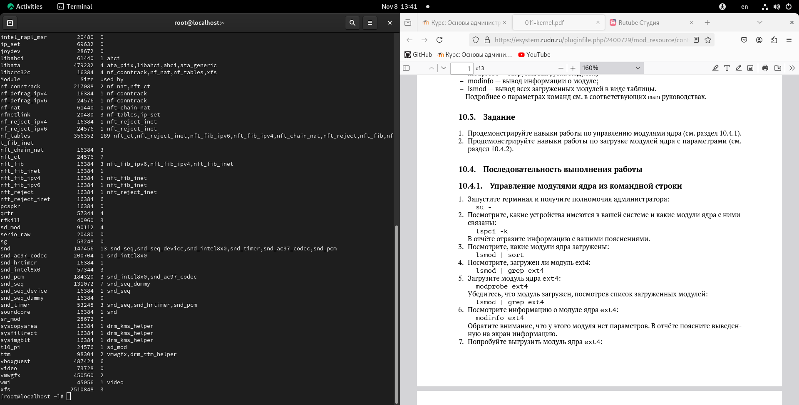
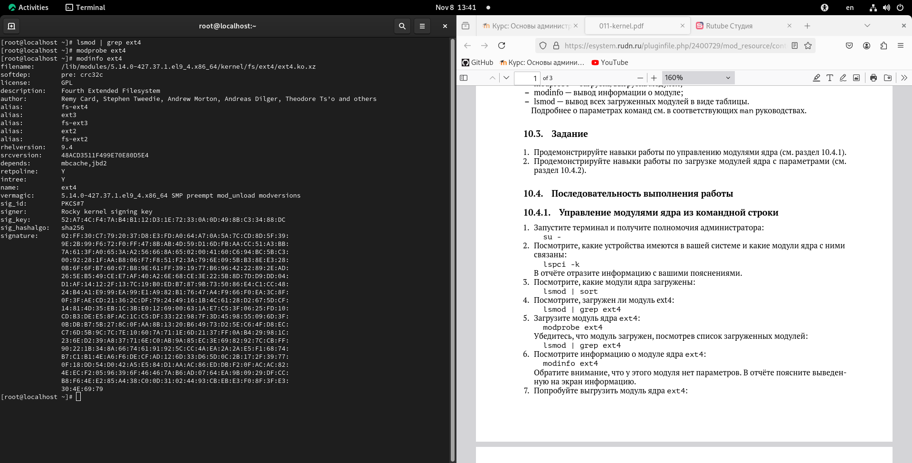
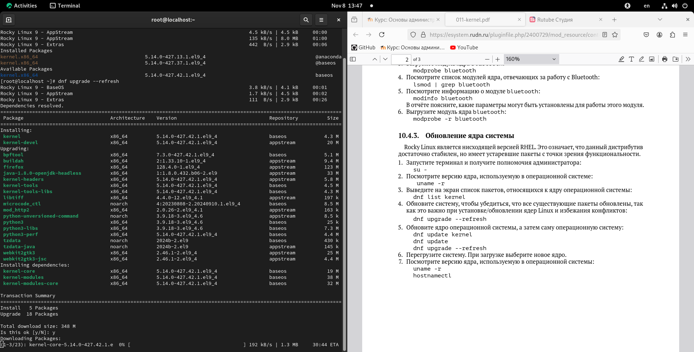
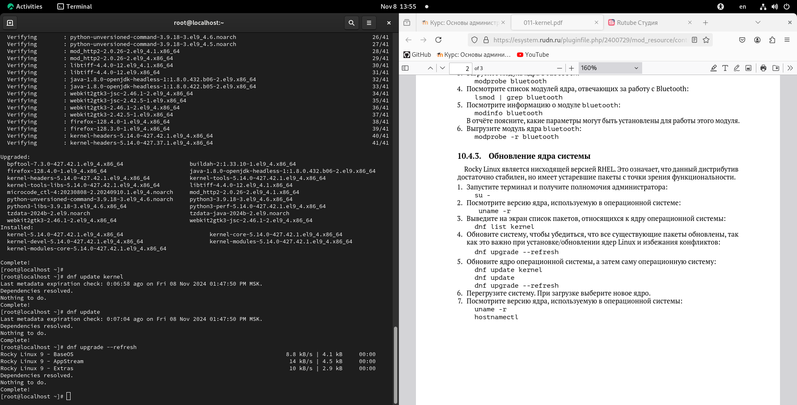
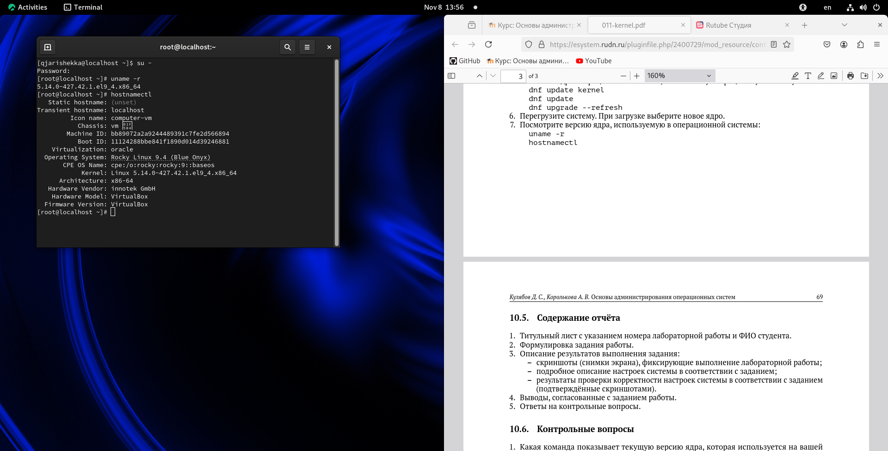

---
## Front matter
lang: ru-RU
title: Презентация лабораторной работы №7
subtitle: Управление журналами событий в системе
author:
  - Кхари Жекка Кализая Арсе

## i18n babel
babel-lang: russian
babel-otherlangs: english

## Fonts
mainfont: IBM Plex Serif
romanfont: IBM Plex Serif
sansfont: IBM Plex Sans
monofont: IBM Plex Mono
mathfont: STIX Two Math
mainfontoptions: Ligatures=Common,Ligatures=TeX,Scale=0.94
romanfontoptions: Ligatures=Common,Ligatures=TeX,Scale=0.94
sansfontoptions: Ligatures=Common,Ligatures=TeX,Scale=MatchLowercase,Scale=0.94
monofontoptions: Scale=MatchLowercase,Scale=0.94,FakeStretch=0.9

## Formatting pdf
toc: false
toc-title: Содержание
slide_level: 2
aspectratio: 169
section-titles: true
theme: metropolis
header-includes:
 - \metroset{progressbar=frametitle,sectionpage=progressbar,numbering=fraction}
---

# Лабораторная работа 

# Последовательность выполнения работы

# Управление модулями ядра из командной строки

## устновленные устройства и модули

- команды:
   - lspci -k
   - lsmod | sort
   - lsmod | grep ext4
   
:::::::::::::: {.columns align=center}
::: {.column width="60%"}

 

:::
::::::::::::::
   
## загрузка модулей и информация
- команды:
   - modprobe ext4
   - modinfo ext4
   
:::::::::::::: {.columns align=center}
::: {.column width="60%"}

 

:::
::::::::::::::

   
   
## выгрузка модулей
- команды:
   - modprobe -r ext4
   - modprobe -r xfs
   
:::::::::::::: {.columns align=center}
::: {.column width="60%"}

 

:::
::::::::::::::

# Загрузка модулей ядра с параметрами

команды:
   - lsmod | grep bluetooth
   - modprobe bluetooth
   - lsmod | grep bluetooth
   - modinfo bluetooth
   - modprobe -r bluetooth

:::::::::::::: {.columns align=center}
::: {.column width="60%"}

 

:::
::::::::::::::

# Обновление ядра системы

## обновление оперативной системы

команды:

   - uname -r
   - dnf list kernel
   - dnf upgrade --refresh

:::::::::::::: {.columns align=center}
::: {.column width="60%"}

 

:::
::::::::::::::
   

## обновление ядра системы
   
   - dnf update kernel
   - dnf update
   - dnf updrade --refresh

:::::::::::::: {.columns align=center}
::: {.column width="60%"}

 

:::
::::::::::::::

   
## проверка обновления ядра
   - uname -r
   - hostnamectl
   
:::::::::::::: {.columns align=center}
::: {.column width="60%"}

 

:::
::::::::::::::

# СПАСИБО ЗА ВНИМАНИЕ

