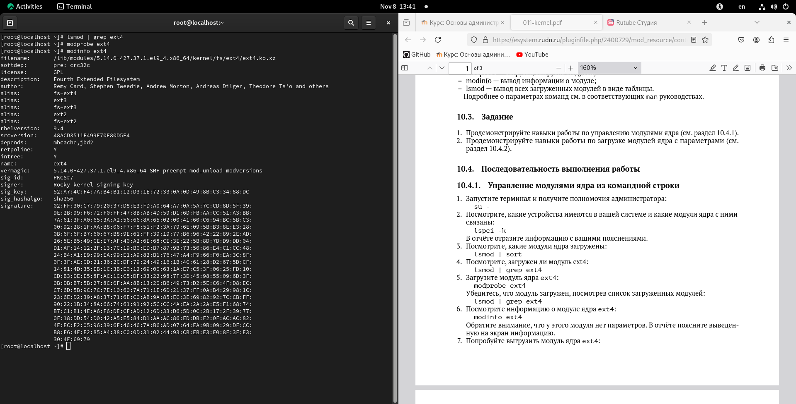
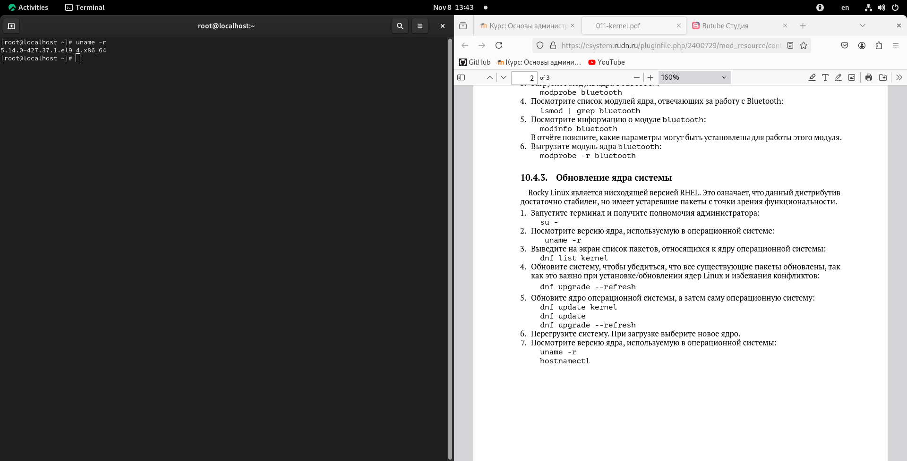

---
## Front matter
title: "Шаблон отчёта по лабораторной работе"
subtitle: "Простейший вариант"
author: "Дмитрий Сергеевич Кулябов"

## Generic otions
lang: ru-RU
toc-title: "Содержание"

## Bibliography
bibliography: bib/cite.bib
csl: pandoc/csl/gost-r-7-0-5-2008-numeric.csl

## Pdf output format
toc: true # Table of contents
toc-depth: 2
lof: true # List of figures
lot: true # List of tables
fontsize: 12pt
linestretch: 1.5
papersize: a4
documentclass: scrreprt
## I18n polyglossia
polyglossia-lang:
  name: russian
  options:
	- spelling=modern
	- babelshorthands=true
polyglossia-otherlangs:
  name: english
## I18n babel
babel-lang: russian
babel-otherlangs: english
## Fonts
mainfont: IBM Plex Serif
romanfont: IBM Plex Serif
sansfont: IBM Plex Sans
monofont: IBM Plex Mono
mathfont: STIX Two Math
mainfontoptions: Ligatures=Common,Ligatures=TeX,Scale=0.94
romanfontoptions: Ligatures=Common,Ligatures=TeX,Scale=0.94
sansfontoptions: Ligatures=Common,Ligatures=TeX,Scale=MatchLowercase,Scale=0.94
monofontoptions: Scale=MatchLowercase,Scale=0.94,FakeStretch=0.9
mathfontoptions:
## Biblatex
biblatex: true
biblio-style: "gost-numeric"
biblatexoptions:
  - parentracker=true
  - backend=biber
  - hyperref=auto
  - language=auto
  - autolang=other*
  - citestyle=gost-numeric
## Pandoc-crossref LaTeX customization
figureTitle: "Рис."
tableTitle: "Таблица"
listingTitle: "Листинг"
lofTitle: "Список иллюстраций"
lotTitle: "Список таблиц"
lolTitle: "Листинги"
## Misc options
indent: true
header-includes:
  - \usepackage{indentfirst}
  - \usepackage{float} # keep figures where there are in the text
  - \floatplacement{figure}{H} # keep figures where there are in the text
---

# Цель работы

Получить навыки работы с утилитами управления модулями ядра операционной си-
стемы.

# Задание

1. Продемонстрируйте навыки работы по управлению модулями ядра (см. раздел 10.4.1).

2. Продемонстрируйте навыки работы по загрузке модулей ядра с параметрами (см.
раздел 10.4.2).

# Выполнение лабораторной работы

## Управление модулями ядра из командной строки

Сначала этой лабораторы я открыл терминал и получил полномочия администратора(рис. [-@fig:001	]).

		su -

{#fig:001 width=70%}

Потом я выполнил команду, которая показывает устройства имеются в моей системе и какие модули ядра с ними связаны (рис. [-@fig:002	]).

		lspci -k

{#fig:002	 width=70%}

Дальше я смотрел список модули ядра загружены (рис. [-@fig:003	]).

		lsmod | sort

{#fig:003	 width=70%}

Потом я смотрел загружен ли модуль ext4  (рис. [-@fig:004	]).

		lsmod | grep ext4

{#fig:004	 width=70%}

Я смотрел что модуль нет загружен поэтому я загрузил его (рис. [-@fig:005	]).

		modprobe ext4

{#fig:005	 width=70%}

и еще раз я смотрел загружен ли модуль (рис. [-@fig:006	]).

		lsmod | grep ext4

{#fig:006	 width=70%}

Потом я посмотрел информацию о модуле ядра ext4 (рис. [-@fig:007	]).

		modinfo ext4

{#fig:007	 width=70%}

Потом я выгрузил модуль ядра ext4 (рис. [-@fig:008	]).

		modprobe -r ext4

{#fig:008	 width=70%}

Потом я выгрузил модуль ядра xfs (рис. [-@fig:009	]).

		modprobe -r xfs

{#fig:009	 width=70%}

## Загрузка модулей ядра с параметрами
 
я использовал тот же терминал и там я выполнил команду uname чтобы смотреть загружен ли модуль bluetooth (рис. [-@fig:010	]).

		lsmod | grep bluetooth

{#fig:010	 width=70%}

Потом я загрузил этот модуль (рис. [-@fig:011	]).

		modprobe bluetooth

{#fig:011	 width=70%}

Дальше я посмотрел список модулей ядра, отвечающих за работу с Bluetooth (рис. [-@fig:110	]).

		lsmod | grep bluetooth

{#fig:110	 width=70%}

Потом посмотрел информацию о модуле bluetooth (рис. [-@fig:012	]).

		modinfo bluetooth

{#fig:012	 width=70%}

там я смог смотреть что есть параметры, которые можно установыть (eSCD conection creation, enhanced transmition mode, enhanced creidt flow control)

Затем я выгрузил модуль bluetooth (рис. [-@fig:013	]).

		modprobe -r bluetooth

{#fig:013	 width=70%}

## Обновление ядра системы

используя тот же терминал я выполнил команду uname чтобы смотреть версию ядра (рис. [-@fig:014	]).

		uname -r 

{#fig:014	 width=70%}

Потом я посмотрел список пакетов, относящихся к ядру операционной системы (рис. [-@fig:015	]).

		dnf list kernel

{#fig:015	 width=70%}

Дальше я обновил систему, чтобы убедиться что все существующие пакеты обновлены (рис. [-@fig:016	]).

		dnf upgrade --refresh

{#fig:016	 width=70%}

Потом я обновил ядро операционной системы с рис. [-@fig:018	]  до рис. [-@fig:020	]

		dnf update kernel
		dnf update
		dnf upgrade --refresh

{#fig:018	 width=70%}

{#fig:019	 width=70%}

{#fig:020	 width=70%}

Дальше я перегрузил систему

Потом я смотрел версию ядра (рис. [-@fig:022	]).

		uname -r
		hostnamectl
		
{#fig:022	 width=70%}

# Выводы

В эту лабораторную работу я посмотрел использование команд modinfo modprobe lsmod чтобы смотреть список модулей, информация и как загрузить и выгрузить их. Также я посмотрел работу команд для обновления ядра системы

# Список литературы{.unnumbered}

::: {#refs}
:::
