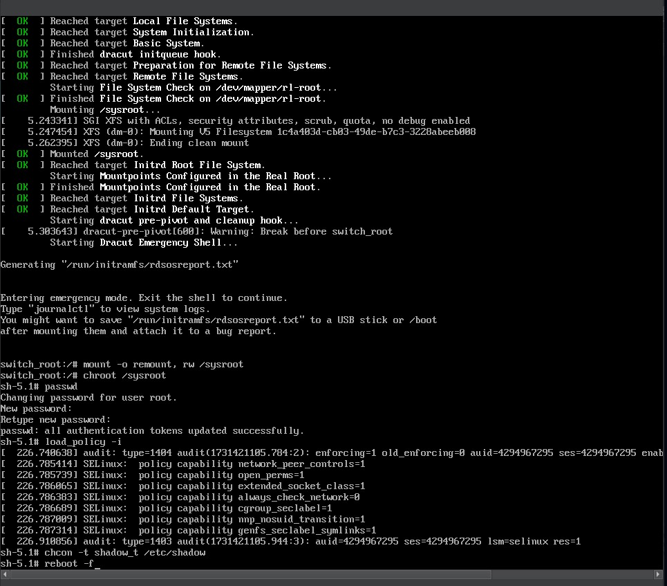

---
## Front matter
lang: ru-RU
title: Презентация лабораторной работы №7
subtitle: Управление журналами событий в системе
author:
  - Кхари Жекка Кализая Арсе

## i18n babel
babel-lang: russian
babel-otherlangs: english

## Fonts
mainfont: IBM Plex Serif
romanfont: IBM Plex Serif
sansfont: IBM Plex Sans
monofont: IBM Plex Mono
mathfont: STIX Two Math
mainfontoptions: Ligatures=Common,Ligatures=TeX,Scale=0.94
romanfontoptions: Ligatures=Common,Ligatures=TeX,Scale=0.94
sansfontoptions: Ligatures=Common,Ligatures=TeX,Scale=MatchLowercase,Scale=0.94
monofontoptions: Scale=MatchLowercase,Scale=0.94,FakeStretch=0.9

## Formatting pdf
toc: false
toc-title: Содержание
slide_level: 2
aspectratio: 169
section-titles: true
theme: metropolis
header-includes:
 - \metroset{progressbar=frametitle,sectionpage=progressbar,numbering=fraction}
---

# Лабораторная работа 

# Последовательность выполнения работы

# Модификация параметров GRUB2

## Модификация параметров GRUB2
- команды:
   - vim /etc/default/grub
   - GRUB_TIMEOUT=10
   - grub2-mkconfig > /boot/grub2/grub.cfg

:::::::::::::: {.columns align=center}
::: {.column width="70%"}

 

:::
::::::::::::::

# Устранения неполадок

## параметры для загрузки системы
- при загрузке системы:
	
	systemd.unit=rescue.target
	systemd.unit=emergency.target
	
:::::::::::::: {.columns align=center}
::: {.column width="70%"}

 

:::
::::::::::::::

## rescue.target

- команды:
   - systemctl list-units
   - systemctl show-environment

:::::::::::::: {.columns align=center}
::: {.column width="70%"}

 

:::
::::::::::::::

## emergency.target

- команды:
   - systemctl list-units

:::::::::::::: {.columns align=center}
::: {.column width="70%"}

 

:::
::::::::::::::

# Сброс пароля root

## сброс пароля root

- параметр:
   - rd.break
  
- команды:
   - mount -o remount,rw /sysroot
   - chroot /sysroot
   - passwd
   
:::::::::::::: {.columns align=center}
::: {.column width="70%"}

 

:::
::::::::::::::

## установка контекста

- команды:
   - load_policy -i
   - chcon -t shadow_t /etc/shadow

:::::::::::::: {.columns align=center}
::: {.column width="70%"}

 

:::
::::::::::::::

