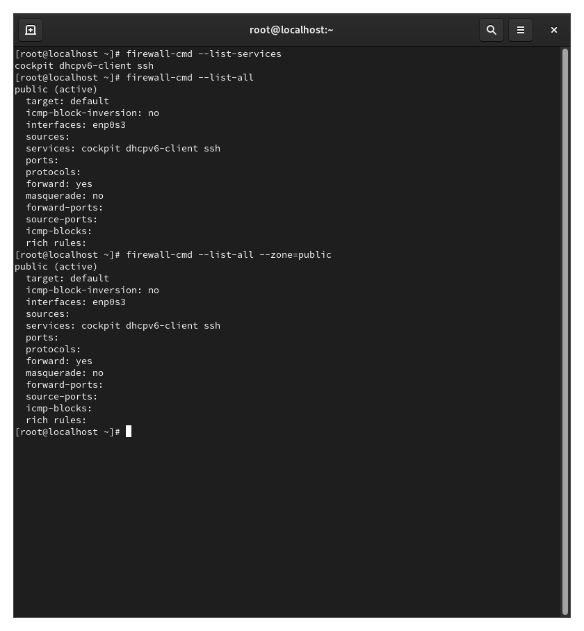
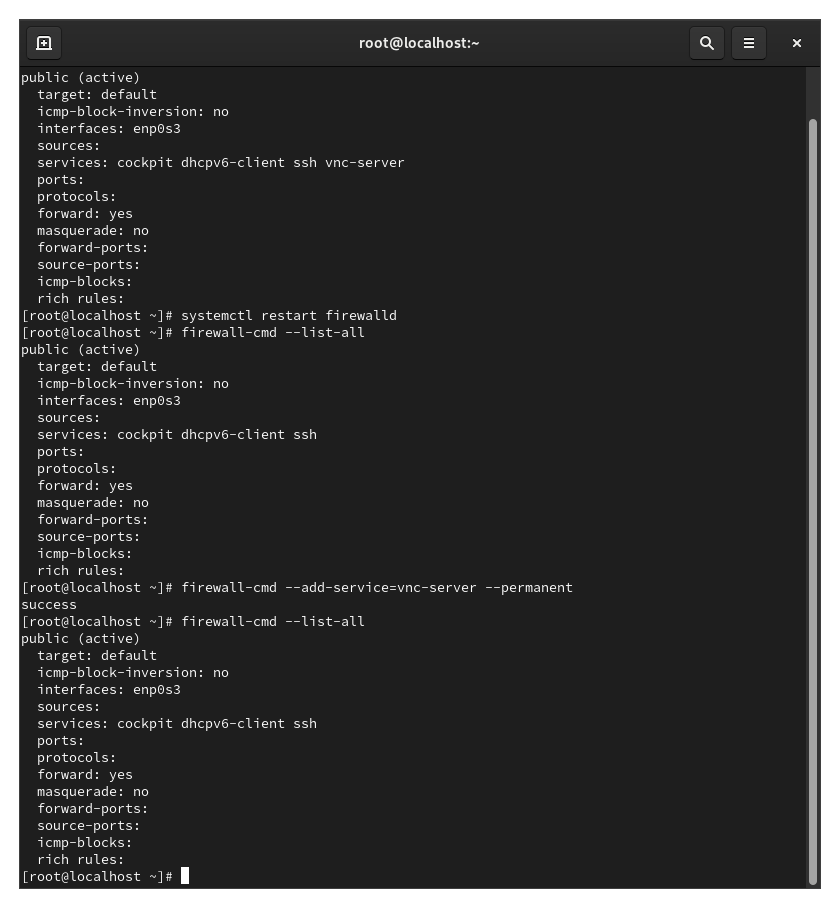
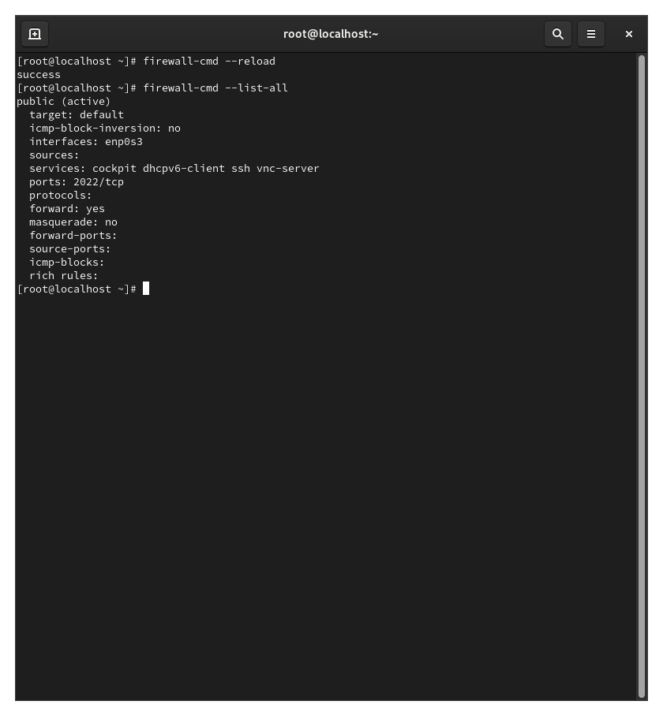
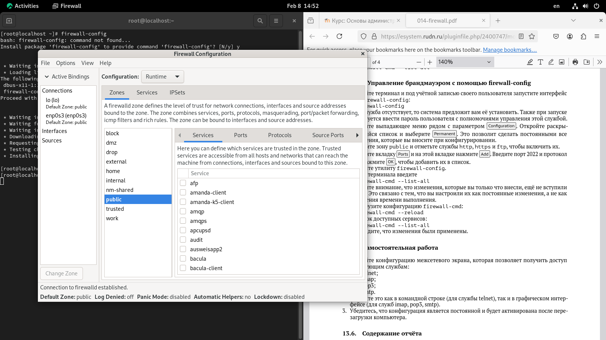

---
## Front matter
lang: ru-RU
title: Презентация лабораторной работы №13
subtitle: Фильтр пакетов
author:
  - Кхари Жекка Кализая Арсе

## i18n babel
babel-lang: russian
babel-otherlangs: english

## Fonts
mainfont: IBM Plex Serif
romanfont: IBM Plex Serif
sansfont: IBM Plex Sans
monofont: IBM Plex Mono
mathfont: STIX Two Math
mainfontoptions: Ligatures=Common,Ligatures=TeX,Scale=0.94
romanfontoptions: Ligatures=Common,Ligatures=TeX,Scale=0.94
sansfontoptions: Ligatures=Common,Ligatures=TeX,Scale=MatchLowercase,Scale=0.94
monofontoptions: Scale=MatchLowercase,Scale=0.94,FakeStretch=0.9

## Formatting pdf
toc: false
toc-title: Содержание
slide_level: 2
aspectratio: 169
section-titles: true
theme: metropolis
header-includes:
 - \metroset{progressbar=frametitle,sectionpage=progressbar,numbering=fraction}
---

# Лабораторная работа 

# Последовательность выполнения работы

# Управление брандмауэром с помощью firewall-cmd

## Управление брандмауэром с помощью firewall-cmd

- команды для информации:
	firewall-cmd --get-default-zone
	firewall-cmd --get-zones
	firewall-cmd --get-services
	firewall-cmd --list-services
	firewall-cmd --list-all
	firewall-cmd --list-all --zone=public

:::::::::::::: {.columns align=center}
::: {.column width="70%"}

 

:::
::::::::::::::

## Управление брандмауэром с помощью firewall-cmd

- команды:
	firewall-cmd --add-service=vnc-server
	firewall-cmd --list-all
	systemctl restart firewalld
	firewall-cmd --list-all
	firewall-cmd --add-service=vnc-server --permanent
	firewall-cmd --list-all
	
:::::::::::::: {.columns align=center}
::: {.column width="70%"}

 

:::
::::::::::::::

## Управление брандмауэром с помощью firewall-cmd

- команды: 
	firewall-cmd --reload
	firewall-cmd --list-all
	firewall-cmd --add-port=2022/tcp --permanent
	firewall-cmd --reload
	firewall-cmd --list-all

:::::::::::::: {.columns align=center}
::: {.column width="70%"}

 

:::
::::::::::::::

# Управление брандмауэром с помощью firewall-config
## Управление брандмауэром с помощью firewall-config

- команды:

	firewall-config
	firewall-cmd --list-all
	firewall-cmd --reload
	firewall-cmd --list-all

:::::::::::::: {.columns align=center}
::: {.column width="70%"}

 

:::
::::::::::::::

