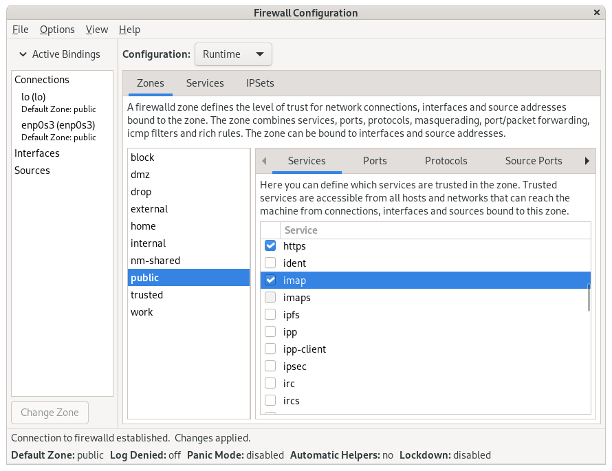

---
## Front matter
title: "отчёт по лабораторной работе №13"
subtitle: "Фильтр пакетов"
author: "Кхари Жекка Кализая Арсе"

## Generic otions
lang: ru-RU
toc-title: "Содержание"

## Bibliography
bibliography: bib/cite.bib
csl: pandoc/csl/gost-r-7-0-5-2008-numeric.csl

## Pdf output format
toc: true # Table of contents
toc-depth: 2
lof: true # List of figures
lot: true # List of tables
fontsize: 12pt
linestretch: 1.5
papersize: a4
documentclass: scrreprt
## I18n polyglossia
polyglossia-lang:
  name: russian
  options:
	- spelling=modern
	- babelshorthands=true
polyglossia-otherlangs:
  name: english
## I18n babel
babel-lang: russian
babel-otherlangs: english
## Fonts
mainfont: IBM Plex Serif
romanfont: IBM Plex Serif
sansfont: IBM Plex Sans
monofont: IBM Plex Mono
mathfont: STIX Two Math
mainfontoptions: Ligatures=Common,Ligatures=TeX,Scale=0.94
romanfontoptions: Ligatures=Common,Ligatures=TeX,Scale=0.94
sansfontoptions: Ligatures=Common,Ligatures=TeX,Scale=MatchLowercase,Scale=0.94
monofontoptions: Scale=MatchLowercase,Scale=0.94,FakeStretch=0.9
mathfontoptions:
## Biblatex
biblatex: true
biblio-style: "gost-numeric"
biblatexoptions:
  - parentracker=true
  - backend=biber
  - hyperref=auto
  - language=auto
  - autolang=other*
  - citestyle=gost-numeric
## Pandoc-crossref LaTeX customization
figureTitle: "Рис."
tableTitle: "Таблица"
listingTitle: "Листинг"
lofTitle: "Список иллюстраций"
lotTitle: "Список таблиц"
lolTitle: "Листинги"
## Misc options
indent: true
header-includes:
  - \usepackage{indentfirst}
  - \usepackage{float} # keep figures where there are in the text
  - \floatplacement{figure}{H} # keep figures where there are in the text
---

# Цель работы

Получить навыки настройки пакетного фильтра в Linux.

# Задание

1. Используя firewall-cmd:
– определить текущую зону по умолчанию;
– определить доступные для настройки зоны;
– определить службы, включённые в текущую зону;
– добавить сервер VNC в конфигурацию брандмауэра.
2. Используя firewall-config:
– добавьте службы http и ssh в зону public;
– добавьте порт 2022 протокола UDP в зону public;
– добавьте службу ftp.
3. Выполните задание для самостоятельной работы 

# Выполнение лабораторной работы

## Управление брандмауэром с помощью firewall-cmd

сначала я открыл терминал и выполнил команду su (рис. [-@fig:001	]).

		su -

{#fig:001	 width=70%}

Потом я определил текущую зону по умалчанию (рис. [-@fig:002	]).

		firewall-cmd --get-default-zone

{#fig:002	 width=70%}

Дальше я определил доступные зоны (рис. [-@fig:003	]).

		firewall-cmd --get-zones

{#fig:003	 width=70%}

потом я смотрел службы, доступные на моем компьютере (рис. [-@fig:004	]).

		firewall-cmd --get-services

{#fig:004	 width=70%}

Затем я определил доступные службы (рис. [-@fig:005	]).

		firewall-cmd --list-services

{#fig:005	 width=70%}

Потом я сравнил резултаты двух разных команд (рис. [-@fig:006	]).

		firewall-cmd --list-all
		firewall-cmd --list-all --zone=public

и не было разницы

{#fig:006	 width=70%}

Потом я добавил сервер VNC (рис. [-@fig:007	]).

		firewall-cmd --add-service=vnc-server

{#fig:007	 width=70%}

Потом я проверил сервер (рис. [-@fig:008	]).

		firewall-cmd --list-all

{#fig:008	 width=70%}

Потом я перезапустил службу firewalld (рис. [-@fig:009	]).

		systemctl restart firewalld

{#fig:009	 width=70%}

Затем я проверил добавление сервера и осознал что он больше не был там и это произошло потому что я не настроил его чтобы он будет постоянным (рис. [-@fig:010	]).

		firewall-cmd --list-all

{#fig:010	 width=70%}

Потом я еще раз добавил сервер но с меткой --permament чтобы делать его постоянный (рис. [-@fig:011	]).

		firewall-cmd --add-service=vnc-server --permanent

{#fig:011	 width=70%}

и еще раз проверил сервер (рис. [-@fig:012	]).

		systemctl restart firewalld
		firewall-cmd --list-all

{#fig:012	 width=70%}

Потом я добавил конфигурацию межсетевого экрана порт 2022 протокола TCP (рис. [-@fig:013	]).

		firewall-cmd --add-port=2022/tcp --permanent

{#fig:013	 width=70%}

Затем я перезагрузил конфигурацию firewalld (рис. [-@fig:014	]).

		firewall-cmd --reload
		
{#fig:014	 width=70%}

Потом я проверил что порт добавлен в конфигурацию (рис. [-@fig:015	]).

		firewall-cmd --list-all

{#fig:015	 width=70%}

## Управление брандмауэром с помощью firewall-config

В этой части я запустил интерфейс GUI firewall и для этого сначала я установил его и потом он сам запутил  (рис. [-@fig:016	]).

		firewall-config

{#fig:016	 width=70%}

Потом я изменил параметр в configuration на permanent. потом я выбрал зону public и отметил службы http, https, ftp. потом я выбрал вкладку port и нажал add 2022 и протокол udp чтобы добавить другой порт (рис. [-@fig:017	] - рис. [-@fig:021]).
 
{#fig:017	 width=70%}

{#fig:018	 width=70%}

{#fig:019	 width=70%}

{#fig:020	 width=70%}

{#fig:021	 width=70%}

Потом я закрыл утилиту firewall-config  и в терминале я смотрел изменения (рис. [-@fig:022	]).
		
		firewall-cmd --list-all

{#fig:022	 width=70%}

потом я перезагрузил конфигурацию firewall-cmd  (рис. [-@fig:023	]).

		firewall-cmd --reload
		firewall-cmd --list-all
		
{#fig:023	 width=70%}

{#fig:024	 width=70%}

## Cамостоятельная работа

{#fig:029	 width=70%}

{#fig:025	 width=70%}

{#fig:026	 width=70%}

{#fig:027	 width=70%}

{#fig:028	 width=70%}

# Выводы

в этой лабораторной работе я смотрел как работать с утилитой firewall в linux

# Список литературы{.unnumbered}

::: {#refs}
:::
