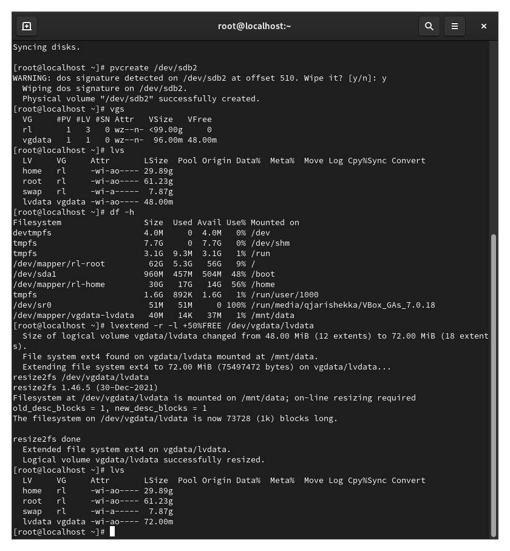

---
## Front matter
lang: ru-RU
title: Презентация лабораторной работы №15
subtitle: Управление логическими томами
author:
  - Кхари Жекка Кализая Арсе

## i18n babel
babel-lang: russian
babel-otherlangs: english

## Fonts
mainfont: IBM Plex Serif
romanfont: IBM Plex Serif
sansfont: IBM Plex Sans
monofont: IBM Plex Mono
mathfont: STIX Two Math
mainfontoptions: Ligatures=Common,Ligatures=TeX,Scale=0.94
romanfontoptions: Ligatures=Common,Ligatures=TeX,Scale=0.94
sansfontoptions: Ligatures=Common,Ligatures=TeX,Scale=MatchLowercase,Scale=0.94
monofontoptions: Scale=MatchLowercase,Scale=0.94,FakeStretch=0.9

## Formatting pdf
toc: false
toc-title: Содержание
slide_level: 2
aspectratio: 169
section-titles: true
theme: metropolis
header-includes:
 - \metroset{progressbar=frametitle,sectionpage=progressbar,numbering=fraction}
---

# Лабораторная работа 

# Последовательность выполнения работы

# Создание физического тома

- цель: создать физического тома

## удаление партиций

- Команды:
   - vim /etc/fstab
   - (коментировать строку)
   - umount /mnt/data
   - fdisk
   - o ENTER w ENTER
   - partprobe /dev/sdb

## удаление партиций

:::::::::::::: {.columns align=center}
::: {.column width="70%"}

 

:::
::::::::::::::

## удаление партиций

:::::::::::::: {.columns align=center}
::: {.column width="70%"}

 

:::
::::::::::::::

# создание физического тома

## создание физического тома

- команды:
   - fdisk /dev/sdb 
   - n p (по умолчанию) t 8e w
   - partprobe /dev/sdb
   - pvcreate /dev/sdb1
   - pvs

## создание физического тома

:::::::::::::: {.columns align=center}
::: {.column width="70%"}

 

:::
::::::::::::::

## создание физического тома

:::::::::::::: {.columns align=center}
::: {.column width="70%"}

 

:::
::::::::::::::

# Создание группы томов и логических томов

## создание группы томов

- команды: 
   - vgcreate vgdata /dev/sdb1
   - vgs
   - pvs
   - lvcreate -n lvdata -l 50%FREE vgdata
   - lvs
   - mkfs.ext4 /dev/vgdata/lvdata
   - mkdir -p /mnt/data
   - vim /etc/fstab 	/dev/vgdata/lvdata /mnt/data ext4 defaults 1 2
   - systemctl daemon-reload
   - mount -a
   - mount

## создание группы томов

:::::::::::::: {.columns align=center}
::: {.column width="70%"}

 

:::
::::::::::::::

## создание группы томов

:::::::::::::: {.columns align=center}
::: {.column width="70%"}

 

:::
::::::::::::::

## создание группы томов

:::::::::::::: {.columns align=center}
::: {.column width="70%"}

 

:::
::::::::::::::

# Изменение размера логических томов

## создание новой партиции

- Команды:
   - pvs
   - vgs
   - fidsk /dev/sdb
   - p e (по-умолчанию) +100Mib t 8e
   - partprobe /dev/sdb
   
## создание новой партиции

:::::::::::::: {.columns align=center}
::: {.column width="70%"}

 

:::
::::::::::::::

   
   
## изменение размера логического тома

- Команды:

   - pvcreate /dev/sdb2
   - vgextend vgdata /dev/sdb2
   - vgs
   - lvs
   - df -h
   - lvextend -r -l +50%FREE /dev/vgdata/lvdata
   - df -h
   - lvreduce -r -L -50M /dev/vgdata/lvdata
   - lvs 
   - df -h

## изменение размера логического тома

:::::::::::::: {.columns align=center}
::: {.column width="70%"}

 

:::
::::::::::::::

## изменение размера логического тома

:::::::::::::: {.columns align=center}
::: {.column width="70%"}

 

:::
::::::::::::::

