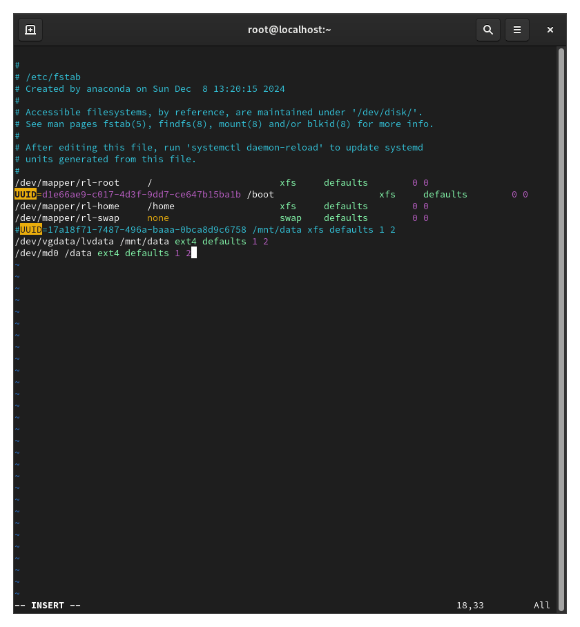

---
## Front matter
title: "отчёта по лабораторной работе №16"
subtitle: "Программный RAID"
author: "Кхари Жекка Кализая Арсе"

## Generic otions
lang: ru-RU
toc-title: "Содержание"

## Bibliography
bibliography: bib/cite.bib
csl: pandoc/csl/gost-r-7-0-5-2008-numeric.csl

## Pdf output format
toc: true # Table of contents
toc-depth: 2
lof: true # List of figures
lot: true # List of tables
fontsize: 12pt
linestretch: 1.5
papersize: a4
documentclass: scrreprt
## I18n polyglossia
polyglossia-lang:
  name: russian
  options:
	- spelling=modern
	- babelshorthands=true
polyglossia-otherlangs:
  name: english
## I18n babel
babel-lang: russian
babel-otherlangs: english
## Fonts
mainfont: IBM Plex Serif
romanfont: IBM Plex Serif
sansfont: IBM Plex Sans
monofont: IBM Plex Mono
mathfont: STIX Two Math
mainfontoptions: Ligatures=Common,Ligatures=TeX,Scale=0.94
romanfontoptions: Ligatures=Common,Ligatures=TeX,Scale=0.94
sansfontoptions: Ligatures=Common,Ligatures=TeX,Scale=MatchLowercase,Scale=0.94
monofontoptions: Scale=MatchLowercase,Scale=0.94,FakeStretch=0.9
mathfontoptions:
## Biblatex
biblatex: true
biblio-style: "gost-numeric"
biblatexoptions:
  - parentracker=true
  - backend=biber
  - hyperref=auto
  - language=auto
  - autolang=other*
  - citestyle=gost-numeric
## Pandoc-crossref LaTeX customization
figureTitle: "Рис."
tableTitle: "Таблица"
listingTitle: "Листинг"
lofTitle: "Список иллюстраций"
lotTitle: "Список таблиц"
lolTitle: "Листинги"
## Misc options
indent: true
header-includes:
  - \usepackage{indentfirst}
  - \usepackage{float} # keep figures where there are in the text
  - \floatplacement{figure}{H} # keep figures where there are in the text
---

# Цель работы

Освоить работу с RAID-массивами при помощи утилиты mdadm.

# Задание

1. Прочитайте руководство по работе с утилитами fdisk, sfdisk и mdadm.
2. Добавить три диска на виртуальную машину (объёмом от 512 MiB каждый). При помо-
щи sfdisk создать на каждом из дисков по одной партиции, задав тип раздела для
RAID (см. разделы 16.4.1, 16.4.2).
Кулябов Д. С., Королькова А. В. Основы администрирования операционных систем 101
3. Создать массив RAID 1 из двух дисков, смонтировать его. Эмитировать сбой одного из
дисков массива, удалить искусственно выведенный из строя диск, добавить в массив
работающий диск (см. раздел 16.4.2).
4. Создать массив RAID 1 из двух дисков, смонтировать его. Добавить к массиву тре-
тий диск. Эмитировать сбой одного из дисков массива. Проанализировать состояние
массива, указать различия по сравнению с предыдущим случаем (см. раздел 16.4.3).
5. Создать массив RAID 1 из двух дисков, смонтировать его. Добавить к массиву третий
диск. Изменить тип массива с RAID1 на RAID5, изменить число дисков в массиве с 2 на 3.
Проанализировать состояние массива, указать различия по сравнению с предыдущим
случаем (см. раздел 16.4.4)

# Выполнение лабораторной работы

## Создание виртуальных носителей

Сначала я создал новые виртуальные диски в VMB  (рис. [-@fig:000	]).

{#fig:000 width=70%}

Потом загрузил систему и открыл терминал. Дальше я получил полномочия администратора (рис. [-@fig:001	]).

		su -

## Создание RAID-диска

{#fig:001 width=70%}

Затем я проверил наличие созданных дисков  (рис. [-@fig:002	]).

		fdisk -l | grep /dev/sd

{#fig:002 width=70%}

После того как я проверил наличие созданных дисков, я создал новые разделы в новых дисках  (рис. [-@fig:005	]).

		sfdisk /dev/sdd <<EOF
		;
		EOF
		sfdisk /dev/sde <<EOF
		;
		EOF
		sfdisk /dev/sdf <<EOF
		;
		EOF

{#fig:005 width=70%}

Дальше я проверил текущий тип созданных разделов (рис. [-@fig:006	]).

		sfdisk --print-id /dev/sdd 1
		sfdisk --print-id /dev/sde 1
		sfdisk --print-id /dev/sdf 1

{#fig:006 width=70%}

Затем я просмотрел какие типы партиций, относящиеся к RAID, можно задать (рис. [-@fig:007	]).

		sfdisk -T | grep -i raid
		
{#fig:007 th=70%}

дальше я установил тип разделов в linux raid autodetect (рис. [-@fig:008		]).

		sfdisk --change-id /dev/sdd 1 fd
		sfdisk --change-id /dev/sde 1 fd
		sfdisk --change-id /dev/sdf 1 fd

{#fig:008 	width=70%}

Потом я просмотрел состояние дисков (рис. [-@fig:009		]).

		sfdisk -l /dev/sdd
		sfdisk -l /dev/sde
		sfdisk -l /dev/sdf

{#fig:009 	width=70%}

Дальше я создал массив RAID 1 из двух дисков (рис. [-@fig:010		]).

		mdadm --create --verbose /dev/md0 --level=1 --raid-devices=2 /dev/sdd1 /dev/sde1

{#fig:010 	width=70%}

Потом я проверил состояние массива RAID (рис. [-@fig:012		]).

		cat /proc/mdstat
		mdadm --query /dev/md0
		mdadm --detail /dev/md0
		
{#fig:012 	width=70%}	

Дальше я создал файловую систему на RAID (рис. [-@fig:013		]).
		
		mkfs.ext4 /dev/md0

{#fig:013 	width=70%}

Потом я подмонтировал RAID (рис. [-@fig:014		]).

		mkdir /data
		mount /dev/md0 /data

{#fig:014 	width=70%}

Дальше я установил автомонтирование в файле /etc/fstab (рис. [-@fig:015		]).
		
		vim /etc/fstab
		/dev/md0 /data ext4 defaults 1 2

{#fig:015	width=70%}

Затем я сымитировал сбой одного из дисков (рис. [-@fig:016		]).

		mdadm /dev/md0 --fail /dev/sde1

{#fig:016 	width=70%}

потом я удалил сбойный диск (рис. [-@fig:017		]).

		mdadm /dev/md0 --remove /dev/sde1

{#fig:017 	width=70%}

Дальше я заменил диск в массиве (рис. [-@fig:018		]).

		mdadm /dev/md0 --add /dev/sdf1

{#fig:018 	width=70%}

Потом я посмотрел состояние массива (рис. [-@fig:020		]).

		cat /proc/mdstat

{#fig:020 	width=70%}

Дальше я удалил массив и очистил метаданные (рис. [-@fig:021		]).

		umount /dev/md0
		mdadm --stop /dev/md0
		mdadm --zero-superblock /dev/sdd1
		mdadm --zero-superblock /dev/sde1
		mdadm --zero-superblock /dev/sdf1

{#fig:021 	width=70%}

## RAID-массив с горячим резервом (hotspare)

в том же терминале я создал массив RAID 1 из двух дисков (рис. [-@fig:022		]).

		mdadm --create --verbose /dev/md0 --level=1 --raid-devices=2 /dev/sdd1 /dev/sde1

{#fig:022	width=70%}

Потом я добавил третий диск  (рис. [-@fig:023		]).

		mdadm --add /dev/md0 /dev/sdf1

{#fig:023 	width=70%}

Дальше я подмонтировал /dev/md0  (рис. [-@fig:024		]).

		mount /dev/md0

{#fig:024 	width=70%}

Затем я проверил состояние массива  (рис. [-@fig:026		]).

		cat /proc/mdstat
		mdadm --query /dev/md0
		mdadm --detail /dev/md0

{#fig:026 	width=70%}

Дальше я сымитировал сбой одного из дисков   (рис. [-@fig:027		]).

		mdadm /dev/md0 --fail /dev/sde1

{#fig:027 	width=70%}

и проверил состояние массива  (рис. [-@fig:028		]).

		mdadm --detail /dev/md0

{#fig:028 	width=70%}

Дальше я убедился что массив автоматически пересобирается

потом я удалил массив и очистил метаданые  (рис. [-@fig:029		]).

		umount /dev/md0
		mdadm --stop /dev/md0
		mdadm --zero-superblock /dev/sdd1
		mdadm --zero-superblock /dev/sde1
		mdadm --zero-superblock /dev/sdf1

{#fig:029 	width=70%}

## Преобразование массива RAID 1 в RAID 5

Сначала я создал массив RAID 1 из двух дисков   (рис. [-@fig:030		]).

		mdadm --create --verbose /dev/md0 --level=1 --raid-devices=2 /dev/sdd1 /dev/sde1
		
{#fig:030 	width=70%}

Потом я добавил третий диск  (рис. [-@fig:031		]).

		mdadm --add /dev/md0 /dev/sdf1

{#fig:031 	width=70%}

Потом я подмонтировал его   (рис. [-@fig:032		]).

		mount /dev/md0

{#fig:032	width=70%}

Дальше я проверил состояние диска  (рис. [-@fig:034		]).

		cat /proc/mdstat
		mdadm --query /dev/md0
		mdadm --detail /dev/md0

{#fig:034 	width=70%}

Потом я изменил тип массива RAID  (рис. [-@fig:035		]).

		mdadm --grow /dev/md0 --level=5
		
{#fig:035 	width=70%}

И еще раз проверил состояние массива  (рис. [-@fig:0100		]).

		mdadm --detail /dev/md0

{#fig:0100 	width=70%}

Потом я изменил количество дисков в массиве RAID 5  (рис. [-@fig:036		]).

		mdadm --grow /dev/md0 --raid-devices 3
		
{#fig:036 	width=70%}

Затем я еще раз проверил состояние массива  (рис. [-@fig:037		]).

		mdadm --detail /dev/md0

{#fig:037 	width=70%}

Потом я удалил и очистил метаданные   (рис. [-@fig:038		]).

		umount /dev/md0
		mdadm --stop /dev/md0
		mdadm --zero-superblock /dev/sdd1
		mdadm --zero-superblock /dev/sde1
		mdadm --zero-superblock /dev/sdf1

{#fig:038 	width=70%}

Потом я закомментировал запись в /etc/fstab (рис. [-@fig:039		]).

		vim /etc/fstab
		dev/md0 /data ext4 defaults 1 2

{#fig:039 	width=70%}

# Выводы

В эту лабораторную работу я смог смотреть работу с RAID-массивами и как использовать утилиты mdamd чтобы создать raid и изменить его настройку 

# Список литературы{.unnumbered}

::: {#refs}
:::
